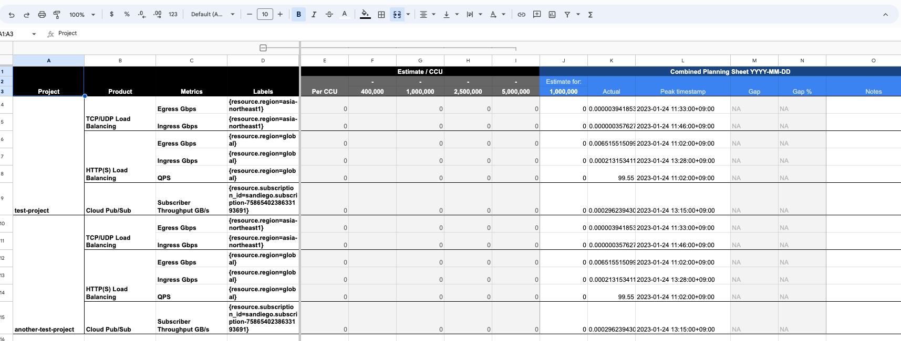
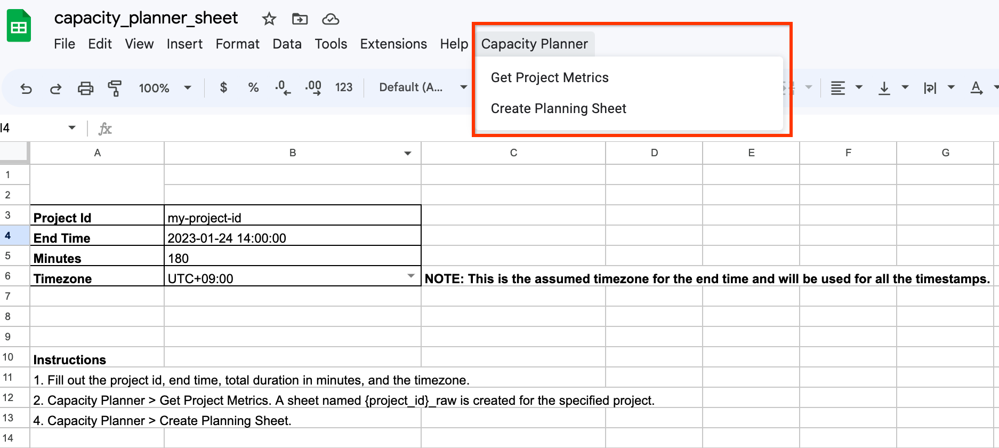
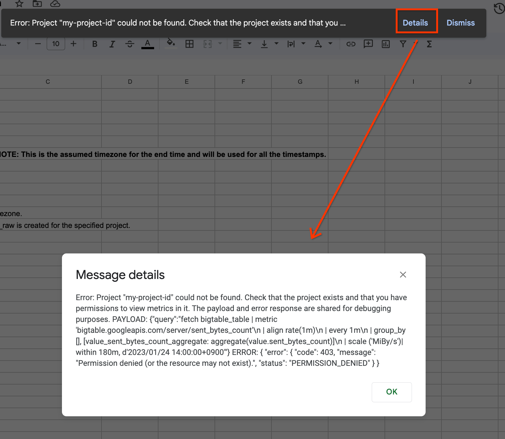

# Capacity Planner Sheets Extension

This tool is a Google Sheets extension for capacity planning on Google Cloud. 
This tool extracts peak resource usage values and corresponding timestamps for a given Google Cloud project, time range and timezone.



## Setup

1. Upload `capacity_planner_sheet.xlsx` to Google Drive.
2. Open `capacity_planner_sheet`, which will be in XLSX mode.
3. `File > Save as Google Sheets` to convert to a Google Sheets file.
4. `Extensions > Apps Script`. Copy all the `.js` files in this directory to the Apps Script editor. There should be 3 files: `main.gs`, `queries.gs`, and `sheets.gs`. (They're saved as `.js` files in GitHub for nice syntax highlighting, but you should save them as `.gs` files in AppsScript.)
5. In Apps Script Settings, change the Google Cloud Project to a project you have permissions to use the Monitoring API in. ([`roles/monitoring.viewer`](https://cloud.google.com/monitoring/access-control#mon_roles_desc) is sufficient)
This project is only used for Monitoring API quota and billing purposes. It does 
not need to be the same project you want to collect metrics in.
   1. [Enable the Monitoring API](https://console.cloud.google.com/apis/api/monitoring.googleapis.com/metrics) in your Google Cloud project, if it is not already enabled. 
   2. [Collect the project number](https://console.cloud.google.com/welcome) and paste the project number into Apps Script Settings.
1. In Apps Script settings, select the `Show "appsscript.json" manifest file in editor` checkbox.
2. Go back to the editor and edit `appsscript.json` to have the `oauthScopes` shown below. Do not edit the other fields.
    ```json
    {
      "timeZone": "Asia/Seoul",
      "dependencies": {},
      "exceptionLogging": "STACKDRIVER",
      "runtimeVersion": "V8",
      "oauthScopes": [
        "https://www.googleapis.com/auth/script.external_request",
        "https://www.googleapis.com/auth/monitoring.read",
        "https://www.googleapis.com/auth/spreadsheets"
      ]
    }
    ```
8. Check that all Apps Script files have been saved, then refresh the Google Sheets tab. You should see a new menu item "Capacity Planner".

    

## Using the Capacity Planner

1. Fill out the project id, end time, total duration in minutes, and the timezone.	
2. `Capacity Planner > Get Project Metrics`. A sheet named `{project_id}_raw` is created for the specified project.	
   - The first time you run the script, A pop up will ask you grant some permissions to your Google Account. Review the permissions and check "allow".
3. Repeat 1. and 2. for any additional projects of interest.
4. `Capacity Planner > Create Planning Sheet` to create a combined sheet.
5. Fill in column F in the Combined Planning Sheet with the CCU value (pre-filled to 400,000) and the estimates for each metric. The rest of the sheet will update with the gap between the estimated and actual values.


## Troubleshooting

Google Sheets will show a small popup if any errors occur during script execution. Click on "Details" to see more information.




## For Developers

During development it can be helpful to execute "Get Project Metrics" and "Create Planning Sheet" from the Apps Script UI instead of the Sheets UI. This allows you to view logs, use the debugger, and get stack traces with specific lines where the error occurred.

From `main.gs`, select the appropriate function:
* `createCapacityPlannerSheet` for "Create Planning Sheet"
* `getProjectMetrics` for "Get Project Metrics"

The script will still fetch inputs from the sheet.