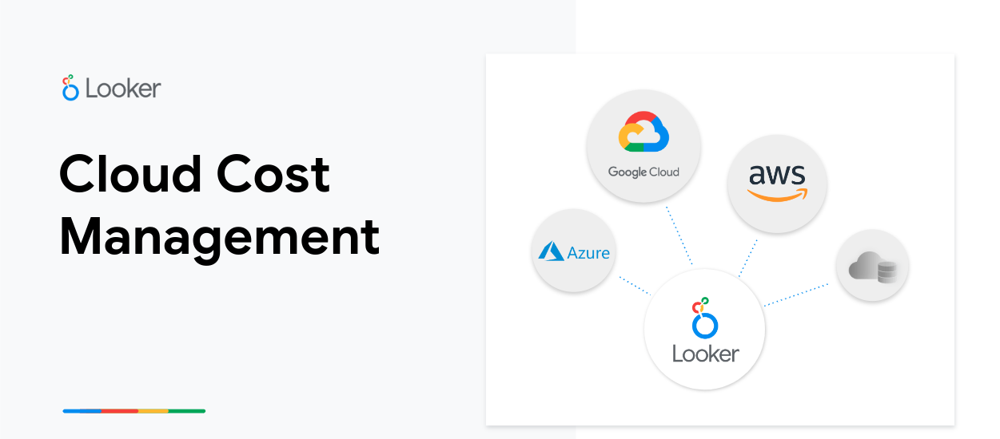
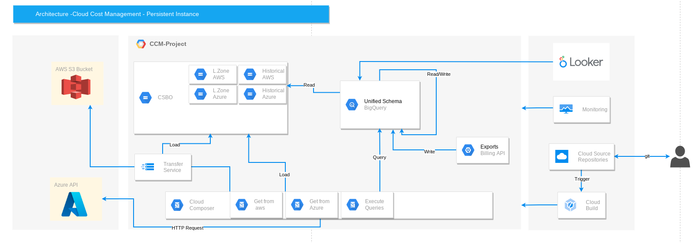
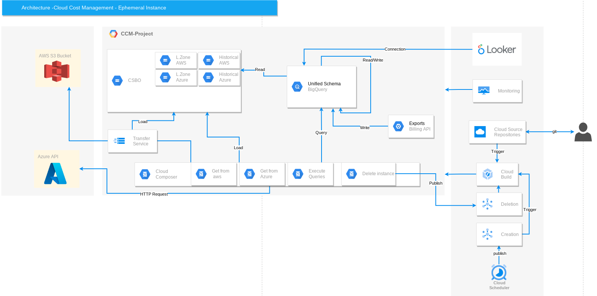

# Multi Cloud Billing Solution

## Introduction
The Multi Cloud Billing Solution enable customers to analyze how different teams at the organization are spending across projects, teams and resources to identify where, when and why teams are spending budget to optimize cloud spend. See where credits and promotional discounts are being applied and analyze recommendations for cutting costs. Centralized storage, harmonization, and standardization of billing data enables the mapping of services, resources, and similar SKUs across all cloud providers. The asset is configurable and customizable.

The prupose of this asset is to provide a baseline and an example of how you can build the data pipeline to create the multi-cloud unified schema in BigQuery in order to use the [Cloud Cost Management Phase 2](https://marketplace.looker.com/marketplace/detail/multicloud-billing-bq-export) block in Looker. The model in BigQuery unfies the billing export of GCP, AWS and Azure into a single model.

## Asset components
This asset has the following structure
- Composer
    - DAGs and scripts used during pipeline execution.
- Infra as Code
    - Terraform code to setup the environment and the scripts use it during Composer Cluster creation.
- Product Mapping
    - Mapping for the different cloud services.

## Prerequisites

### Billing Exports
- Google Cloud Platform billing export
    - The team has to enable the billing export to BigQuery from the GCP console. In this case we will use the standard usage cost export. Make sure to follow this link to enable the export job.

- Amazon Web Services billing export
    - Incoming files from AWS must be incremental only and should consist of only one day. Google proposes two different approaches for this task:
    API Rest: if you have an endpoint to request the file this will be the easiest way to get the files
    Storage Transfer Service (STS): you have to create a dedicated bucket in S3 and store every day a copy of a single file to be migrated to GCS. With sts we execute a job to transfer the data and once it finishes we delete the file from the S3 bucket in order to keep it empty waiting for the next day file.

- Azure billing export 
    - Incoming files from Azure must be incremental only and should consist of only one day. Same strategies described above for AWS can be applied

> **_NOTE:_**  it is not mandatory to have all cloud providers mentioned to create this model. Keep in mind that you would have to change some visualization on the Looker side if you don’t incorporate all providers in the model.

### Cloud Composer

We recommend Composer to orchestrate the whole pipeline. You will find the scripts in the git repository.

### Looker

- Establish connection with BigQuery.
- Download and install the [Cloud Cost Management: Phase 2](https://marketplace.looker.com/marketplace/detail/multicloud-billing-bq-export) block from the marketplace.
- The structure of the model in BQ is defined as LookML is expecting. Notice that if you change names or structure you will need to apply some changes in the LookML side.

### Google Cloud Storage

A bucket in GCS with four different folders

- aws_landingzone: will receive the daily file to be processed
- aws_historical: once we process the daily file, this will be moved to this folder
- azure_landingzone: will receive the daily file to be processed
- azure__historical: once we process the daily file, this will be moved to this folder

### Storage Transfer Service or APIs

Storage Transfer Service: it is a low-cost service to transfer data from AWS or Azure storage to GCS. You will find an example of the terraform code to deploy the jobs.

Instead of using sts you can get the files from each cloud provider with the APIs enabled. In the airflow scripts you will find an operator to make the calls.

> **_NOTE:_**  for transfer service, you will need to have an empty bucket in AWS or Azure side and store a daily copy of your daily billing file. Then the sts will be executed and transfer the copy of the file to the landing zone folder and delete the file from the source. This is just a suggestion you can modify as your needs.

### BigQuery

Two BigQuery datasets with their respective tables:

- cloud_cost_staging
    - gcp_billing
    - azure_billing
    - aws_billing
    - unified_list
    - location_compare
    - service_compare

- cloud_cost_final
    - project
    - service_type
    - resource_location
    - product_name
    - usage_unit_of_measure
    - cloud_provider
    - charge_type
    - billing_account
    - service
    - charge
    - currency
    - unified_cloud_billing

### Networking

This asset assumes that you already implemented a cloud foundation. If you don't have a VPC or shared VPC, you will need to create the network components before implementing this asset.

## Solution Architecture

### Overview

We have two deployment options for this kit. 

- Persistent Composer: will be more expensive but if the customer already leverages Composer for other pipelines, it is the recommended option.
- Ephemeral composer: Create the composer instance by writing to Pub/Sub via Cloud Scheduler - this option would trigger Cloud Build and the Composer deployment would be generated. After running the entire flow, the last task of Composer is to write to another Pub/Sub topic to delete the Composer instance in case the workflow finishes successfully.

### Persistent Composer

### Ephemeral Composer

### Implementation

1. Go to **/infra-as-code/**
2. Go to **/composer/**