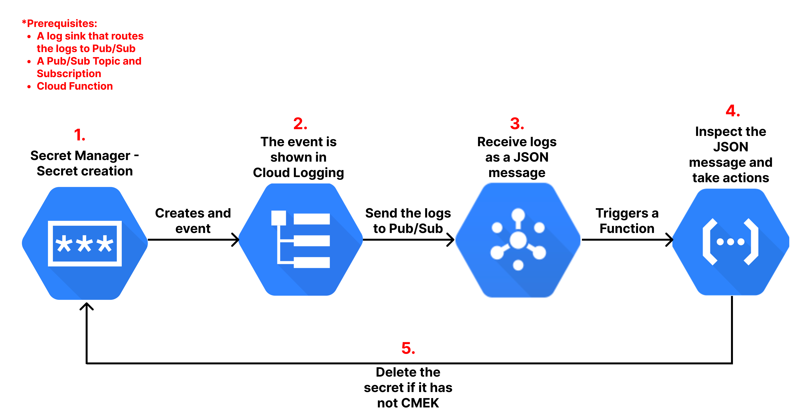

# Google Cloud Function Automation 
## Automation Data flow Diagram
This automation will create resources and integrate them together for this entire flow
1. Logs flow from any cloud resource to Cloud Logging
2. Logs will get filtered by the Log Router (Log Sink)
3. Log Sink will send log to GCP Pub/Sub
4. Cloud Function will get triggered when logs reach to Pub/Sub

Sample Diagram for reference 


## Prerequisites
1. Make sure that you have the required access to create Log Sink, Cloud Pub/Sub topic and Cloud Function.
2. Create a bucket and upload the cloud function code as a zip file. 
Refer [Link](https://cloud.google.com/functions/docs/writing#functions-writing-helloworld-http-python)
for details about how to write cloud function
3. Install required python modules

Supported python versions are 3.7, 3.8, 3.9
```commandline
python3 -m pip install -r requirements.txt
```
## Usage and Options

1. Update variables.py with configuration parameters, configuration parameters are explained below
```text
 ACTION = Specify CREATE or DELETE
 PROJECT_ID = Specify GCP project id
 PROJECT_NUMBER = Specify GCP Project number
 PUBSUB_TOPIC_NAME = Add a name for GCP Pub/Sub Topic
 SINK_NAME = Add a name for Log Sink
 LOG_SINK_FILTER = Add filter for Log Sink
 CLOUD_FUNCTION_CONFIG = Add GCP cloud function details
```

## How to run

### Example
Supported python versions are 3.7, 3.8, 3.9
```commandline
python3 cloud_function_automation.py
```

# Author

Arun Singh