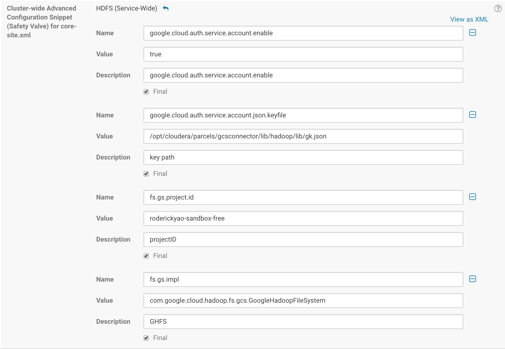
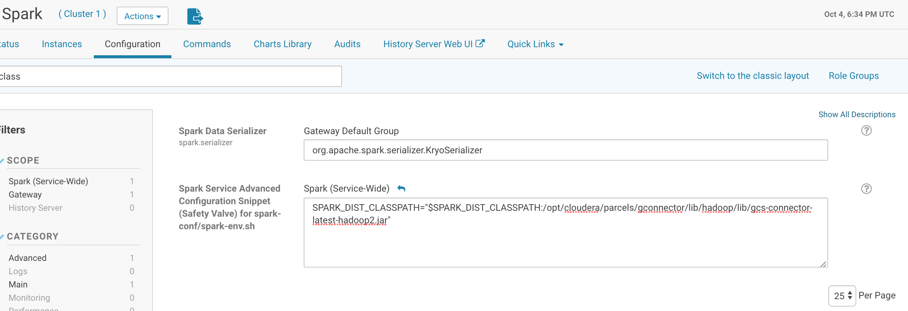
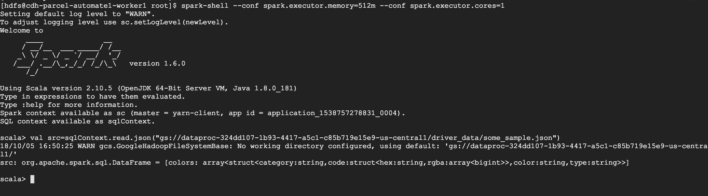
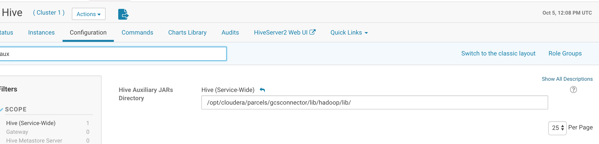
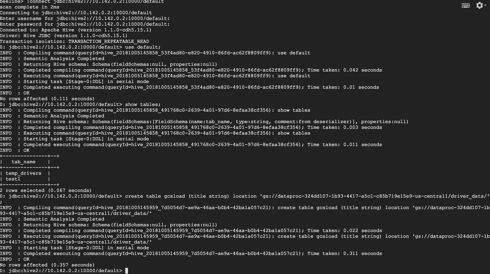

# Cloudera Parcel Installation

This script helps you create a Cloudera parcel that includes Google Cloud Storage connector. The parcel can be deployed on a Cloudera managed cluster.

## Prerequisites
1. Download create_parcel.sh script file.
2. [Optional] If you want the script to deploy the parcel file under Cloudera Manager's parcel repo directly, you need to use the script on the Cloudera Manager server.
3. [Optional] For on-premise clusters or clusters on other cloud providers, you need to get the service account JSON key from your GCP account. You can follow steps from [this document](https://cloud.google.com/iam/docs/creating-managing-service-account-keys).

## Installation
Once you have the required files, put all the files under one directory and run create_parcel.sh script in below format.
```
$ ./create_parcel.sh -f parcel_name -v version -o operating_system -d
```

Where,
-f is for parcel_name : is name of the parcel in a single string format without any spaces or special characters.

-v is for version : is the version of the parcel in the format x.x.x (ex: 1.0.0)

-o is for operating_system : is the name of the operating system to be chosen from this list (rhel5, rhel6, rhel7, suse11, ubuntu10, ubuntu12, ubuntu14, debian6, debian7)

-d is to be used if you want to deploy the parcel to the cloudera manager parcel repo folder, this flag is optional and if not provided then the parcel file will be created in the same directory where create_parcel.sh is script run.

Example
------
We can name this parcel as “gcsconnector”, version as “1.0.0”, and os type rhel6, run the below command.
```
$ ./create_parcel.sh -f gcsconnector -v 1.0.0 -o el6 -d
```

## Deployment
Once the script runs successfully, you need to make sure that Cloudera Manager can find the new parcel, especially if you host the parcel file by yourself.

You can check the parcel by go to the Cloudera Manager Home page, click the **Hosts** > **Parcels** > **Check parcels**. Once the new parcel populates in the list of parcels.
Click **Distribute** > **Activate parcel**. This will distribute and activate the parcel on all Cloudera managed hosts.

Once activated successfully, **restart** all the stale services.

Check below path for logs:
/var/log/build_script.log


## Configure CDH services to use GCS connector

### HDFS service
From the Cloudera Manager console go to **HDFS service** > **Configurations** > **core-site.xml**

Add the following properties in the Cluster-wide Advanced Configuration Snippet (Safety Valve) for **core-site.xml**

**google.cloud.auth.service.account.enable** : true

**[Optional] google.cloud.auth.service.account.json.keyfile** : Full path to JSON key file downloaded for service account
Example :
/opt/cloudera/parcels/gcsconnector/lib/hadoop/lib/key.json

**fs.gs.project.ids** : GCP project ID

**fs.gs.impl** : com.google.cloud.hadoop.fs.gcs.GoogleHadoopFileSystem



Save configurations and restart required services.

#### Validate HDFS service
Export Java and Hadoop classpath pointing to the gcsconnector jar.
```
$ export JAVA_HOME=/usr/lib/jvm/jre-1.8.0-openjdk.x86_64/
$ export HADOOP_CLASSPATH=$HADOOP_CLASSPATH:/opt/cloudera/parcels/gcsconnector-1.0.0/lib/hadoop/lib/gcs-connector-latest-hadoop2.jar
```

Run the 'hdfs dfs -ls' command to access GCS bucket:
```
hdfs dfs -ls gs://bucket_name
```

### Spark Service
From the Cloudera Manager console, go to **Spark** > **Configurations** > Spark Service Advanced Configuration Snippet (Safety Valve) for spark-conf/spark-env.sh

Add below configuration according to the gcs connector jar path.

**SPARK_DIST_CLASSPATH**=$SPARK_DIST_CLASSPATH:/opt/cloudera/parcels/gcsconnector/lib/hadoop/lib/gcs-connector-latest-hadoop2.jar



Validate Spark connection with GCS by opening Spark shell:

```
$ spark-shell
```
Read file stored on Cloud Storage by providing the gs:// path of a JSON file stored under GCS bucket.
```
val src=sqlContext.read.json("gs://bucket-name/some_sample.json")
```



### Hive Service
From the Cloudera Manager console, go to **Hive Service** > **Configuration** > **Hive Auxiliary JARs Directory**. Set the value to /opt/cloudera/parcels/gcsconnector/lib/hadoop/lib/
(absolute directory to the GCS connector)



Validate if JAR is being accepted by opening beeline and connecting to HiveServer2:



