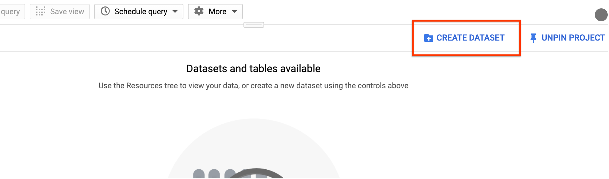
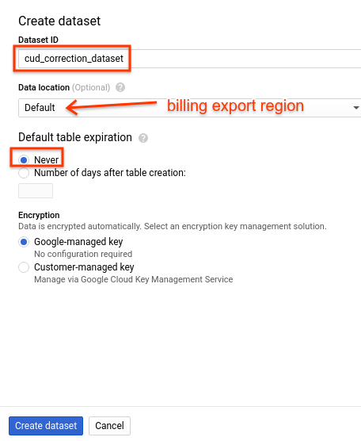
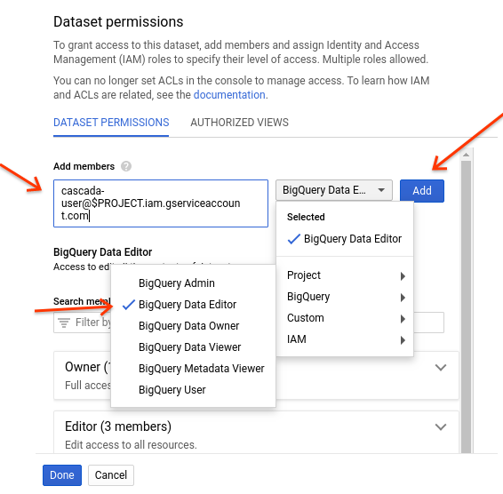
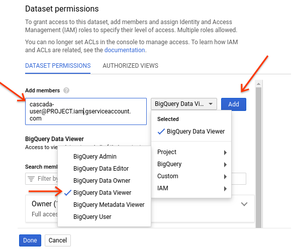
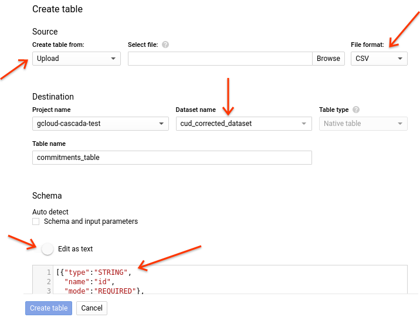

# Introduction

Committed Use Discounts (CUDs) are an important self-serve pricing model for GCP, allowing any customer to receive a substantial discount by committing to use a minimum quantity of concurrent GCE resources.

Despite the popularity of the CUD pricing model, the current implementation does not properly cater to the needs of some large enterprise organizations. At many large enterprises, each sponsor makes decisions independently about what quantity of commitments to sign up for. This is critical because workload patterns vary substantially across business units, and each sponsor has the deepest knowledge about the stability of their own business unit’s current and future usage.

The goal of this solution is to allow  a customer  to prioritize a given scope (e.g. project, folder), where the discount for a given commitment tranche be applied first before letting any unconsumed discount float out to other parts of the organization.

This solution creates a Cloud Composer environment with an Airflow DAG and executes three queries in BigQuery. These queries result in a new table in BigQuery, which matches the schema of the original billing export table. This new table contains the correctly attributed CUD/SUD data.

The solution adjusts each resource's cost by generating new line items in the output table, each of which represent a new SKU for reattribution. The purpose of this SKU is to amend the incorrect original per-resource cost. The SKUs that are prefixed with "Reattribution_Negation_" subtract out the incorrect cost from the original billing table. The SKUs prefixed with "Reattribution_Addition_" then add in the newly generated correctly proportioned cost. These SKUs are generated for both CUD and SUD costs/credits.

## Installation/Set-up

This project assumes that you already have a project set up with billing data exported to BigQuery. Note the billing project id, dataset ids, and the table name, as you will need these later on when configuring the Cloud Composer source code.


# Requirements

1. Your project must have a VPC created in order to create a Composer environment. The project's default network will be used if no specific network is specified during the Composer setup. If your project does not have any VPCs, you must either create a custom VPC, use a shared VPC, or recreate the default network. You can view the documentation about how to specify the network in the [Composer creation page](https://cloud.google.com/composer/docs/how-to/managing/creating).

1. Your organization cannot have enabled [domain restricted sharing](https://cloud.google.com/resource-manager/docs/organization-policy/restricting-domains)  as an organization policy. If it is enabled, you must disable it prior to deploying. You can reenable it after the Composer environment has been created.

1. You will need your organization's CUD purchase information and be able to provide this later on in this setup.

1. These commands are only for Linux/MacOS. If you are using a different operating system, please consider performing the following steps inside of the [Cloud Shell](https://console.cloud.google.com/home/dashboard?cloudshell=true).


# How to Deploy:

Step 1a. [Option 1a: Deploy via Terraform in Existing GCP Project](#option-1a)

Step 1b. [Option 1b: Deploy via gcloud SDK in New GCP Project](#option-1b)

Step 2. [Grant Viewer Permissions on BigQuery Exported Billing Data](#step-2)

Step 3. [Upload Commitments Mapping](#step-3)

Step 4. [View Results](#view-results)

[FAQ](#faq)

## Option 1a: Deploy via Terraform in Existing GCP Project

1. Install Terraform [here](https://learn.hashicorp.com/terraform/getting-started/install)

1. In your terminal type:

    ````
    git clone https://github.com/GoogleCloudPlatform/professional-services
    ````

1. In your terminal, cd into the `tools/cuds-prioritized-attribution/terraform/` directory.

    ````
    cd tools/cuds-prioritized-attribution/terraform/
    ````

1. Copy `terraform.tfvars.sample` to create a `terraform.tfvars` file. You must add values for the
associated variables that are provided. If you would like to provide additional variables, you
can see those that are used with default values in `variables.tf`. Provide the name in the same
format in your `terraform.tfvars` file to override the default value.
You must edit the project_id, billing_export_table_path, billing_export_location,
corrected_dataset_id, and commitment_table_path.

    Here is an example of a `terraform.tfvars` file:
    ````
    project_id = "my_project"
    billing_export_table_path = "my_billing_project.my)billing_dataset.my_billing_original_billing_export"
    billing_export_location = "US"
    commitment_table_path = "my_project.my_dataset.my_table"
    ````

1. Enter the following commands, ensuring that there are no errors:

    ````
    terraform init
    terraform plan -out plan.out
    terraform apply plan.out
    ````

    **Note that deploying the Cloud Composer environment will take about an hour to deploy.**

    Everything will be deployed.
    While the Composer environment is being created, you can skip ahead to upload your commitments.
    Ensure that Terraform did not produce any errors about the BigQuery dataset before doing so.

    For any errors, you can view them in the [FAQ](#faq) to resolve common issues related to setup.

1. Proceed to [step 2](#step-2) instructions about granting BigQuery viewer permissions on the exported billing data and uploading your commitment information.

## Option 1b: Deploy via gcloud SDK in a new GCP Project

### Install/Configure the gcloud command line tool:

1. [Install and initialize the Cloud SDK](https://cloud.google.com/sdk/docs/how-to)


1. Update all components:

    ````
    gcloud components update
    ````

### Create a new project for viewing the corrected data:

1. Open a terminal where you installed on the SDK and clone the professional services repository.
    ````
    git clone https://github.com/GoogleCloudPlatform/professional-services
    `````

1. Create a variable to store the project id for the project that you want to create
    ````
    export PROJECT=[PROJECT_ID]
    ````
    where `[PROJECT_ID]` is a unique ID for GCP for the project that you want to create.

1. Create the project
    ````
    gcloud projects create $PROJECT
    ````

1. Configure gcloud to use the project that you created
    ````
    gcloud config set project $PROJECT
    ````

### Open the GCP Console and enable the following:

1. [Enable billing](http://console.cloud.google.com/billing/?_ga=2.49090150.-1918546401.1542306879)

### Enable APIs

1. Enable the BigQuery API

    ````
    gcloud services enable bigquery-json.googleapis.com
    ````

1. Enable Cloud Composer (this may take a few minutes. Wait until you receive a success
message)

    ```
    gcloud services enable composer.googleapis.com
    ```

### Create Service Account
1. Create Service Account
    ````
    cloud iam service-accounts create cascada-user \
     --display-name "CUD Correction Service Account"
    ```
1. Create Custom IAM Role
    ````
    cloud iam roles create cud_correction_role --project $PROJECT \
     --title "CUD Correction IAM Role" --description "Custom Role for Service Account" \
      --permissions bigquery.jobs.create,bigquery.tables.create,bigquery.tables.updateData,bigquery.tables.get,bigquery.tables.getData \
       --stage GA
    ```

1. Bind IAM Role to Service Account

    ````
    export SERVICE_ACCOUNT=cascada-user@$PROJECT.iam.gserviceaccount.com

    export MEMBER=serviceAccount:$SERVICE_ACCOUNT

    export ROLE=projects/$PROJECT/roles/cud_correction_role

    gcloud projects add-iam-policy-binding $PROJECT --member=$MEMBER --role=$ROLE

    gcloud projects add-iam-policy-binding $PROJECT --member=$MEMBER --role=roles/composer.worker
    ````

### Create New Dataset and Set up BigQuery Permissions

1. Open up the [BigQuery UI](https://pantheon.corp.google.com/bigquery).

1. Under 'Resources' on the left-hand side, click on your project name.

1. On the right-hand side, click 'Create Dataset' in the project that you have created.

    

1. Enter details:
    * For the id, enter what you want to name the dataset, such as `cud_corrected_dataset`. **Note this id as you will need it when creating the Composer environment.**
    * **For location, choose the same location as your Exported Billing Dataset. For example, if you are a European customer and your billing data resides in the EU, you must make this location also be the EU.**
    * For expiration, choose 'Never'.
    * Click 'Create Dataset'.

    

1. On the right-hand side, click 'Share Dataset'.

1. In the opened panel, enter the service account email from 'Create Service Account' under 'Add member'.

1. In 'Select Role', choose 'BigQuery Data Editor'.

1. Click 'Add'.

1. Click 'Done'.

    

### Set up Composer environment and dependent resources

1. Create a GCS bucket. This is a temporary file store for Composer.
    ```
    gsutil mb -l [LOCATION] gs://$PROJECT-cud-correction-commitment-data
    ```
    where `[LOCATION]` is the region of your billing export data, either us, eu, or asia.

1. Change directories into the `tools/cuds-prioritized-attribution/composer/` folder

    ````
    cd tools/cuds-prioritized-attribution/composer/
    ````

1. Create the Composer environment. This depends on the new BigQuery dataset that you created when you opened up the BigQuery UI.

    **Note: this will take about an hour to complete.**

    * **Network Specification:** Your project must have a VPC created in order for composer to create an environment. You do not need to specify a network if the project has the default network created. If you deleted the default network or have the "Skip default network creation" policy enforced, the environment creation will fail. To resolve this, you must add the `network` flag to the gcloud command and specify the VPC to use. You will then also have to add the `subnetwork` flag to specify the subnetwork from either your custom VPC or shared VPC. Alternatively, you can also recreate the [default network](https://cloud.google.com/vpc/docs/vpc#default-network) as described here.

    * **Disable Domain Restricted Sharing:** If your organization has enabled the policy for [disabling domain restricting](https://cloud.google.com/resource-manager/docs/organization-policy/restricting-domains) sharing, you must disable it at this time. You can reenable after the deployment is complete.

    ````
    gcloud beta composer environments create cud-correction-env --location [LOCATION] \
      --python-version 3 --service-account $SERVICE_ACCOUNT \
      --airflow-configs=update-pypi-packages-from-file=requirements.txt \
      --env-variables=billing_export_table_name=[BILLING_PROJ.BILLING_DATASET.BILLING_TABLE],corrected_dataset_id=[CORRECTED_DATASET],corrected_table_name=[CORRECTED_TABLE],commitments_table_name=[PROJECT.DATASET.COMMITMENT_TABLE],enable_cud_cost_attribution=false,project_id=$PROJECT,cud_cost_attribution_option=a
    ````
    where
    * `[LOCATION]` is the Compute Engine region where you want to create the environment, such as `us-central1` or `europe-west1`.
    * `[BILLING_PROJECT.BILLING_DATASET.BILLING_TABLE]` is the path to your original billing export table.
    * `[CORRECTED_DATASET]` is the ID of the new dataset that you created in BigQuery.
    * `[CORRECTED_TABLE]` is the table ID that you would like to name the new table created by this solution (suggestion: `corrected_billing_export_table`).
    * `[PROJECT.DATASET.COMMITMENT_TABLE]` is the path to where you will upload your commitments table in BQ. This upload is performed in [step 3](#step-3).
    *  `cud_cost_attribution_option` is the type of cost attribution to perform if `enable_cud_cost_attribution` is true. Choose `a` if all of the cost is attributed within the scope (default). Choose `b` if a project that is not part of the scope gets any CUD, it also incurs the cost. Any remaining cost (of any unallocated commit) is attributed within the scope.

    Here is an example command:

    ````
    gcloud beta composer environments create cud-correction-env --location us-central1 \
      --python-version 3 --service-account $SERVICE_ACCOUNT \
      --airflow-configs=update-pypi-packages-from-file=requirements.txt \
      --env-variables=billing_export_table_name=my-project.my_dataset.my_original_billing_export,corrected_dataset_id=cud_corrected_dataset,corrected_table_name=test_output,commitments_table_name=my-project.cud_corrected_dataset.commitments_table,enable_cud_cost_attribution=false,project_id=$PROJECT,cud_cost_attribution_option=a
    ````

1. Add the current folder to the DAG

    ````
    gcloud composer environments storage dags import \
      --environment cud-correction-env --location [LOCATION] --source ../composer/
    ````
    where `[LOCATION]` is the Compute Engine region specified in the step above when you created the environment.


### Step 2: Grant Viewer Permissions of Exported Billing Data for Service Account

1. Open up the [BigQuery UI](https://pantheon.corp.google.com/bigquery).

1. Under 'Resources' on the left-hand side, click on your project name where the exported billing dataset lives.

1. On the left-hand side, click on the exported billing dataset.

1. On the right-hand side, click 'Share Dataset'.

1. In the opened panel, enter the service account email in the format of,`cascada-user@PROJECT.iam.gserviceaccount.com`, under 'Add member'.

1. In 'Select Role', choose 'BigQuery Data Viewer'.

1. Click 'Add'.

    

1. Click 'Done'.


### Step 3: Upload CSV with Commitment Information

1. Make a copy of the [template](https://docs.google.com/spreadsheets/d/1XKmBB9FUF8mWH88kXBMIUvbSrZCKusa2_muqB-mh9q8/edit?usp=sharing) with the commitments for your billing account.

    * Enter your commitment details.
    * Download as a CSV. An example with one commitment shows that the output of the CSV should like this if following the template:
    ````
    id,folder_ids,project_ids,commitments_unit_type,commitments_cud_type,commitments_amount,commitments_region,commit_start_date,commit_end_date
    """1""",null,"project-1,project-2",RAM,Regular Usage,100,us-west1,2017-01-01,2020-01-01
    ````
    Notes:
    * Each row represents a singular purchased commitment.
    * For `commitments_unit_type`, the supported values are either `RAM` or `CPU`.
    * For `commitments_cud_type`, the supported values are either `Regular Usage` or `Memory Optimized Usage`.
    * For both `commit_start_date` and `commit_end_date` the format is YYYY-MM-DD.
    * The ID does not represent any sort of prioritization order. It is an arbitrary value, but must be unique per row.
    * The `folder_ids` and `project_ids` represent which folders/projects are to be prioritized for a given commitment, not necessarily where the commitment was purchased.
    * Either `folder_ids` or `project_ids` may be null, but not both. Otherwise, the solution will not know how to allocate the CUD credits.
    * You may list multiple projects/folders per commitment, but they must each be separated by a comma.
    * To see more examples of sample CSVs, please look inside of the `test/tests` directory for a variety of sample use cases, each with an accompanying `commitments.json`.


1. Upload the CSV into the BigQuery table created by Terraform. You can choose UI or gcloud:

    You can do this in the UI by clicking 'Create Table' once you select a dataset:
    * For source, choose the CSV file that you downloaded with your information.
    * For destination, choose the `corrected_dataset_id` that you previously created. For table name,
    enter the value that you used for `commitment_table_name` in the Composer environment.
    * For schema, toggle 'Edit as Text'. Copy and paste the JSON found in `terraform/commitments_schema.json`.

    

    Or alternatively, if you want to use the gcloud SDK, you can enter the gcloud commands in your terminal. If your CSV does not contain the titles of the columns, please remove the flag `skip_leading_rows`:

    Ensure that you are located in the `terraform/` directory.
    ````
    cd terraform/
    ````

    ````
    bq load --source_format=CSV \
      --skip_leading_rows=1 $PROJECT:[commitment_table_name] [CSV_FILE] ./commitments_schema.json
    ````

    where `$PROJECT` is the ID of your GCP project that you instantiated in the beginning, `commitment_table_name` is the path to the commitment table in the format of dataset.table that you created in the composer environment, `CSV_FILE` is the file path to the CSV that you entered with your commitments, and `SCHEMA` is the JSON from `commitments_schema.json`.

    **This table must use the predefined schema, to ensure that the solution can use the input correctly. The CSV must adhere to the template, or else the output will not be correct.**


### View Results: Run the job:
You can test the workflow above by running the project now, instead of waiting for the scheduled UNIX time. To do this:

1. Open up the Composer page in the console.

1. Click the 'Airflow' hyperlink for your environment.

1. In the DAG, click the Play icon to trigger it. It will run for at least 10 minutes. Wait for the
success message.

1. Open up BigQuery in the console.

1. Under your `corrected_dataset_id` dataset, look for your `corrected_table_name`, this will contain the data.


### FAQ: Common Errors

1. `{"ResourceType":"PROJECT/europe-west1-cud-correction-123-addons-gke-typer:container.projects.zones.clusters.nodePools.setManagement","ResourceErrorCode":"404","ResourceErrorMessage":{"code":404,"message":"Not found: projects/PROJECT/zones/europe-west1-b/clusters/europe-west1-cud-correction-123-gke.","status":"NOT_FOUND","details":[],"statusMessage":"Not Found","requestPath":"https://container.googleapis.com/v1/projects/PROJECT/zones/europe-west1-b/clusters/europe-west1-cud-correction-123-gke/nodePools/default-pool/setManagement","httpMethod":"POST"}}`

    This means that your project does not contain a VPC. Composer requires a network in order to create the environment. To fix this, you have a few options. You can either recreate the [default network](https://cloud.google.com/vpc/docs/vpc#default-network) and then redeploy the same way. If you wish to use a custom netowrk, you can add the `network` flag to your gcloud command or terraform variable and then specify the VPC. If using a shared VPC, the network's relative resource name be provided using the format projects/HOST_PROJECT_ID/global/networks/NETWORK_ID. For Shared VPC subnetwork requirements, see [subnetwork documentation](https://cloud.google.com/composer/docs/how-to/managing/creating).

1. `{"ResourceType":"gcp-types/storage-v1:storage.bucketAccessControls.insert","ResourceErrorCode":"404","ResourceErrorMessage":{"code":404,"errors":[{"domain":"global","message":"Not Found","reason":"notFound"}],"message":"Not Found","statusMessage":"Not Found","requestPath":"https://www.googleapis.com/storage/v1/b/europe-west1-cud-correction-123-bucket/acl","httpMethod":"POST"}}`

    This means that your organization has the organization policy of [Domain Restricted Sharing](https://cloud.google.com/resource-manager/docs/organization-policy/restricting-domains) enabled. You must disable the policy constraint before creating an environment. This action permits Cloud Composer to apply the required ALCs to the Cloud Storage bucket for your environment. You can re-enable the policy constraint after environment creation.

1. `BigQuery fails to execute the query due to different dataset regions`

    All of the datasets used in this solution must reside in the same region. Your exported billing data most likely resides in your company's location (if you are a European company, it is probably in the EU. If you are in the US, your dataset is probably in the US.) To resolve this, verify that the dataset containing the `commitments_table` and the `cud_corrected_dataset` are in the same region as your billing data. You can update the location of a dataset following these [instructions](https://cloud.google.com/bigquery/docs/locations#moving-data).
If your billing datasets are all in the same region, ensure that your GCS buckets are also in the same region. You specified this on creation using the `l` flag when executing `gsutil mb`.


1. `Other "Invalid Argument"`

    Ensure that all of the environment variables were specified properly and that you performed all of the previous steps. This includes ensuring that the service account was created and contains the proper IAM role to execute Composer work.
