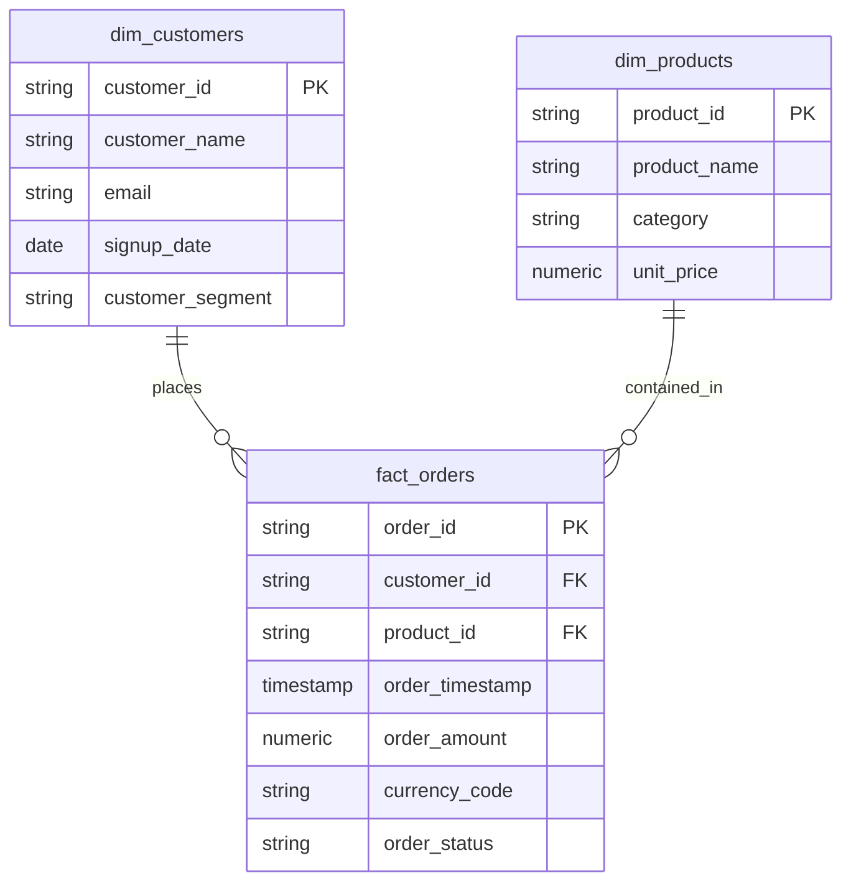

# BigQuery Data Modeling Multi-Agent System

An enterprise-grade multi-agent AI system built on Google Agent Development Kit (ADK) and Gemini to automate data discovery, schema reverse-engineering, dimensional modeling (Star and Snowflake schemas), DDL generation, BigQuery metadata documentation, synthetic data generation, visual ER diagram rendering, and AI feature engineering.

---

## 🚀 Overview

Modern enterprise data architectures often span multiple disparate, undocumented data sources. Designing unified data models, keeping documentation updated, and designing real-time machine learning features typically requires weeks of manual effort from data architects and engineers.

The **BigQuery Data Modeling Multi-Agent System** solves this by orchestrating specialized AI agents to:
- **Inspect Live BigQuery Schemas**: Query live `INFORMATION_SCHEMA` metadata across multiple datasets in seconds.
- **Automate Data Documentation**: Automatically generate and apply business descriptions directly to BigQuery tables and columns (`ALTER TABLE ... SET OPTIONS(...)`).
- **Architect Unified Dimensional Models**: Design Star and Snowflake schemas connecting disparate sources, complete with BigQuery partitioning and clustering strategies.
- **Generate Visual ER Diagrams**: Dynamically render visual Entity-Relationship Diagram artifacts.
- **Engineer AI/ML Features**: Suggest high-impact predictive features and provide BigQuery analytical SQL queries for Vertex AI Feature Store integration.
- **Synthesize Test Data**: Populate modeled tables with realistic synthetic data using Gemini and BigFrames.

---

## 🏛️ Multi-Agent Architecture

The system uses a hierarchical multi-agent architecture powered by Google ADK:

```
                      +-----------------------------+
                      |     data_modelling_agent    |
                      |  (Master Root Orchestrator) |
                      +--------------+--------------+
                                     |
    +-----------------+--------------+--------------+-----------------+
    |                 |                             |                 |
+---+----------+ +----+------------------------+ +--+-----------+ +---+----------------------+
|  ddl_agent   | | modelling_orchestrator_agent | |   reporting | | synthetic_data_generator |
| (Inspection  | | (Star/Snowflake Schema      | |    _agent    | |          _agent          |
|  & DDL Ops)  | |  & ML Feature Engineering)  | | (ER Diagrams)| |  (Gemini + BigFrames Mock) |
+---+----------+ +----+------------------------+ +--+-----------+ +---+----------------------+
    |                 |                             |                 |
+---+----------+ +----+------------------------+     +------------+    |
| search_agent | |         dml_agent           |                       |
| (Datastore   | | (NL2SQL Analytical Queries) |                       |
|  Search)     | |                             |                       |
+--------------+ +-----------------------------+-----------------------+
```

### Specialist Sub-Agents

1. **`ddl_agent`**: Inspects live BigQuery tables and columns directly from `INFORMATION_SCHEMA`. Executes multi-statement BigQuery SQL DDL and applies persistent table and column documentation with built-in quota protection.
2. **`modelling_orchestrator_agent`**: Designs enterprise dimensional data models (Fact and Dimension tables, surrogate keys, grains), generates physical DDL with partitioning/clustering, and designs machine learning features.
3. **`reporting_agent`**: Uses Graphviz to render visual, color-coded Entity-Relationship (ER) diagram image artifacts (`er_diagram.png`).
4. **`synthetic_data_generator_agent`**: Uses Gemini and BigFrames to generate realistic mock data and load it directly into target BigQuery tables.
5. **`dml_agent`**: Converts natural language into BigQuery SQL queries (NL2SQL) to analyze and query the modeled datasets.
6. **`search_agent`**: Searches Vertex AI Datastore collections for documented models and schemas.

---

## 🛠️ Setup and Installation

### Prerequisites

- **Python 3.11+** or **UV** package manager ([Installation Guide](https://docs.astral.sh/uv/getting-started/installation/)).
- **Google Cloud Platform (GCP) Account** with BigQuery and Vertex AI enabled (or a Gemini API key for local testing).
- **Graphviz** (for ER diagram generation):
  - macOS: `brew install graphviz`
  - Debian/Ubuntu: `sudo apt-get install -y graphviz graphviz-dev`

### Installation

1. **Clone the repository:**
   ```bash
   git clone https://github.com/your-org/data-modeling-agent.git
   cd data-modeling-agent
   ```

2. **Install dependencies:**
   ```bash
   make install
   # or with uv directly:
   uv sync
   ```

3. **Configure Environment Variables:**
   Copy `.env.example` to `.env` and fill in your GCP configuration:
   ```bash
   cp .env.example .env
   ```

   Example `.env` configuration:
   ```bash
   # Google Cloud & Vertex AI Configuration
   GOOGLE_CLOUD_PROJECT=your-gcp-project-id
   GOOGLE_CLOUD_LOCATION=us-central1
   GOOGLE_GENAI_USE_VERTEXAI=true

   # BigQuery Configuration
   BQ_DATA_PROJECT_ID=your-gcp-project-id
   BQ_COMPUTE_PROJECT_ID=your-gcp-project-id
   BQ_DATASET_ID=your_dataset_id

   # Root Model Selection
   ROOT_AGENT_MODEL=gemini-2.5-flash
   ```

4. **Authenticate with Google Cloud:**
   ```bash
   gcloud auth application-default login
   gcloud config set project YOUR_PROJECT_ID
   gcloud services enable aiplatform.googleapis.com bigquery.googleapis.com
   ```

---

## 🖥️ Running the Agent

### Interactive Web UI (ADK Web)

Launch the interactive local web UI:
```bash
make web
```
Open **`http://localhost:8000`** in your browser and select **`data_modelling_agent`**.

### FastAPI Server

Launch the headless agent API server:
```bash
make api_server
```
Interactive API documentation is available at **`http://127.0.0.1:8000/docs`**.

---

## 🏛️ End-to-End Walkthrough: Enterprise Dimensional Data Modeling

This scenario demonstrates how the agent inspects undocumented source datasets, automatically writes persistent documentation back to BigQuery, unifies them into a dimensional Star Schema, and engineers predictive ML features.

### Scenario Context
* **Source 1: CRM & Customer Master (`raw_crm.customers`)**: Customer profiles and segments.
* **Source 2: Point of Sale & Online Orders (`raw_pos.orders`)**: Transactional order events and line totals.
* **Source 3: Product Catalog (`raw_catalog.products`)**: Inventory and product category details.

---

### Step-by-Step Prompt Flow

#### 1️⃣ Step 1: Live Discovery & Undocumented Schema Inspection
**User Prompt:**
> *"We have three disparate source datasets in BigQuery: `raw_crm.customers`, `raw_pos.orders`, and `raw_catalog.products`. None of them have descriptions or documentation. Please inspect them and explain in clear business terms what each table and column represents."*

* The agent dynamically queries BigQuery's `INFORMATION_SCHEMA.COLUMNS` across all datasets and provides a clear business breakdown of every entity.

---

#### 2️⃣ Step 2: Automated Documentation & Source-of-Truth Sync
**User Prompt:**
> *"This is very clear. Please go ahead and automatically update our BigQuery tables with these business descriptions so our analytics and data engineering teams have a documented source of truth."*

* The agent generates and executes batch `ALTER TABLE ... SET OPTIONS(description=...)` and `ALTER COLUMN ... SET OPTIONS(...)` commands directly in BigQuery.

---

#### 3️⃣ Step 3: Unified Dimensional Model & Visual ER Diagram
**User Prompt:**
> *"Our analytics leadership needs a unified reporting data warehouse to analyze customer purchasing patterns and revenue trends. Please design a Star Schema that unifies these source systems together."*

* The agent designs a Star Schema linking `dim_customers`, `fact_orders`, and `dim_products`, complete with BigQuery partition/cluster specifications and generates a color-coded **Visual ER Diagram artifact** dynamically.



---

#### 4️⃣ Step 4: AI Feature Engineering for Real-Time KPI
**User Prompt:**
> *"Our Data Science team is building a machine learning model to achieve a critical KPI: Predicting High-Value Repeat Customers and Churn Risk. Looking at our unified model, what new predictive features or metrics should we add to our data model to help achieve this KPI?"*

* The agent recommends predictive feature categories:
  - **Recency, Frequency, Monetary (RFM) Metrics**: `days_since_last_order`, `order_count_last_90d`, `avg_order_value_180d`.
  - **Behavioral Deviations**: Order amount deviation from customer lifetime average.
  - **Product Category Affinity**: Diversity of purchased product categories.
  - Ready-to-run BigQuery analytical SQL window queries for Vertex AI Feature Store integration.

---

## 🚀 Deployment to Vertex AI Agent Engine

This agent is built strictly using Google ADK standards and can be deployed directly to **Vertex AI Reasoning Engines (Agent Engine)** for managed serverless hosting:

```bash
# Deploy agent to Vertex AI Agent Engine
adk deploy agent_engine \
  --project YOUR_PROJECT_ID \
  --region us-central1 \
  --agent src/agents/data_modelling_agent
```

Alternatively, you can run the FastAPI server on any container environment using:
```bash
adk api_server src/agents/
```

---

## 🧪 Running Tests

Run the test suite using `make` or `pytest`:

```bash
make test
# or with pytest:
uv run pytest tests/unit/
```

---

## 📄 License

This project is distributed under the Apache 2.0 License. See the `LICENSE` file for details.
