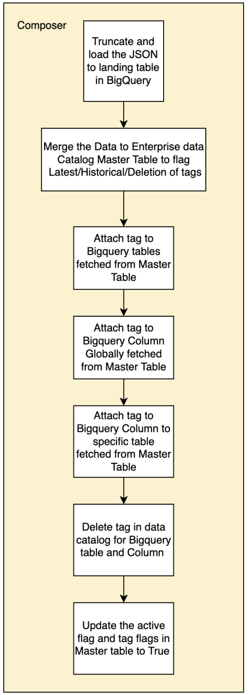

# Data Catalog Tagging Using Tag Templates

Reference pattern for effectively tagging data assets stored in BigQuery which helps in tagging and deleting tags on BQ Table and columns 

## Table of Contents

- [Data Catalog Tags and Tag templates Overview](#data-catalog-tags-and-tag-templates-overview)
- [High Level Design ](#high-level-design)
  - [Prerequisites](#Prerequisites)
- [Implementation](#implementation)
  - [scripts](#scripts)
  - [Prerequisites](#Prerequisites)
  - [Inputs for Data Catalog tagging](#inputs-for-data-catalog-tagging)
  - [Execution steps for tagging and deleting the tags](#execution-steps-for-tagging-and-deleting-the-tags)
  - [Search for tagged resources](#search-for-tagged-resources)

# Data Catalog Tags and Tag templates Overview

Data catalog tagging is the process of adding metadata tags to data assets to describe their characteristics and make them easier to find and understand. This metadata can be generic metadata or specific metadata for a team and can  include information such as:
- **Data type**: The type of data, such as structured, semi-structured, or unstructured.
- **Data format**: The format of the data, such as CSV, JSON, or XML.
- **Data source**: The source of the data, such as a database, application, or sensor.
- **Data owner**: The person or team responsible for the data.
- **Data sensitivity**: The sensitivity of the data, such as public, internal, or confidential.

Data catalog tagging can help with data governance in a number of ways, including:
- Improved data visibility and understanding: Data catalog tagging makes it easier to find and understand data assets, which can help organizations to make better decisions about how to use and protect their data.
- Improved data protection: Data catalog tagging can help organizations to identify and protect sensitive data assets, which can reduce the risk of data breaches and other security incidents.
- Improved data quality management: Data catalog tagging can help organizations to identify and correct data quality issues, which can improve the accuracy and reliability of their data.
- Improved data lineage tracking: Data catalog tagging can help organizations to track the lineage of data assets, which can help them to understand how their data is being used and to identify potential data risks.

# High Level Design

## Prerequisites

Before proceeding with the tagging process, the following prerequisites must be met:
1. Creation of a Tag Template using Terraform:
    - Utilize Terraform to define and create a customized tag template that aligns with organization's data classification and tagging requirements. This template serves as the blueprint for assigning tags to data assets.
2. Create an Enterprise Data Catalog Master Table:
    - Create a master table for managing  data asset tags by creating an Enterprise Data Catalog Master table in Bigquery . This table will store the tags and their associated metadata, providing a comprehensive view of tagged data assets.


The tagging process consists of the following steps:
1. **Uploading a JSON File to a Cloud Storage Bucket**:
    - customer initiates the tagging process by placing a JSON file containing the tagging instructions in a predefined Cloud Storage bucket. This JSON file specifies the data assets (e.g., BigQuery tables, columns,) to be tagged, along with the corresponding tag template to be applied.
2. **Triggering a Cloud Composer Job**:
    - A Cloud Composer job is configured to listen for changes in the Cloud Storage bucket where the JSON file is placed. Once a new JSON file is detected, the job is automatically triggered.
3. **Tagging or Deleting Tags Based on Master Table**:
    The Cloud Composer job references the Enterprise Data Catalog Master table to determine the appropriate actions for each data asset specified in the JSON file. If a tag needs to be created or deleted, the job performs the necessary operations in dataplex.
4. **Utilizing DataPlex for Enhanced Search**:
    - Once the BigQuery tables and columns are tagged, customers can leverage DataPlex, a unified data management platform, to easily search and discover their data assets based on the applied tags. This simplifies data exploration and enables more efficient decision-making.

Cloud Composer tasks can be used to streamlined as below tasks:



# Implementation

let’s use the above design to create the boilerplate template for composer tasks.

## Scripts  

Tagging utility helps to attach tags to resources such as tables, views & columns as well as delete tags.It supports attaching and deleting tags of column that is present in a specific table as well as column that is present in multiple tables with the same name. Below scripts are essential for Tagging : 

1. **insert_landing.py**
- This is a script used to truncate and load the json file consisting of table and column level tag attributes and values to the landing table of Enterprise Data Catalog master table in bigquery .
- Test the script in cloud shell using command like below
  ```python
  python insert_landing.py --project <projectname> --dataset <datasetname> --table <tablename>
  ```
2. **upsert_staging.py**
- This is a script used to upsert into the staging table of Enterprise Data Catalog master table in bigquery from landing table.
- Enterprise Data Catalog master table is a SCD2 table with all the historical data along with Latest records
- This script inserts and updates the records with relevant flags to identify the records either to Tag or delete the tag.
- Test the script in cloud shell using command like below
  ```python
  python upsert_staging.py --landingtable <prjname.datasetname.tablename> --mastertable <prjname.datasetname.tablename>
  ```
3. **attach_delete_tag_to_table_column.py** 
- This is a script used for fetching the tables and columns to be tagged from Enterprise Data Catalog master table in bigquery assigning and deleting the tags based on the flag value. 
- This script segregates the records fetched from Bigquery master table , assigns the precedence of execution and executes tagger.py to attach and delete the tags
- Test the script in cloud shell using command like below
  ```python
  python attach_delete_tag_to_table_column.py --mastertable <prjname.datasetname.tablename> --dataplexprojectid <prjname> --dataplexprojectregion <region> 
  ```
4. **tag_util.py**
- This is a script used for assigning tags. Resources fetched as results of the provided search string will be tagged using provided tag values from Json. 
- Deletion process uses this script to search the relevant resource to be deleted.

## Prerequisites

- The Data Catalog API needs to be enabled in the project, enable it by visiting the home page in the Cloud Console 
- Service_account of composer with below permissions created in the project
    - Dataplex Administrator
    - DataCatalog Entry Owner
- Create config tables in BigQuery that contain information regarding respective resources and tags.Bigquery will have landing and staging table which will be Enterprise Data Catalog master table.

## Inputs for Data Catalog tagging

1. Enterprise Data Catalog master
Enterprise Data Catalog master is SCD2 table in Bigquery which will have all the historical and latest records for tag keys and values for tables and columns in bigquery.
Below is the DDL for landing table and master table : 

```python
CREATE TABLE `test-datahub.test1.Enterprise_Data_Catalog_Master_Landing`
(
  projectName STRING,
  datasetName STRING,
  tableName STRING,
  columnName STRING,
  level STRING,
  tagTemplate STRING,
  tagFlag BOOL,
  activeFlag BOOL,
  mode STRING,
  tag ARRAY<STRUCT<key STRING, value STRING>>,
  createTimestamp TIMESTAMP,
  UpdateTimestamp TIMESTAMP,
  id STRING OPTIONS(description=""md5 hash of primary columns"")
);

CREATE TABLE `test-datahub.test1.Enterprise_Data_Catalog_Master`
(
  projectName STRING,
  datasetName STRING,
  tableName STRING,
  columnName STRING,
  level STRING,
  tagTemplate STRING,
  tagFlag BOOL,
  activeFlag BOOL,
  mode STRING,
  tag ARRAY<STRUCT<key STRING, value STRING>>,
  createTimestamp TIMESTAMP,
  UpdateTimestamp TIMESTAMP,
  id STRING
);
```


- ID column will be md5 hash of primary columns : ["projectname", "datasetname", "tablename", "columnname", "level", "tagtemplate"]
- tagFlag is a Bool type and when a newly created or updated tag is available it will be False . Once the tagging process is completed it is flagged True.
- activeFlag indicates the tag is latest when it is true or it is deleted or historical when it is False.Tagger dag processes these flags when it executes.
- Mode can have 3 values
    - Deleted
    - Historical
    - Latest
    Tagger dag processes these values when it executes SCD2 script. 
    For deletion process, mode is flagged as Delete when script starts , once tag is deleted in dataplex , mode gets updated to Deleted.
- The Delete process is soft delete in Bigquery and hard delete in Dataplex. Deleted records is persisted in Bigquery to maintain the history

2. JSON file 

JSON file consists of the required tag keys and attributes along with tag template and column/table details to be tagged. This should be provided by the governance team and to be placed in the Github repository .
This file is then moved to the GCS bucket through git actions and Tagger DAG can be manually triggered / auto triggered using airflow sensors for tagging.

- When inserting a new tag , copy the entire JSON block below and provide the required values
- When deleting , remove the block of JSON that needs to be deleted .
- Keep the values as an empty string , if currently no value is available for that key.

Below is the format of JSON file for table tagging : 

```python
[
    {
      "projectname": "test-datahub",
      "datasetname": "dataset1",
      "tablename": "",
      "tagtemplate": "bq_table_template",
      "level": "table",
      "tag": [
        {"key": "Attribute_Name", "value": ""},
        {"key": "Physical_Data_Cloud_Table_Name", "value": ""},
        {"key": "Physical_Data_Cloud_Column_Name", "value": ""},
        {"key": "Description", "value": ""},
        {"key": "Source_System", "value": ""},
        {"key": "Target_System", "value": ""},
        {"key": "Interface_Name", "value": ""},
        {"key": "Contract_ID", "value": ""},
        {"key": "Mandatory_for_Source", "value": ""},
        {"key": "Mandatory_for_Target_System", "value": ""},
        {"key": "Technical_Requirement", "value": ""},
        {"key": "Business_Process_Requirement", "value": ""},
        {"key": "Business_Justification", "value": ""},
        {"key": "Global__or_Local", "value": ""}
        ]
    },
    {
        "projectname": "test-datahub",
        "datasetname": "dataset1",
        "tablename": "",
        "tagtemplate": "bq_table_template",
        "level": "table",
        "tag": [
          {"key": "Attribute_Name", "value": ""},
          {"key": "Physical_Data_Cloud_Table_Name", "value": ""},
          {"key": "Physical_Data_Cloud_Column_Name", "value": ""},
          {"key": "Description", "value": ""},
          {"key": "Source_System", "value": ""},
          {"key": "Target_System", "value": ""},
          {"key": "Interface_Name", "value": ""},
          {"key": "Contract_ID", "value": ""},
          {"key": "Mandatory_for_Source", "value": ""},
          {"key": "Mandatory_for_Target_System", "value": ""},
          {"key": "Technical_Requirement", "value": ""},
          {"key": "Business_Process_Requirement", "value": ""},
          {"key": "Business_Justification", "value": ""},
          {"key": "Global__or_Local", "value": ""}
          ]
      }
 ]
```

## Execution steps for tagging and deleting the tags

1. Place the JSON file for column and table tagging in Github Repository.
2. Once placed and merged to the master branch , through gitactions JSON input file is placed in GCS bucket .
3. Below steps can be orchestrated through composer DAG:
    - Task insert_landing will execute to truncate and insert the JSON file to the landing table .
    - Task upsert_staging will execute to merge the changes from landing table to master table. There are 3 steps in this task
        - Script identifies the records to be deleted and flags MODE as DELETE. Active flag and tagflag will be made false
        - It identifies the updated records and Merges the changes and flags MODE as HISTORICAL.active flag will be made false. But tagflag remains the same as tag still exists.
        - It identifies new records and flags it as LATEST as well the updated records which need to be updated in the data catalog as LATEST. tagFlag will be flagged as false .
    - Script attach_delete_tag_to_table_column.py is segregated as 4 different task as below
        - Task1 is to filter and  fetch the records from master table in bigquery and tag all the tables 
        - Task2 is to filter and fetch the records from master table in bigquery and tag all the columns which should be tagged globally 
        - Task3 is to filter and fetch the records from master table in bigquery and tag all the columns which should be tagged specifically in a  table 
        - Task4 is to filter and fetch the records from master table in bigquery and delete the tags. 
            - Delete the table tags
            - Delete column tag globally
            - Delete column tag specific to the table

## Search for tagged resources

To search in Dataplex using tags:
    - Open the Dataplex console.
    - In the search bar, enter the following query:

```python
tags:<tag_name>
```

All the scripts provided can be executed step by step explained above through cloud shell.

