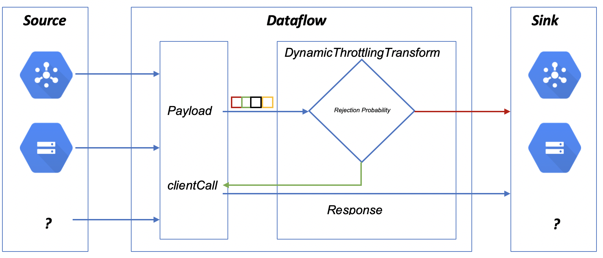

# Client-side Throttling in Dataflow

### Introduction
When Dataflow pipeline is trying to get the response for each incoming event from third-party API’s there is a chance of the request to fail in getting response for some reasons like network issues, limits on API calls, etc. At times, client-side throttling can act as a way to limit the number of requests coming from dataflow by either postponing or dropping excessive requests. It can also serve as a fail-safe mechanism that prevents the loss of payload of requests throttled by the server.

For example, when a streaming pipeline calls the Cloud DLP API for each event to inspect sensitive data or de-identify the additional columns, DLP API can accept only 600 requests per minute though the incoming flow can be more than the limit (this quota can be increased from the GCP console). In this scenario, Instead of sending events to DLP API and getting failures, client-side throttling buffers the requests locally and fails them only if the DLP service starts to throttle the client even if the number of requests sent by Dataflow is below quota. Dataflow throttling can also reroute the events to a Dead Letter Queue or to any other sink from where we can reprocess the events.

This artifact is designed to implement distributed adaptive client-side throttling. [Adaptive throttling](https://landing.google.com/sre/sre-book/chapters/handling-overload/#eq2101) activates when a service called by Dataflow starts rejecting requests due to throughput higher than expected. This transform tracks the request rejection probability to decide whether it should fail locally without going through network to save the cost of rejecting a request.

### Dataflow Client-side Throttling

This generic library intended to reject requests that have a high probability of being rejected locally on Dataflow nodes. Irrespective of Batch or Streaming, when Dataflow pipeline is sending HTTP requests to the server with input elements as payload, once the request has been processed by the backend, it should send a response back to the pipeline whether the request has been accepted or rejected. The error code depends up on the backend throttling implementation (defaults to HTTP code 429).



The library uses [stateful](https://beam.apache.org/blog/2017/02/13/stateful-processing.html) processing. A user of this library needs to implement clientCall function which makes requests to the external service.

### Adaptive throttling in Dataflow

Dataflow pipeline maintains the number of requests it has sent to the backend [totalRequestsProcessed] and the number of requests got accepted by the backend [acceptedRequests]. Using stateTimer, it will process a batch of elements from each state value and remove the processed elements from the state value. Request rejection probability will be calculated as follows.
    ```RequestRejectionProbability = (total_requests - k * total_accepts)/(total_requests+1)```
If it is more than a random number between 0 or 1, incoming requests will be sent to either Pub/Sub dead letter queue or any other sink defined by the user.

We’re going to maintain the following Apache Beam states:

* incomingRequests - requests stored in Apache Beam bag state
* acceptedRequests number
* totalRequestsProcessed number
For more information on these parameters see [Adaptive throttling](https://landing.google.com/sre/sre-book/chapters/handling-overload/#eq2101).
The count of the incoming requests and accepted requests should be equal under normal conditions. Once the requests start getting rejected, the number of processing requests gets decreased by the difference of incoming requests and accepted requests.

Pipeline will process the payload in multiple groups. To achieve this, pipeline will transform the PCollection[Bounded/Unbounded] into multiple groups based on random distribution (the random function implementation can be overridden).
Pipeline transform steps:
* Converts the Input PCollection<<T>T</T>> into PCollection<<T>Key,Value</T>>. Here, Key will be group id (random by default) and Value will be payload.
* Adaptive throttling will be applied to each group[State cell] accordingly.
* Pipeline processes each state cell using [stateful](https://beam.apache.org/blog/2017/02/13/stateful-processing.html) and [timely](https://beam.apache.org/blog/2017/08/28/timely-processing.html) processing. That said each state cell will be processed after reaching a predefined interval of  time. A user function clientCall will be applied on a group of elements.
* ClientCall, a user defined function, is invoked. This function sends PCollection elements to the backend node. Based on the response of the clientCall respective counters will get incremented.

The variables which stores the number of requested and accepted requests are zeroed out after a certain interval of time (defaults to 1 min). This reset speeds up client recovery if server throughput was limited due to limitations on the server side not caused by the client.

### Library testing

#### Requirements

* Install Java 8+
* Install Maven 3

### HTTP Server with Throttling capabilities

To simulate a third-party service a test web server is created intended to accept and process certain number of HTTP requests only, remaining requests should get rejected. The requests will be sent from a job running on Dataflow. Each HTTP request will carry an element from the ParDo function as payload. Follow this steps to create a test environment.

#### 1. Clone the repository

* git clone https://github.com/GoogleCloudPlatform/professional-services.git to GCE instance or local machine.
* Change directory to professional-services/examples/dataflowthrottling/src/main/java/com/google/cloud/pso/dataflowthrottling
* Pass the InetSocketAddress as an run time argument, which should be your Compute Engine instance internal IP or ‘localhost’ if you’re using DirectRunner to run DataFlow on your local machine.

#### 2. Compile and run the backend server

```bash
javac HttpServerThrottling.java && java HttpServerThrottling localhost
```

#### 3. Running DynamicThrottlingTransform

* Create a Google Cloud Platform project.
* Go to GCP console and activate cloud shell.
		 Change the directory to $HOME
* Alternatively to run  on your machine set up a service account.
		In GCP console, in navigation menu go to IAM & Admin and click on service accounts.
		Create a service account and for role select Dataflow worker.
		Create a key and download to your machine.
		Export it to environment variable GOOGLE_APPLICATION_CREDENTIALS.
* Create a cloud storage bucket where input and output objects can be stored.
* Clone the repository.
* See the following Maven command to run the Dataflow pipeline.
```bash
#Project vars
PROJECT_ID=<project-id>
BUCKET=<bucket>
PIPELINE_FOLDER=gs://${BUCKET}/dataflowthrottling
#Set the runner
RUNNER=DataflowRunner
#Build the template
mvn clean
mvn compile exec:java \
-Dexec.mainClass=com.google.cloud.pso.dataflowthrottling.ThrottlingOrchestration \
-Dexec.args=” \
--project = ${PROJECT_ID} \
--stagingLoaction = ${PIPELINE_FOLDER}/staging \
--tempLoaction = ${PIPELINE_FOLDER}/temp \
--inputFilePattern = ${PIPELINE_FOLDER}/input \
--outputFilePattern = ${PIPELINE_FOLDER}/output/ \
--inputTopic = projects/${PROJECT_ID}/topics/${TOPIC_NAME} \
--runner = ${RUNNER}”
```
* Expected results
    * Successful requests will write return value from clientCall to ${PIPELINE_FOLDER}/output/successTag.
	* Payload of throttled requests and requests rejected by backend node as well as the error message are written to ${PIPELINE_FOLDER}/output/throttlingTag.
		* Throttled requests will be written as {"input": payload,"error":"Throttled by Client. Request rejection probability: 0.3111111111111111"}.
		* Rejected requests by backend will be written as {"input":"payload","error":"Server returned HTTP response code: 429"}.
	* Requests which are failed with unexpected errors will be written to ${PIPELINE_FOLDER}/output/errorTag.
		* For example {"input":"payload","error":"Corresponding error"}.
* To call a dependency other than Java Http Server, update lambda function `clientCall` with how each request should be processed.
```
DynamicThrottlingTransform<InputType, OutputType> clientCall = request -> {
    //Process the request
    response = request_response.
    if(response is Out of Quota Error){
        throw new ThrottlingException;
    }
    else{
        return request_response;
    }
}
```