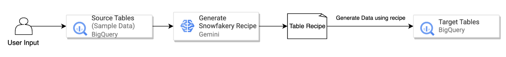
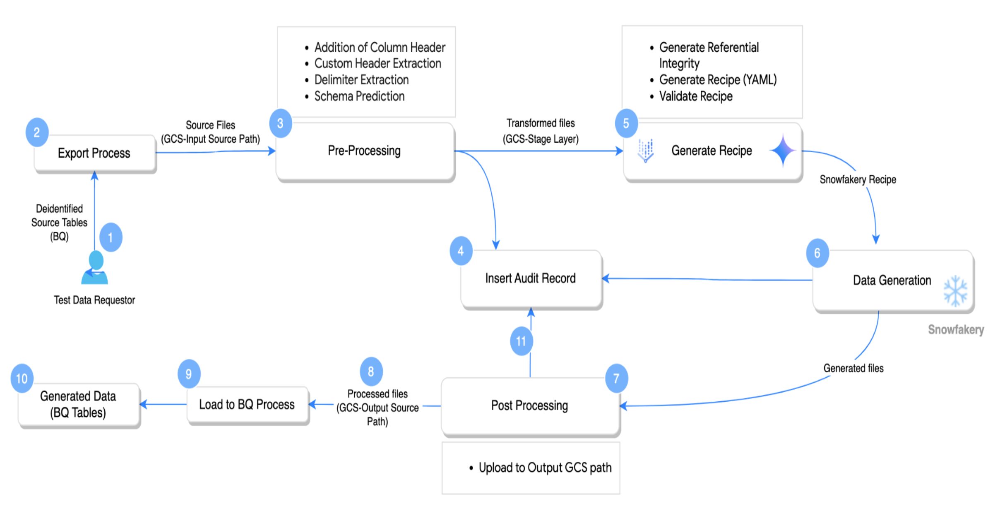

# Synthetic Data Generation Pipeline (BigQuery to BigQuery)

This project offers a Python-based pipeline designed to generate synthetic data. It works by leveraging **existing table structures and sample data within Google BigQuery**. The pipeline integrates **generative AI** for tasks like schema inference and data generation recipe creation, **Snowfakery** for the actual data synthesis, and **Google Cloud services** (BigQuery, Google Cloud Storage) for efficient data handling and orchestration. Additionally, it provides robust capabilities for pre-processing input data, post-processing generated data, and maintaining detailed audit logs.

---
## Design Flow



This high-level design outlines an AI-powered data pipeline. User provides the input and BigQuery Source Tables with sample data, which is feed into Gemini. The Gemini intelligently generates a Snowfakery Recipe. This recipe then drives the generation of data, which is subsequently loaded into BigQuery Target Tables.

---

## High Level Design



1. User will provide the BigQuery Source Tables
2. Export from BigQuery to GCS for Preprocessing
3. **Gemini Driven Pre-Processing** (Column name extraction, Delimiter Extraction)
4. Export the Pre-Processed File to staging GCS
5. Log the status to Audit Table
6. **Gemini Driven Referential Integrity Mapping**
7. **Gemini Driven SnowFakery recipes generation**
8. Generation of data based on the recipes
9. Post-processing of the generated file
10. Export the generated files to GCS output path
11. Import from GCS Output Path to BigQuery Target Tables
12. Log the status to Audit Table

---

## Setup and Usage

### Prerequisites

* **Python 3.x** installed.
* Access to a **Google Cloud Platform project** with the following APIs enabled:
    * BigQuery API
    * Google Cloud Storage API
    * Vertex AI API
* Appropriate **IAM permissions** for the service account or user running the scripts to access BigQuery, GCS, and Vertex AI.
* Google Cloud SDK configured (`gcloud auth application-default login`)
* Create the audit table in Bigquery usign the below DDL

```sql
CREATE TABLE `your_project_id.your_dataset_id.audit_log` (
  `batch_id` STRING,
  `gcs_bucket_name` STRING,
  `input_gcs_path` STRING,
  `header_gcs_path` STRING,
  `user_requested_table_count` INTEGER,
  `table_name` STRING,
  `column_names` STRING,
  `column_header_flag` BOOLEAN,
  `delimiter` STRING,
  `custom_header` STRING,
  `schema` STRING,
  `num_records_generated` INTEGER,
  `status` STRING,
  `error_message` STRING,
  `insert_timestamp` TIMESTAMP
)
OPTIONS(
  description = "Audit log for synthetic data generation and processing jobs."
);

```

### Installation

1.  Clone the repository or download the code files.
2.  Install the required Python packages:

    ```bash
    pip3 install -r requirements.txt
    ```

### Configuration

Modify **config_vars.py** with your specific GCP project details, BigQuery source/target information, GCS bucket name, table names, and desired synthetic record counts. Ensure the BigQuery audit table specified in **config_vars.py** exists with the expected schema (see **audit_utils.py** for fields like `batch_id`, `table_name`, `status`, etc.).

### Running the Pipeline

Execute the main script:

```bash
python3 main.py
```

---

## Key Features

* **BigQuery Integration**: Seamlessly reads data and schemas from source BigQuery tables and loads the generated synthetic data into target BigQuery tables.
* **Generative AI-Powered**: Utilizes generative models (e.g., Gemini) for:
    * Predicting schema (column names, data types) from sample data.
    * Identifying file properties like delimiters and header presence.
    * Generating Snowfakery recipes based on inferred schemas and sample data.
* **Synthetic Data Generation with Snowfakery**: Employs **Snowfakery** to create realistic synthetic data based on dynamically generated recipes.
* **Data Pre-processing**:
    * Extracts sample data from source files (exported from BigQuery or provided via GCS).
    * Predicts and handles column headers.
    * Detects file delimiters.
    * Prepares data for recipe generation by staging it in GCS, adding headers if necessary.
* **Data Post-processing**:
    * Adjusts the delimiter of generated files to match input formats.
    * Removes or adds column headers as per the original data structure.
    * Adds custom headers if specified.
    * Counts the number of generated records.
    * Uploads finalized synthetic data to a GCS output path.
* **Audit Logging**: Records detailed information about each processing step, including batch ID, input/output paths, record counts, status, and timestamps into a designated BigQuery audit table.
* **Google Cloud Storage (GCS) Utilization**: Uses **GCS** for staging intermediate data (e.g., exported BigQuery tables, pre-processed files) and storing final synthetic data outputs before loading to BigQuery.
* **Customizable Configuration**: Allows users to easily configure project settings, BigQuery details, GCS paths, table names, and desired record counts for synthetic data generation through a central configuration file (**config_vars.py**).

---

## Low Level Design


## Workflow

The data generation process is orchestrated by **main.py** and follows these general steps:

### Initialization

A unique **batch_id** is generated for the run. Google Cloud clients (BigQuery, Vertex AI) are initialized, and dynamic GCS paths for output and staging are constructed using the **batch_id**. Local directories for Snowfakery output are also prepared.

### Export BigQuery Data to GCS (Conditional)

If **SOURCE_TYPE** in **config_vars.py** is set to "**BigQuery**", specified source tables are exported from BigQuery to a staging area in GCS as CSV files. The GCS paths of these exported files are tracked.

### File Pre-processing (file_processing_utils.py)

For each input file (from GCS):

1.  Sample rows are extracted.
2.  A generative model predicts if a header row is present.
3.  Custom headers (if any specific format exists) are extracted.
4.  The schema (column names and data types) is predicted using a generative model.
5.  Column names are extracted from the predicted schema.
6.  If the original file doesn't have a header, the predicted column names are prepended to a new version of the file in a GCS staging location. Otherwise, the file is copied as is to the staging location.
7.  The file delimiter is detected.
8.  Attributes for each table (header flag, custom header, schema, delimiter, staging GCS path) are stored.

### Start Audit Log (audit_utils.py)

An initial entry for each table being processed is logged to the BigQuery audit table, marking the status as "**In Progress**".

### Generate Synthetic Data (snowfakery_gen.py)

* **Recipe Generation**: For each table, a **Snowfakery recipe** (YAML format) is generated. This involves using a generative model (Gemini) with prompts from **prompts_collection.py**, providing the model with the inferred schema and sample data (from the staged GCS files). The model generates a recipe, which may undergo correction steps (e.g., for YAML syntax, curly brace usage). Table relationships are identified (using the generative model and combined schemas) to refine the recipes with appropriate primary/foreign key handling.
* **Data Generation**: The generated and refined YAML recipes are updated with user-defined record counts from **config_vars.py**. Snowfakery's `generate_data` function is called with the updated recipes to produce synthetic data files (CSV) in a local batch-specific directory.

### File Post-processing (file_processing_utils.py)

For each generated synthetic data file (locally):

1.  The number of data records generated is counted.
2.  The file's delimiter is converted to match the original input file's delimiter (if different from CSV's comma).
3.  The column header is removed if the original source file did not have one.
4.  A custom header (if extracted during pre-processing) is added to the top of the file.
5.  The processed file is uploaded to the final GCS output path for that table and batch.
6.  Table attributes are updated with the count of generated records and the final output GCS path.

### Load Data to BigQuery (bq_ops.py)

For each table, the generated and post-processed synthetic data is loaded from its GCS output path into the corresponding target BigQuery table. The target table is created if it doesn't exist, using the schema of the original source table. Data is appended to the target table.

### End Audit Log (audit_utils.py)

A final entry for each table is logged to the BigQuery audit table, updating the status to "**Completed**" and recording the number of records generated.

### Cleanup

The local directory created for Snowfakery outputs for the current batch is removed.

---

## Module Descriptions

* **main.py**: The main script that orchestrates the entire synthetic data generation pipeline from start to finish.
* **config_vars.py**: Contains all the necessary configuration variables for the project, such as GCP project IDs, BigQuery dataset and table names, GCS bucket names, and desired record counts for generation.
* **bq_ops.py**: Handles all BigQuery related operations, including exporting tables from BigQuery to GCS, creating target tables (copying schema from source tables) if they don't exist, and loading data from GCS into BigQuery tables.
* **gcs_ops.py**: Manages interactions with Google Cloud Storage. Functions include appending headers to files in GCS, retrieving filenames and sample rows from GCS files, uploading local files to GCS, and reading GCS files to determine properties like delimiters using a generative model.
* **file_processing_utils.py**: Contains utilities for pre-processing input source files and post-processing the synthetically generated files.
    * **Pre-processing** involves: determining if a header exists, extracting custom headers, predicting schema, extracting column names, appending headers to files in GCS if needed, and detecting file delimiters.
    * **Post-processing** involves: counting generated records, converting delimiters, removing column headers if necessary, adding custom headers, and uploading the final files to GCS.
* **snowfakery_gen.py**: Responsible for the core synthetic data generation. It uses generative AI (Gemini) along with prompts from **prompts_collection.py** to generate Snowfakery recipes based on table schemas and sample data. It then uses these recipes to invoke Snowfakery and produce the synthetic data files. It also handles relationship building between tables for more consistent data.
* **audit_utils.py**: Manages logging audit trails to a specified BigQuery table. It logs the start and end of the processing for each table within a batch, including details like GCS paths, record counts, and status.
* **prompts_collection.py**: A collection of prompt strings fed to the generative AI model (Gemini) for various tasks. These tasks include delimiter prediction, custom header extraction, schema prediction, Snowfakery recipe creation, YAML correction, relationship building, and object name correction in recipes.
* **requirements.txt**: Lists all the Python package dependencies required to run the project, such as `google-cloud-aiplatform`, `snowfakery`, `pandas`, etc.

---

## Customization Options

The primary way to customize the pipeline is by modifying the **config_vars.py** file. Key parameters include:

* **PROJECT_ID**: Your Google Cloud Project ID.
* **LOCATION**: The GCP region for services like Vertex AI.
* **target_bq_project_id**: Project ID for the target BigQuery dataset.
* **target_bq_dataset**: Dataset name in BigQuery where synthetic data will be loaded.
* **source_bq_project_id**: Project ID for the source BigQuery dataset (if **SOURCE_TYPE** is "**BigQuery**").
* **source_bq_dataset**: Dataset name in BigQuery from which source data/schema is read.
* **audit_table**: Full path to the BigQuery table used for audit logging (e.g., `project.dataset.table`).
* **input_bq_table_names**: A comma-separated string of full BigQuery table names to be used as sources (e.g., `project.dataset.table1,project.dataset.table2`).
* **user_counts**: A Python dictionary mapping table names (short names, e.g., "Dim_Account") to the desired number of synthetic records to generate for that table.
* **gcs_bucket_name**: The name of the GCS bucket to be used for staging and output files.
* **SOURCE_TYPE**: Specifies the source of the data. Can be "**BigQuery**" (to export from BQ) or potentially "**GCS**" (if files are already in GCS, though the current main.py primarily details the BQ export flow).
* **LOCAL_OUTPUT_BASE_DIR**: The base local directory where Snowfakery will generate output files before they are post-processed and uploaded to GCS.
