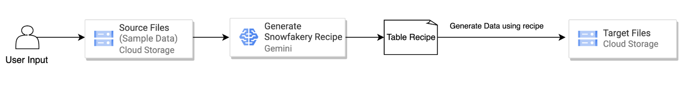
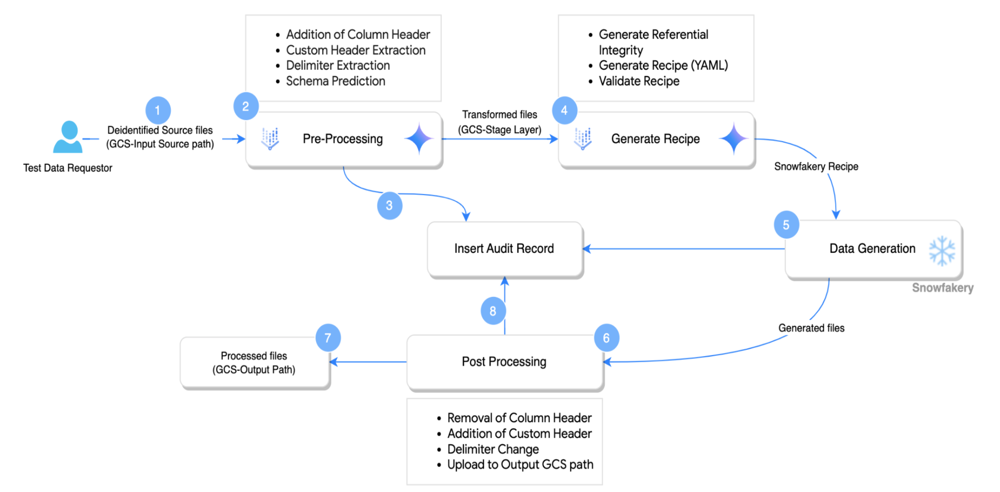
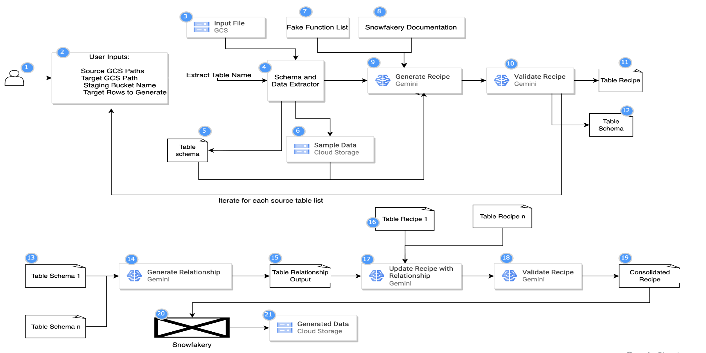

# Synthetic Data Generation Pipeline: GCS to GCS

This project offers a Python-based pipeline designed to generate synthetic data. It works by leveraging **existing sample data in Google Cloud Storage(GCS)**. The pipeline integrates **generative AI** for tasks like schema inference and data generation recipe creation, **Snowfakery** for the actual data synthesis, and **Google Cloud services** (BigQuery, Google Cloud Storage) for efficient data handling and orchestration. Additionally, it provides robust capabilities for pre-processing input data, post-processing generated data, and maintaining detailed audit logs.

---

## Design Flow



This high-level design outlines an AI-powered data pipeline. User provides the input and GCS Path with sample data, which is feed into Gemini. The Gemini intelligently generates a Snowfakery Recipe. This recipe then drives the generation of data, which is subsequently loaded into target GCS directory

---

## High Level Design




1. User will provide the Sources Files in GCS
2. **Gemini Driven Pre-processing** (Addition of Column Header, Custom Header Extraction, Delimiter Extraction, Schema Prediction)
3. Export the Pre-Processed File to staging GCS
4. Log the status to Audit Table
5. **Gemini Driven Referential Integrity Mapping**
6. **Gemini Driven SnowFakery recipes generation**
7. Generation of data based on the recipes
8. **Post-processing of the generated file** (Column Header Removal, Addition of Custom Header, Delimiter Conversion)
9. Export the generated files to GCS output path
10. Log the status to Audit Table

---

## Setup and Usage

### Prerequisites

* **Python 3.x** installed.
* Access to a **Google Cloud Platform project** with the following APIs enabled:
    * BigQuery API
    * Google Cloud Storage API
    * Vertex AI API
* Appropriate **IAM permissions** for the service account or user running the scripts to access BigQuery, GCS, and Vertex AI.
* Google Cloud SDK configured (`gcloud auth application-default login`)
* Create the audit table in Bigquery usign the below DDL

```sql
CREATE TABLE `your_project_id.your_dataset_id.audit_log` (
  `batch_id` STRING,
  `gcs_bucket_name` STRING,
  `input_gcs_path` STRING,
  `header_gcs_path` STRING,
  `user_requested_table_count` INTEGER,
  `table_name` STRING,
  `column_names` STRING,
  `column_header_flag` BOOLEAN,
  `delimiter` STRING,
  `custom_header` STRING,
  `schema` STRING,
  `num_records_generated` INTEGER,
  `status` STRING,
  `error_message` STRING,
  `insert_timestamp` TIMESTAMP
)
OPTIONS(
  description = "Audit log for synthetic data generation and processing jobs."
);

```
    

### Installation

1.  Clone the repository or download the code files.
2.  Install the required Python packages:

    ```bash
    pip3 install -r requirements.txt

### Configuration

Modify **config_vars.py** with your specific GCP project details, GCS source/target information, GCS bucket name, and desired synthetic record counts. Ensure the BigQuery audit table specified in **config_vars.py** exists with the expected schema (see **audit_utils.py** for fields like `batch_id`, `table_name`, `status`, etc.).

### Running the Pipeline

Execute the main script:

```bash
python3 main.py
```

---


## Key Features

* **Flexible Data Source**: Supports input data from both **Google Cloud Storage (CSV files)** and **BigQuery tables**.
* **AI-Powered Schema Handling**:
    * If header files are provided in GCS, their schema is used directly.
    * If header files are not provided, the system uses Google's **Gemini model** to predict the schema, detect headers, and identify delimiters from the sample input files.
* **Synthetic Data Generation**: Utilizes **Snowfakery** to generate synthetic data based on recipes. These recipes can be partly auto-generated with the help of the Gemini model by analyzing the input schema and sample data.
* **Pre-processing**:
    * Extracts sample rows from input files.
    * Predicts if a header row is present.
    * Extracts custom headers if they follow a specific format ('HEADER...').
    * Predicts or reads schema (column names and types).
    * Appends column names to files if the original file lacks a header, creating staging files.
    * Detects the delimiter of the input files.
* **Post-processing**:
    * Counts the number of generated records.
    * Converts the delimiter of the generated output files to match the input file's delimiter if they differ.
    * Removes column headers from the generated files if the original input did not have them.
    * Adds custom headers to the output files if they were present in the input.
    * Uploads the final processed synthetic data to a specified GCS output path.
* **Audit Logging**: Captures detailed logs for each step of the process, including batch ID, input/output paths, schema details, record counts, and status. These logs are stored in a BigQuery table for traceability and monitoring.
* **Customizable Output**: Allows users to specify the number of synthetic records to generate for each table.
* **Modular Design**: The code is organized into logical modules for GCS operations, BigQuery operations, file processing, Snowfakery recipe generation, audit logging, and configuration.

---

## Low Level Design




## Workflow

The data generation process is orchestrated by **main.py** and follows these general steps:

### Initialization

A unique **batch\_id** is generated. Google Cloud services (Vertex AI, BigQuery) are initialized. Dynamic GCS paths for output and staging are defined using the **batch\_id**.

### Data Source Handling (if SOURCE\_TYPE is "BigQuery")

If the source is BigQuery, specified tables are exported as CSV files to a staging area in GCS. The paths to these CSVs then become the `input_gcs_path` for further processing.

### File Pre-processing (file\_processing\_utils.py)

For each input file specified in `config_vars.input_gcs_path`:

1.  Sample rows are extracted.
2.  The Gemini model predicts if a header row exists.
3.  The Gemini model attempts to extract any custom header.
4.  **Schema Determination**:
    * If a corresponding header file is provided in `config_vars.header_gcs_path`, its content is used as the schema.
    * Otherwise, the Gemini model predicts the schema (column names and data types) based on the file name and sample rows.
5.  Column names are extracted from the schema.
6.  If the original file has no header, the extracted/predicted column names are appended to a new version of the file in a GCS staging path. Otherwise, the file is copied to staging as-is.
7.  The delimiter of the input file is detected using the Gemini model.
8.  All extracted attributes (header flag, custom header, schema, delimiter, staging path, etc.) are stored in the `table_attributes` dictionary.

### Audit Logging - Start (audit\_utils.py)

An initial entry for each table is logged to the BigQuery audit table with the status "**In Progress**". This entry includes details like batch ID, input paths, schema, and user-requested counts.

### Synthetic Data Generation (snowfakery\_gen.py)

* **Recipe Generation**: For each table, a **Snowfakery recipe** is generated. The Gemini model assists by creating a recipe draft based on the table's schema (from `table_attributes`) and sample records (from the staging GCS path). Prompts from **prompts\_collection.py** guide this process. The individual YAML recipes are combined. Table relationships are inferred by Gemini (if multiple tables exist) to enhance the recipe. The combined recipe is further refined (e.g., correcting object names, ensuring proper YAML syntax). The `user_counts` from **config\_vars.py** are used to set the number of records to generate for each object in the Snowfakery recipe.
* **Data Generation**: The final Snowfakery recipe is executed, generating synthetic data files (CSV by default) in a local temporary directory specific to the current **batch\_id**.

### File Post-processing (file\_processing\_utils.py)

For each generated local data file:

1.  The number of generated data records (excluding header) is counted.
2.  If the input file's delimiter (from `table_attributes`) was different from CSV's comma, the generated file's delimiter is converted.
3.  If the original input file did not have a header (as per `column_header_flag` in `table_attributes`), the header row is removed from the generated file.
4.  If a `custom_header` was extracted during pre-processing, it is added to the top of the generated file.
5.  The processed file is uploaded from the local temporary directory to the final GCS output path (`output_gcs_path` defined in `main.py`). The path to this final GCS file is stored in `table_attributes`.

### Audit Logging - End (audit\_utils.py)

A final entry for each table is logged to the BigQuery audit table with the status "**Completed**" and the actual `num_records_generated`.

### Cleanup

The local temporary directory created for Snowfakery output is removed.

---

## Configuration (config\_vars.py)

The pipeline's behavior is primarily controlled by the **config\_vars.py** file. Key configuration options include:

* **PROJECT\_ID**: Your Google Cloud Project ID.
* **LOCATION**: The Google Cloud region/location (e.g., "us-central1").
* **input\_gcs\_path**: A dictionary mapping table names to their GCS input file paths.
    * Example: `{"Dim_Customer": "gs://bucket/path/to/Dim_Customer.csv"}`
* **header\_gcs\_path**: An optional dictionary mapping table names to their corresponding header file paths in GCS. If a table has an entry here, its schema will be read from this file instead of being predicted by Gemini.
    * Example: `{"Dim_Date": "gs://bucket/path/to/header_Dim_Date.csv"}`
* **user\_counts**: A dictionary specifying the desired number of synthetic records to generate for each table.
    * Example: `{"Dim_Customer": 100, "Fact_Transactions": 500}`
* **gcs\_bucket\_name**: The GCS bucket name used for storing output and staging files.
* **audit\_table**: The full BigQuery table ID for storing audit logs (e.g., `your_project.your_dataset.audit_log_table`).
* **SOURCE\_TYPE**: Specifies the source of the data. Currently supports "**GCS**". If you intend to use BigQuery as a source, this would be set to "**BigQuery**", and additional BigQuery-specific configurations (like `input_bq_table_names`, `source_bq_project_id`, `source_bq_dataset`, `target_bq_project_id`, `target_bq_dataset`) would be relevant.
* **LOCAL\_OUTPUT\_BASE\_DIR**: The base local directory where Snowfakery will temporarily write generated files before they are uploaded to GCS. A subfolder named with the **batch\_id** will be created here.
* Dynamic paths like `output_gcs_path`, `staging_gcs_path`, and `staging_path_bigquery` are constructed in `main.py` using the `gcs_bucket_name`, `PROJECT_ID`, and the generated **batch\_id**.

---

## File Descriptions

* **main.py**: The main script that orchestrates the entire data generation pipeline.
* **config\_vars.py**: Contains all the necessary configurations for the pipeline, such as project ID, GCS paths, BigQuery table names, and user-defined record counts.
* **gcs\_ops.py**: Handles all Google Cloud Storage operations, including reading files, extracting sample rows, appending headers, and uploading files.
* **bq\_ops.py**: Manages operations related to Google BigQuery, such as exporting tables to GCS (if **SOURCE\_TYPE** is "**BigQuery**") and potentially loading generated data back to BigQuery (though the current primary target is GCS).
* **file\_processing\_utils.py**: Contains functions for pre-processing input files (header detection, schema prediction using Gemini, delimiter detection) and post-processing generated files (delimiter conversion, header manipulation).
* **snowfakery\_gen.py**: Responsible for generating Snowfakery recipes (with assistance from Gemini) and then running Snowfakery to produce synthetic data based on these recipes.
* **audit\_utils.py**: Manages the logging of audit trails to a specified BigQuery table, recording the start and end of processing for each table along with relevant metadata.
* **prompts\_collection.py**: Stores the various prompts used to interact with the Gemini model for tasks like delimiter prediction, header extraction, schema prediction, and Snowfakery recipe generation.
* **requirements.txt**: Lists all the Python dependencies required to run the project.

---

## Customization

* **Input Data**: Modify `input_gcs_path` in **config\_vars.py** to point to your source CSV files in GCS. If using BigQuery as a source, configure the relevant BigQuery settings and set `SOURCE_TYPE="BigQuery"`.
* **Header Files**: Provide paths to header files in `header_gcs_path` if you want to use predefined schemas instead of Gemini's prediction.
* **Output Volume**: Adjust `user_counts` in **config\_vars.py** to control the number of synthetic records generated for each table.
* **Gemini Prompts**: The prompts used for interacting with the Gemini model are located in **prompts\_collection.py**. These can be fine-tuned if specific modifications to the AI's behavior are needed for schema prediction or recipe generation.
* **Audit Table Schema**: The audit logging functions in **audit\_utils.py** assume a specific schema for the BigQuery audit table. Ensure your audit table matches this structure or modify the functions accordingly.
* **Snowfakery Features**: For more advanced synthetic data needs, the recipe generation logic in **snowfakery\_gen.py** can be extended to leverage more of Snowfakery's capabilities.