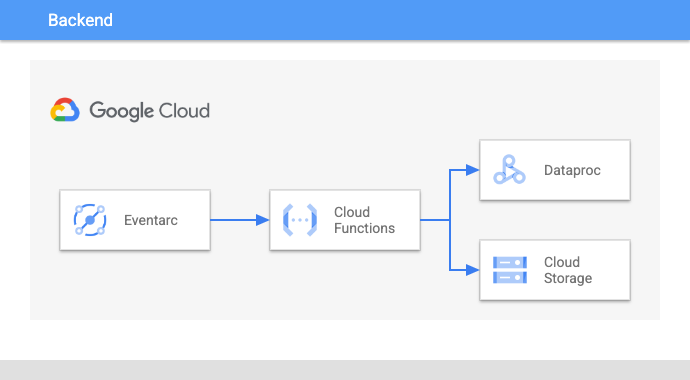

# dataproc-event-driven-spark-recommendations

----

## Table Of Contents

1. [Use Case](#use-case)
2. [About](#about)
3. [Architecture](#architecture)
4. [Guide](#guide)
5. [Sample Output](#sample-output)

----

## use-case

Use [Google Cloud Functions](https://cloud.google.com/functions) to analyze [Cloud Dataproc](https://cloud.google.com/dataproc) clusters and recommend best practices for Apache Spark jobs.  Also logs cluster configurations for future reference.

----

## about

This repository contains infrastructure-as-code to set up an automated, event-driven monitoring tool.  When a Dataproc Cluster is created within a specified project/region, a Cloud Function will be triggered that analyzes the configuration of every dataproc cluster in that specified project/region.  The Cloud Function will output a configuration of each cluster to [Google Cloud Storage](https://cloud.google.com/storage) as well as a spark recommendation report.  This report will recommend spark properties based on the dataproc cluster configuration (machine type, number of nodes) and Google's Apache Spark best practices.

----

## architecture



----

## guide


#### 1. To get started, update setup.sh with environment variables, then run.

```bash
./scripts/setup.sh -i <project-id> -n <project-number> -r <region> -z <zone>
```

#### 2. To test with sample dataproc cluster, update testing.sh with environment variables, then run.

```
./scripts/test.sh -i <project-id> -r <region> -c <cluster-name>
```

#### 3. View results in the newly created GCS bucket:

configuration library:

```
gs://<project-id>-dataproc-cluster-analysis/dataproc-cluster-configuration-library/
```

recommendations:

```
gs://<project-id>-dataproc-cluster-analysis/dataproc-cluster-spark-recommendations/
```

----

## sample-output

```json
{
    "current_configuration": {
        "cluster_name": "dp-cluster",
        "machine_type": "n1-standard-4",
        "nodes": 5,
        "vcores": 4,
        "ram_per_node": 15360,
        "spark.executor.cores": "2",
        "spark.driver.cores": "",
        "spark.executor.instances": "2",
        "spark.executor.memory": "5586m",
        "spark.driver.memory": "3840m",
        "spark.executor.memoryOverhead": "",
        "spark.default.parallelism": "",
        "spark.sql.shuffle.partitions": "",
        "spark.shuffle.spill.compress": "",
        "spark.io.compression.codec": "",
        "spark.dynamicAllocation.enabled": "",
        "spark.shuffle.service.enabled": ""
    },
    "recommendations": {
        "spark:spark.executor.cores": 5,
        "spark:spark.driver.cores": 5,
        "spark:spark.shuffle.spill.compress": "true",
        "spark:spark.checkpoint.compress": "true",
        "spark:spark.io.compression.codec": "snappy (if splittable files), lz4 (otherwise)",
        "spark:spark.shuffle.service.enabled": "true (if multiple spark apps on cluster), false (otherwise)",
        "spark:spark.dynamicAllocation.enabled": "true (if multiple spark apps on cluster), false (otherwise)",
        "spark:spark.executor.instances": 4,
        "spark:spark.executor.memory": "12902m",
        "spark:spark.driver.memory": "12902m",
        "spark:spark.executor.memoryOverhead": "1434m",
        "spark:spark.default.parallelism": 40,
        "spark:spark.sql.shuffle.partitions": 40
    }
}
```
