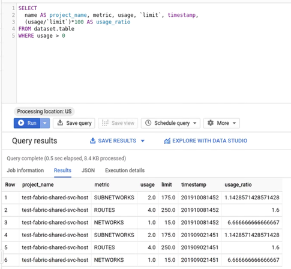
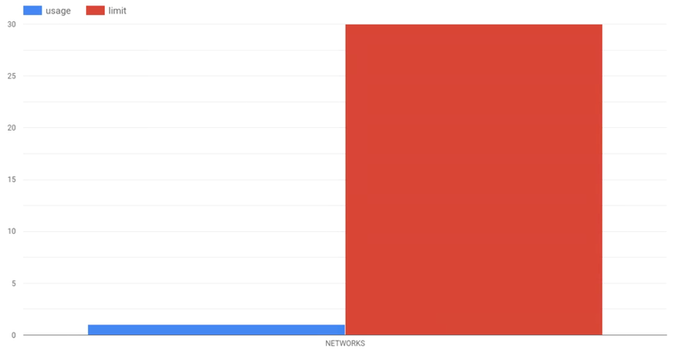

# GCE quota exporter

This tool serves a single, simple purpose: computing [GCE resource
quota](https://cloud.google.com/compute/quotas) usage and exporting it to
BigQuery for storage and analysis.

This tool can be used to list resource quoa usage all projects visible for the
user, with an optional filtering on a folder.

It does this by:

* Using a gcloud command to list all projects visible for the user (in a folder
  if specified)
* For each project, getting the current resource quota utilization and limits
  and exporting it to a file
* Adding the current timestamp to the file 
* Loading the resource quota utilization and limits into the BigQuery dataset

SQL commands can then be ran on the BigQuery, for example getting the
utilization to limit ratio for resources used in the projects: 
```sql
SELECT 
  name AS project_name, metric, usage, `limit`, timestamp,
  (usage/`limit`)*100 AS usage_ratio
FROM test_import_ale.demo_quotas
WHERE usage > 0
```



A Data Studio dashboard can then be constructed based on the BigQuery dataset to
display quota usage and limits for GCE resources in GCP projects.



## Usage

The tool is a bash script which should work on most linux distributions. It
requires gcloud CLI to be installed and configured.

It should be ran by a service account with the `compute.projects.get`
permission.

To list quotas for all projects visible to the SA, you can use:
`./gce-quota-export.sh`.

Optionally, you can filter on a specific folder:

To list quotas for all projects visible to the SA in a folder only, you can use
the optional folder argument: `./gce-quota-export [folder-id]`. You need to
specify the folder name as an input as folder names are not unique.

To get your folder id, you can use the following;
```bash
gcloud resource-manager folders list \
    --organization `gcloud organizations list --format="value(ID)"`
```