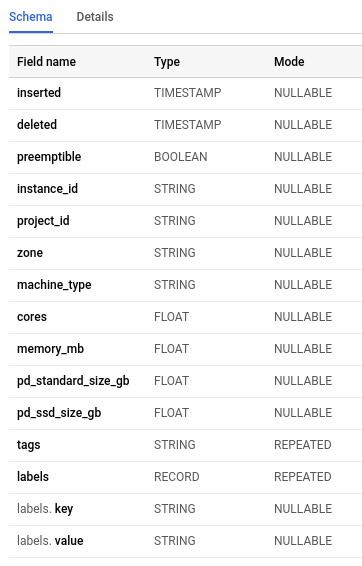
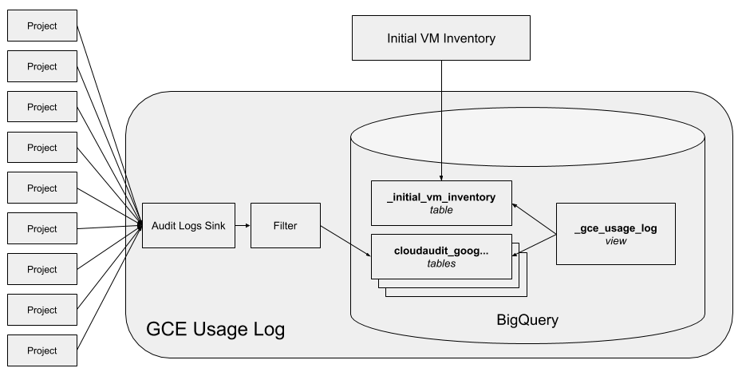
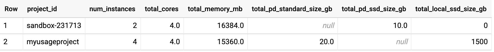

# GCE Usage Log

This project is designed to provide you with tools to capture an ongoing record of your GCE instances and their associated disk usage.

As your GCP organization grows, you may want to understand the business context of your overall GCE instance footprint. An accounting of your GCE resource usage can be analyzed to optimize autoscaling strategies, to aid in capacity forecasting, and to assist in your internal resource accounting. Further insights can be drawn by segmenting your fleet based on labels or network tags (to represent entities such as production environment or team).

## 1. Overview

This project will capture events relevant to your GCE instance usage and log them in BigQuery in way that surfaces your GCE vCPUs (cores), RAM, and attached persistent (standard and SSD) or scratch (local SSD) disks, sliceable by zone, project, network tags, labels, and whether the instance was preemptible.

This solution entails three components: an organization-level audit log sink, a process to inventory your currently running GCE instances, and a BigQuery view.

### 1.1 Google Cloud Audit Logging

An organization-level audit log sink captures `create` and `delete` events on any GCE instance, and stores those into daily tables (`cloudaudit_googleapis_com_activity_<date>`) in a BigQuery dataset. These events include relevant metadata about the VM such as machine type, and details about the attached persistent storage.

The audit logs will have separate entries for the creation and deletion of an instance, but these entries are generic audit log entries and we’ll need to do some additional work to surface the metadata interesting to us. As an example, the audit log doesn’t record the actual number of vCPUs or amount of memory that an instance has, but instead it records the machine type.

### 1.2 Initial VM Inventory

A process is run to capture your existing footprint into a table (`_initial_vm_inventory`) in the same BigQuery dataset. This is required to capture the state of running instances for which a `create` instance event has not already been logged.

### 1.3 BigQuery View

A view is created which joins the audit log and initial VM inventory tables to provide a more user-friendly view (`_gce_usage_log`), calculating cores and RAM from the machine type listed in the audit log events.

The resulting schema of the view looks like this:



### 1.4 Component Architecture

Bringing it all together, we can visualize how the components interact with this diagram.



## 2. Setup

Let’s go through the steps to configure audit logging, scan your VM inventory, and create the BigQuery view.

We recommend operating in the Cloud Shell as it already has the necessary tools installed.

### 2.1 Prerequisites

Before starting, let’s gather some prerequisite information.

* PROJECT_ID: The ID of the project
* BQ_LOCATON: BigQuery location to use for your dataset
* ORG_NUMBER: The numeric id of the organization. Find yours by invoking `gcloud organizations list`

Now export them as environment variables in your Cloud Shell for subsequent use.

```bash
export PROJECT_ID=myusageproject
export BQ_LOCATION=EU
export ORG_NUMBER=622243302570
```

### 2.2 Permissions

To follow these interactive instructions, you will need permissions to:

* Create and manage a BQ dataset in the project you’ve chosen
  * bigquery.datasets.create
  * bigquery.tables.create
  * bigquery.tables.getData
  * bigquery.tables.updateData

And you will need permissions at the organization level to:

* Create an organization-level audit log sink
  * roles/logging.configWriter
* Scan your inventory:
  * compute.disks.get
  * compute.instances.get
  * compute.instances.list
  * compute.zones.get
  * compute.zones.list
  * resourcemanager.organizations.get
  * resourcemanager.projects.get
  * resourcemanager.projects.list

You will need these permissions only during initial setup.

### 2.3 Preparing the audit log dataset

Let’s walk through the steps necessary to create and populate the dataset.

#### 2.3.1 Creating the dataset

Now, let’s create the dataset inside the project.

```bash
bq mk --location=${BQ_LOCATION} -d "${PROJECT_ID}:gce_usage_log"
```

#### 2.3.2 Create the audit log sink

```bash
gcloud logging sinks create gce_usage \
  bigquery.googleapis.com/projects/${PROJECT_ID}/datasets/gce_usage_log \
  --log-filter='resource.type="gce_instance" AND
  (protoPayload.methodName:"compute.instances.insert" OR
  protoPayload.methodName:"compute.instances.delete")' \
  --organization=${ORG_NUMBER} --include-children
```

This command will create and return a service account ID, such as serviceAccount:o125240632470-886280@gcp-sa-logging.iam.gserviceaccount.com.

Note down the account name, as we'll use it in the next step!

#### 2.3.3 Allow the service account to write to our dataset

Taking the service account created in the last step, let’s assign to it the narrowest privileges on our dataset - in this case, “BigQuery Data Editor.”

This can be done a number of ways, and here we’ll just follow [the manual process](https://cloud.google.com/bigquery/docs/dataset-access-controls#controlling_access_to_a_dataset).

#### 2.3.4 Test that the dataset is receiving audit log entries

Create a GCE instance in any project in your GCP organization, and you should see an entry arrive in the `gce_usage_log` dataset.

The daily BigQuery tables named `cloudaudit_googleapis_com_activity_<date>` will appear in your project the first time a GCE instance is created or deleted after the audit log sink is created. If you are not seeing tables being created, you may have a permissions issue. Troubleshoot by looking at [your project activity](https://console.cloud.google.com/home/activity) in the project where you created the instance. There you should see your audit log sink service account creating the daily audit log BigQuery table.

### 2.4 Scanning for existing GCE instances

At this point, you are collecting the raw audit log events representing creation or deletion of GCE instances. The missing link, however, is the events for the set of instances which were created before the sink started generating these events.

We’ll run a process to populate a new, separate table in our dataset with an inventory of the currently running instances in your GCP organization to fill in this missing link.

This process only needs to be run once and would benefit from a low-latency network location to GCP. In our example we will run it in the cloud shell.

#### 2.4.1 Clone the code repository

Clone `https://github.com/GoogleCloudPlatform/professional-services` and `cd` into the `tools/gce-usage-log` directory inside the repository.

#### 2.4.2 Authenticate your shell session

You'll need to authenticate yourself to be allowed to call APIs.

```bash
gcloud auth application-default login
```

#### 2.4.3 Run the process

This process uses the CloudResourceManager APIs to fetch all the projects your account has access to. **Please ensure that your account only has access to a single GCP organization**, otherwise you will fetch projects from multiple orgs.

Execute the process:

```bash
mvn package && \
java -jar target/gce-usage.jar initial-vm-inventory \
  ${PROJECT_ID} ${ORG_NUMBER} gce_usage_log
```

This process will run and create a new BigQuery table called _`initial_vm_inventory` in your dataset, which should contain one line for every instance that was running in your GCP organization. You may need to reload the BQ UI in order to see this new table.

If you’ve decided not to run in the cloud shell, you may need to install `maven` yourself.

### 2.5 Creating the BigQuery view

Now we have the data required to calculate an aggregate view of our GCE usage. Let’s create a BigQuery view to make the data more friendly.

#### 2.5.1 Create the BigQuery view

Let’s create the view from the `gce_usage_view.sql` file in the repository.

Note: As BigQuery views require fully-qualified table references, we need to insert our project name before creating the view.

```bash
export USAGE_VIEW=$(cat gce_usage_view.sql | sed "s/_PROJECT_/$PROJECT_ID/g")
```

Now create the view.

```bash
bq mk \
--use_legacy_sql=false \
--description "GCE Usage" \
--view "${USAGE_VIEW}" \
--project_id "${PROJECT_ID}" \
gce_usage_log._gce_usage_log
```

## 3. Using the dataset

Now that your dataset is ready, how do you query it?

To find resource usage at a point in time `t`, query the view for records that were inserted before `t`, and deleted after `t` (or not deleted yet).

Here we also group by project.

```bash
SELECT
  project_id,
  count(instance_id) as num_instances,
  SUM(cores) as total_cores,
  SUM(memory_mb) as total_memory_mb,
  SUM(pd_standard_size_gb) as total_pd_standard_size_gb,
  SUM(pd_ssd_size_gb) as total_pd_ssd_size_gb
  SUM(local_ssd_size_gb) as total_local_ssd_size_gb
FROM `gce_usage_log._gce_usage_log`

WHERE inserted < '2019-08-23 08:00:00.000 UTC'
  AND ('2019-08-23 08:00:00.000 UTC' < deleted OR deleted is null)

GROUP BY project_id
```

Your results will look something like:



You can also filter on network tags, or labels, by adding them to the query:

```bash
  AND 'ssh' IN UNNEST(tags)
  AND ('env', 'development') IN UNNEST(labels)
```

### 3.3 Caveats

The schema from audit logs is dynamic and may not include the labels or tags fields depending on whether any records contain those fields.

Practically, if you do not have any GCE instances with labels or network tags in the latest partition of the `cloudaudit_googleapis_com_activity_` table:

* any query to the view will fail
* the view cannot be created
