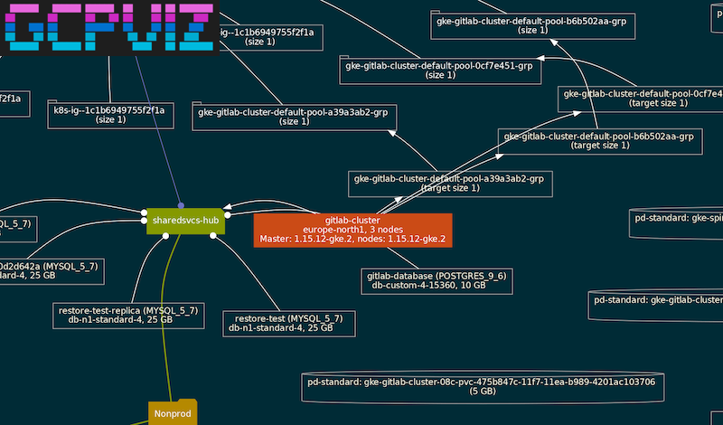
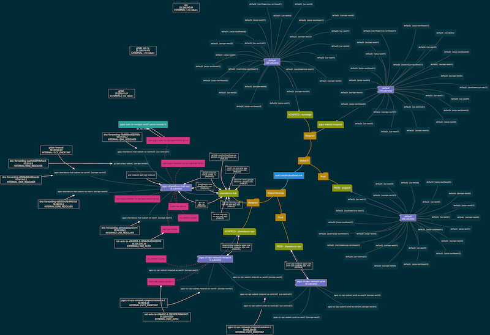
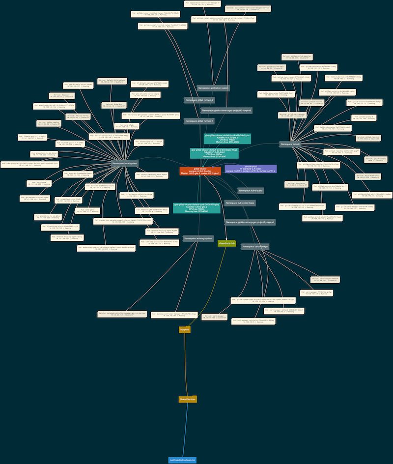
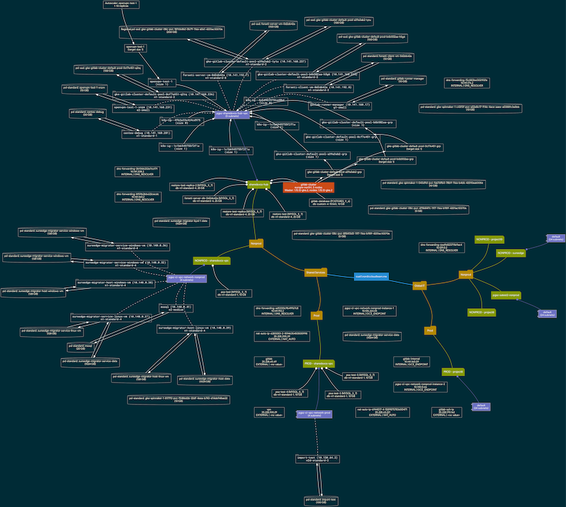
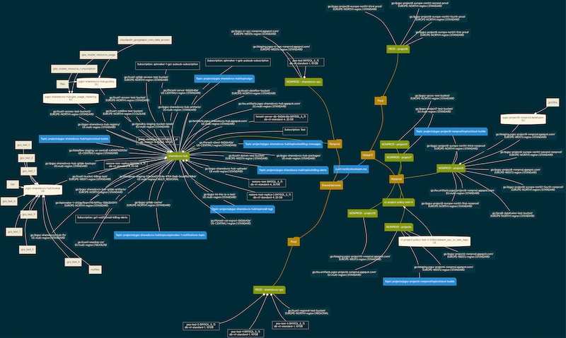

# gcpviz - Cloud Asset Inventory visualization



`gcpviz` is a visualization tool that takes input from [Cloud Asset Inventory](https://cloud.google.com/asset-inventory/docs/overview),
creates relationships between assets and outputs a format compatible with [`graphviz`](http://graphviz.gitlab.io/). You can use
it to visualize all resources in the export (examples are provided for the basic use cases).

## Requirements

The tool requires the following:
- Golang 1.14 (or later)
- Graphviz

## Installing locally

You can install the tool locally by running:

```sh
go install github.com/GoogleCloudPlatform/professional-services/tools/gcpviz/cmd/gcpviz
```
## Usage

```sh

  ██████   ██████ ██████  ██    ██ ██ ███████ 
 ██       ██      ██   ██ ██    ██ ██    ███  
 ██   ███ ██      ██████  ██    ██ ██   ███   
 ██    ██ ██      ██       ██  ██  ██  ███    
  ██████   ██████ ██        ████   ██ ███████

  -alsologtostderr
        log to standard error as well as files
  -cpuprofile file
        write cpu profile to file
  -export-file string
        location of JSON export file (default "graph.json")
  -graph-file string
        location of Graph & Asset database file (default "graph.db")
  -graph-parameter value
        override graph style parameters using SJSON (ie. "options.overlap=vpsc")
  -graph-title string
        Title for the graph
  -labels-file string
        location of node/edge labels file (default "labels.yaml")
  -log_backtrace_at value
        when logging hits line file:N, emit a stack trace
  -log_dir string
        If non-empty, write log files in this directory
  -logtostderr
        log to standard error instead of files
  -memprofile file
        write memory profile to file
  -mode string
        mode of operation (generate, visualize, export)
  -no-banner
        disables banner
  -no-color
        disables color in output
  -query-file string
        location of Gizmo query file (default "query.js")
  -query-parameter value
        additional parameter to pass to Gizmo query (param=value)
  -relations-file string
        location of relations file (default "relations.yaml")
  -resource-data data
        adds resource data to graph under data predicate
  -resource-inventory-file string
        location of resource inventory file from Cloud Asset Inventory (default "resource_inventory.json")
  -stderrthreshold value
        logs at or above this threshold go to stderr
  -style-file string
        location of graph style file (default "style.yaml")
  -v value
        log level for V logs
  -vmodule value
        comma-separated list of pattern=N settings for file-filtered logging
```


## Exporting Cloud Asset Inventory and creating graph

You'll need a Cloud Storage bucket to store the export and `roles/cloudasset.viewer` permission (on
organisational level).  

Then run the command:

```sh
export ORGANIZATION_ID=<YOUR-ORGANIZATION-ID>
export CAI_BUCKET_NAME=<YOUR-BUCKET>
gcloud asset export \
   --content-type resource \
   --organization $ORGANIZATION_ID  \
   --output-path "gs://$CAI_BUCKET_NAME/resource_inventory.json"
```


Copy the `resource_inventory.json` to your machine and generate the graph file:

```sh
gcpviz -resource-inventory-file resource_inventory.json -mode generate 
```


## Creating graphs

The tool has many options - feel free to play around with them until you get the look
you want! A number of sample queries into the graph tree has been provided:

- [Visualize basic network](queries/network-basic.js)
- [Visualize load balancing components](queries/load-balancing.js)
- [Visualize Google Kubernetes Engine](queries/gke.js)
- [Visualize Compute instances](queries/instances.js)
- [Visualize storage and data sets](queries/data.js)
- [Visualize security components](queries/security.js)
- [Visualize VPNs](queries/vpns.js)

To create a graph, simply run (remember, you'll need to generate the graph file first):

```sh
gcpviz -query-file queries/gke.js -mode visualize > gke.gv
dot -Kneato -Tsvg -Gdpi=60 gke.gv -o gke.svg
```

## Exporting the graph

You can also use the `-mode export` for export the enriched assets and edges.

### Sample graphs

#### Basic networking components



#### GKE clusters with workloads



#### Instances



#### Storage buckets, BigQuery datasets and Cloud SQL



## Customizing your graph

To customize the entities that are displayed in graph, you can create new queries or adapt
the examples in the [queries/](queries/) directory. The query language is based on 
[Gizmo](https://cayley.gitbook.io/cayley/query-languages/gizmoapi#path-filter-args). The
graph has two types of predicates: `child` for parent-child relationships and `uses` for
when a resources is attached or consumes another resource. Subgraph types are the Cloud
Asset Inventory `asset_type`s. 

You can customize your graph styling by editing the following files:

- `relations.yaml`: contains jsonpath mappings that build `uses` relationships between objects.
- `style.yaml`: contains graph, node and edge styles (you can override these styles using `-graph-parameter` or just make a new style file)
- `labels.yaml`: contains formatting for node labels and clickable links.


## Building a Docker image

Easiest way to get started is to build a container from the tool, that includes all the necessary
dependencies. You can build a Docker image using the supplied `Dockerfile`:

```sh
docker build -t gcr.io/YOUR-PROJECT/gcpviz .
docker push gcr.io/YOUR-PROJECT/gcpviz
```

## Running Docker image locally and generate a graph

```sh
mkdir cai
cp resource_inventory.json cai/
docker run --rm -v $PWD/cai:/gcpviz/cai gcr.io/YOUR-PROJECT/gcpviz gcpviz.sh network --query-file queries/data.js
```

You'll then find `network.gv`, `network.svg` and `network.png` under the `cai/` directory.


## Cool tips

- You can visualize multiple organizations by combining resource inventories (and modifying
the queries a little bit).
- The queries have some filtering in place (empty projects, etc.), you can remove it.
- You can also start from any other node than organization root by changing the query `root` 
  (see `one-project-example.js` and pass the project via `-query-parameters "project=//cloudresourcemanager.googleapis.com/projects/PROJECT_ID"`)
- A [Gitlab sample pipeline](.gitlab-ci.yaml) has been included.
- A Cloud Asset Inventory export can contain some sensitive information. A simple tool,
  called [redactor.py](redactor.py), has been included to remove some fields from the export.
- A few asset types have clickable links in a SVG! Try it out.
- If you have a huge resource inventory, only export the assets you need for your graph 
  by specifying `--asset-types` when doing the `gcloud asset export`.
- You can now access the resource properties if you specify `-resource-data` flag during
  graph database creation. For an example how to use it, see [standalone-projects.js](queries/standalone-projects.js).
