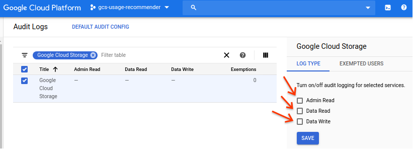
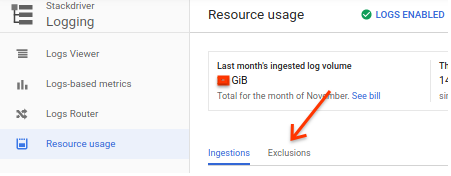
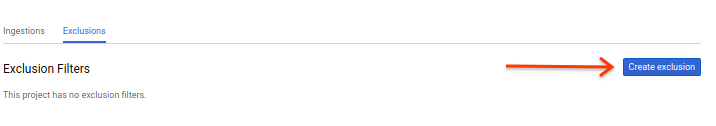
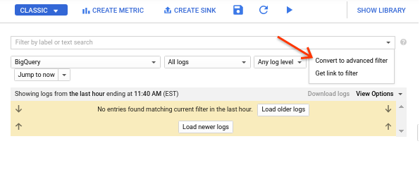
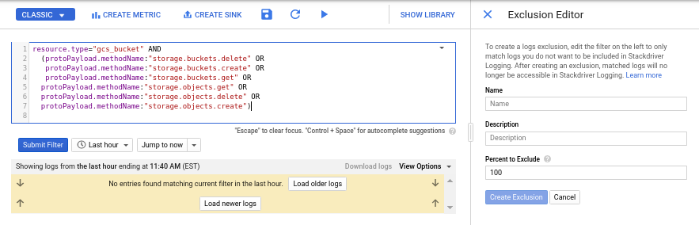
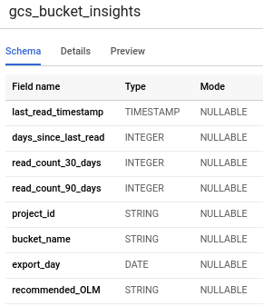

<h1>GCS Bucket Insights</h1>

<h3> 1.1 Overview </h3>

This tool helps an organization better understand its GCS bucket usage patterns,
across all of its projects by computing aggregation statistics related to bucket
access patterns in order to help better generate object lifecycle management.

This tool utilizes GCS audit logs in order to find how often objects are read
within a bucket, and then displays the corresponding statistics. Once these
are computed, the tool then creates a recommended OLM policy, such as by telling
a user to downgrade the storage classes of objects within a bucket to "nearline"
if they have not been read in over 30 days. This will help optimize costs
for an organization as otherwise it may be hard to know how often buckets are
being accessed and if they are configured with the appropriate
storage class/OLM based on its access patterns.

<h3> 1.2 GCS Audit Logs </h3>

An organization-level audit log sink captures create, read, and delete events
for any GCS bucket, and stores those into two daily tables, `cloudaudit_googleapis_com_activity_<date>`
and `cloudaudit_googleapis_com_data_access_<date>` in a BigQuery dataset. These
events include relevant metadata about the object such as labels, location, and
details about where the request is coming from.

The audit logs will have separate entries for the creation and read of a GCS
bucket or object, but these entries are generic audit log entries and we’ll need
to do some additional work to surface the metadata interesting to us.

<h2>2. Set-up/Prerequisites</h2>

<h3> 2.1 Prerequisites</h3>
Before starting, let’s gather some prerequisite information.

* `OUTPUT_PROJECT_ID`: The ID of the project where you want to create the table.
* `OUTPUT_DATASET_ID`: The ID of the BigQuery dataset where you want to create the table.
* `BQ_LOCATION`: BigQuery location to use for your dataset, such as 'US' or 'EU'.
* `ORG_ID`: The numeric ID of the GCP organization

Now export them as environment variables in your Cloud Shell for subsequent use.
The following are example values of what you may use.

````bash
export AUDIT_LOG_PROJECT_ID=gcsauditlogs
export AUDIT_LOG_DATASET_ID=gcs_audit_logs
export OUTPUT_PROJECT_ID=gcsusagerecommder
export OUTPUT_DATASET_ID=gcs_usage_log
export OUTPUT_TABLE_NAME=gcs_bucket_insights
export BQ_LOCATION=EU
export ORG_ID=622243302570
````
* `AUDIT_LOG_PROJECT_ID` is the project ID in BigQuery where you will export the
audit logs.
* `AUDIT_LOG_DATASET_ID` is the dataset ID in BigQuery where the audit logs will
be exported to.
* `OUTPUT_PROJECT_ID` is the project ID where the bucket insights table will be.
* `OUTPUT_DATASET_ID` is the dataset ID where the bucket insights table will be.
* `OUTPUT_TABLE_NAME` is the name of the BigQuery table holding the bucket insights.
* `BQ_LOCATION` is either EU or US, and will be for both datasets created.
* `ORG_ID` Find yours by invoking `gcloud organizations list`

<h3> 2.2 Permissions </h3>
To follow these interactive instructions, you will need permissions to:

* Create and manage a BigQuery dataset in the project you’ve chosen
  * bigquery.datasets.create
  * bigquery.tables.create
  * bigquery.tables.getData
  * bigquery.tables.updateData

And you will need permissions at the organization level to:

* Create an organization-level audit log sink
  * roles/logging.configWriter

* Scan your inventory:
  * storage.buckets.get
  * storage.buckets.list
  * storage.objects.get
  * storage.objects.list
  * resourcemanager.organizations.get
  * resourcemanager.projects.get
  * resourcemanager.projects.list

You will need these permissions only during initial setup.

<h3> 2.3 Preparing the audit log dataset</h3>
Let’s walk through the steps necessary to create and populate the dataset.

<h4> 2.3.1 Creating the dataset </h4>
Let’s create the dataset inside the project you specified above.
<b>Note that this does not specify a partition expiration. Audit logs can get
costly, so it is recommended to choose a default partition expiration for this
dataset, such as 90 days.</b>

````
bq mk --location=${BQ_LOCATION} -d "${OUTPUT_PROJECT_ID}:${OUTPUT_DATASET_ID}"
````

<h4> 2.3.2 Create the audit log sink </h4>

For GCS, we'll be enabling two types of [audit logs](https://cloud.google.com/storage/docs/audit-logs):
* <b>Admin Activity logs</b>: Entries for operations that modify the
configuration or metadata of a project, bucket, or object.

* <b>Data Access logs</b>: Entries for operations that modify objects or read a
project, bucket, or object. There are several sub-types of data access logs:
    * <b>ADMIN_READ</b>: Entries for operations that read the configuration or
    metadata of a project, bucket, or object.
    * <b>DATA_READ</b>: Entries for operations that read an object.
    * <b>DATA_WRITE</b>: Entries for operations that create or modify an object.

By default, only admin activity logs are enabled for organizations. However, data
access logs are not configured by default. For this example, we will enable them in
the GCP console; however, you could do so with the CLI or programmatically, as well.

To do this, go to the [console](https://console.cloud.google.com/iam-admin/audit?_ga=2.160269630.-2040617453.1540660549).


1. Filter on Cloud Storage, and select ADMIN_READ, DATA_READ, AND DATA_WRITE. Then click save.

2. Now, we will export the logs from Stackdriver to BigQuery.

````bash
gcloud logging sinks create gcs_usage \
  bigquery.googleapis.com/projects/${AUDIT_LOG_PROJECT_ID}/datasets/${AUDIT_LOG_DATASET_ID} \
  --log-filter='resource.type="gcs_bucket" AND
  (protoPayload.methodName:"storage.buckets.delete" OR
   protoPayload.methodName:"storage.buckets.create" OR
   protoPayload.methodName:"storage.buckets.get" OR
  protoPayload.methodName:"storage.objects.get" OR
  protoPayload.methodName:"storage.objects.delete" OR
  protoPayload.methodName:"storage.objects.create")' \
  --organization=${ORG_ID} --include-children
````

This command will create and return a service account ID, such as
serviceAccount:o125240632470-886280@gcp-sa-logging.iam.gserviceaccount.com.

Note down the account name, as we'll use it in the next step!

3. <b>Optional: Create a [Stackdriver Logging Exclusion Filter](https://cloud.google.com/logging/docs/exclusions)</b>
In the spirit of cost optimization, we can optionally set an exclusion filter for Stackdriver Logging, only after the logging sink is set up. This will allow us to control the log entries which are sent to Stackdriver, since for this solution we only care about their presence in BigQuery, rather than paying for their additional ingest in Stackdriver Logging. This is specifically needed for the Data Access logs, as Admin Activity and System Event logs are both free and cannot be excluded. If the sole manner in which your organization wants to consume these logs is in BigQuery, then you should follow these steps to save on the ingest. Note that this must be done in the console, as it's not yet available in [gcloud](https://cloud.google.com/logging/docs/reference/tools/gcloud-logging#logs_exclusion).

To do this:

* Navigate to the [Logs Ingestion Page](https://console.cloud.google.com/logs/usage?_ga=2.119983247.-642813928.1575916563) as a part of Stackdriver Logging Resource Usage Page, and select the <b>Exclusions Tab</b>.


* Select <b>Create Exclusion</b>.


* In the dropdown, select <b>Convert to advanced filter</b>.


* In the expansion panel, enter the following filtering query, which should match what you used to create the sink in the previous step:
````
resource.type="gcs_bucket" AND
  (protoPayload.methodName:"storage.buckets.delete" OR
   protoPayload.methodName:"storage.buckets.create" OR
   protoPayload.methodName:"storage.buckets.get" OR
  protoPayload.methodName:"storage.objects.get" OR
  protoPayload.methodName:"storage.objects.delete" OR
  protoPayload.methodName:"storage.objects.create")
````


* In the <b>Exclusions Editor</b> right-hand panel, enter:
   * <b>Name:</b> GCS_Data_Access_Logs_Filter
   * <b>Description:</b> Excluding GCS Data Access logs by enabling direct export to BigQuery sync for bucket usage intelligence.
   * <b>Percent to Exclude:</b> 100
* Click 'Create Exclusion'.
* A warning will appear, specifying that logs can still go to our BigQuery sink.
Click 'Create Exclusion'.


<h4> 2.3.3 Allow the service account to write to our dataset </h4>
Taking the service account created in the last step, let’s assign to it the
narrowest privileges needed for this tool - in this case, “BigQuery Data Editor.”

This can be done a number of ways, and here we’ll just follow the
[manual process](https://cloud.google.com/bigquery/docs/dataset-access-controls#controlling_access_to_a_dataset).

<h4> 2.3.4 Test that the dataset is receiving audit log entries </h4>

Create a GCS object in any project in your GCP organization, and you should see
an entry arrive in the `${OUTPUT_DATASET_ID}` dataset.

The daily BigQuery tables named `cloudaudit_googleapis_com_activity_<date>` and
`cloudaudit_googleapis_com_data_access_<date>` will appear in your project the
first time a GCS object/bucket is created or read after the audit log sink is
created. If you are not seeing tables being created, you may have a permissions
issue. Troubleshoot by looking at [your project activity](https://console.cloud.google.com/home/activity)
in the project where you created the GCS resource. There you should see your
audit log sink service account creating the daily audit log BigQuery tables.

<h3> 2.4 Scanning for existing GCS objects </h3>
Currently, you are now collecting the raw audit log events representing GCS
objects/buckets. The missing link, however, is the events for the set of
buckets/objects which were created before the sink started generating these events.

We’ll run a process to populate a new, separate table in our dataset with an
inventory of the currently existing buckets in your GCP organization to fill in
this missing link.

This process only needs to be run once and would benefit from a low-latency
network location to GCP. In our example we will run it in the cloud shell.

<h4> 2.4.1 Clone the code repository </h4>

````
git clone https://github.com/GoogleCloudPlatform/professional-services.git
cd tools/gcs-usage-recommender
````


<h4> 2.4.2 Authenticate your shell session </h4>
You'll need to authenticate yourself to be allowed to call APIs.

````
gcloud auth application-default login
````

<h4> 2.4.3 Run the process </h4>
This process uses the Python Cloud Resource Manager client library to fetch all the
projects your account has access to within a specified org. It then finds
all existing GCS buckets in each of the projects.

Set up your Python environment:
````
virtualenv venv --python python3
source venv/bin/activate
pip install -r requirements.txt
````

Run the script to create a local JSON file of all GCS buckets in your org:
````
python3 -m python.backfill ${ORG_ID}
````

Create the table with the existing GCS inventory before audit logs were enabled,
which will use the JSON file created in the previous step.
````
bq --location=${BQ_LOCATION} load \
--source_format=NEWLINE_DELIMITED_JSON \
${OUTPUT_PROJECT_ID}:${OUTPUT_DATASET_ID}.${OUTPUT_TABLE_NAME} \
initial_gcs_inventory.json \
schema.json
````
<h4>2.4.4 Create the scheduled BigQuery job that computes access statistics </h4>

Enable the BigQuery Data Transfer API
````
gcloud services enable bigquerydatatransfer.googleapis.com
````

Configure your configuration variables
````
export audit_log_query=$(cat audit_log_query.sql | sed -e "s/{OUTPUT_PROJECT_ID}/$OUTPUT_PROJECT_ID/g" -e "s/{OUTPUT_DATASET_ID}/$OUTPUT_DATASET_ID/g" -e "s/{OUTPUT_TABLE_NAME}/$OUTPUT_TABLE_NAME/g" -e "s/{AUDIT_LOG_PROJECT_ID}/$AUDIT_LOG_PROJECT_ID/g" -e "s/{AUDIT_LOG_DATASET_ID}/$AUDIT_LOG_DATASET_ID/g")

````

Upload the logic to generate a scheduled query job. This is recommended to run
daily as it computes the read count over days.
````
bq query \
--project_id $OUTPUT_PROJECT_ID \
--use_legacy_sql=false \
--destination_table=$OUTPUT_DATASET_ID.$OUTPUT_TABLE_NAME \
--display_name="GCS Bucket Insights Table" \
--replace=true \
--schedule='every 24 hours' "$audit_log_query"
````

This will prompt you to enter an authorization code on your first time. Go
to the URL that the prompt specifies, copy the code, and paste it back
into the terminal. After this, your scheduled query is created successfully.
Verify this by checking in the [cloud console](https://console.cloud.google.com/bigquery/scheduled-queries)

<h2>3. Using the Data</h2>



The table that is created uses the schema described above.

Note that this will only be interesting after audit logs have been enabled for
at least a few days. All backfilled inventory also defaults to "-1", meaning
that it has yet to have been accessed.
