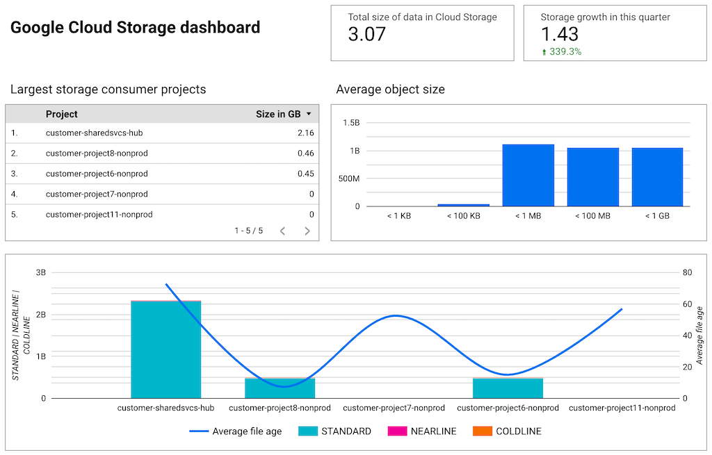

# Google Cloud Storage to BigQuery

## Ever wanted to know what's your organization's average file creation time or size?



This small applications discovers all buckets from a Google Cloud Platform organization, 
then fetches all the objects in those and creates an Avro file containing all the objects 
and their attributes. This can be then imported into BigQuery.

### Installing

You can install the binary on your computer by running:

```sh
go install github.com/GoogleCloudPlatform/professional-services/tools/gcs2bq@latest
```

### Building

You can build it either manually, or using the supplied `Dockerfile`:

```bash
export GOOGLE_PROJECT=your-project
docker build -t eu.gcr.io/$GOOGLE_PROJECT/gcs2bq:latest .
docker push eu.gcr.io/$GOOGLE_PROJECT/gcs2bq:latest
```

### Usage

```bash
$ ./gcs2bq -help
Google Cloud Storage object metadata to BigQuery, version 0.1
Usage of ./gcs2bq:
  -alsologtostderr
    	log to standard error as well as files
  -buffer_size int
    	file buffer (default 1000)
  -concurrency int
    	concurrency (GOMAXPROCS) (default 4)
  -file string
    	output file name (default "gcs.avro")
  -log_backtrace_at value
    	when logging hits line file:N, emit a stack trace
  -log_dir string
    	If non-empty, write log files in this directory
  -logtostderr
    	log to standard error instead of files
  -stderrthreshold value
    	logs at or above this threshold go to stderr
  -v value
    	log level for V logs
  -versions
    	include GCS object versions
  -vmodule value
    	comma-separated list of pattern=N settings for file-filtered logging
```

You can also use the supplied `run.sh` scripts, which accepts the following
environment variables as input:

- `GCS2BQ_PROJECT`: project ID where the storage bucket and BigQuery dataset resides in
- `GCS2BQ_DATASET`: BigQuery dataset name (eg. `gcs2bq`)
- `GCS2BQ_TABLE`: BigQuery table name (eg. `objects`)
- `GCS2BQ_BUCKET`: Bucket for storing the temporary Avro file to be loaded into BigQuery (no `gs://` prefix)
- `GCS2BQ_LOCATION`: Location for the bucket and dataset (if they need to be created, eg. `EU`)
- `GCS2BQ_VERSIONS`: Set to non-empty if you want to retrieve object versions as well

## IAM permissions on GCP

To be able to discover all projects and buckets, the Service Account that you
run GCS2BQ under should have the following permissions on organization level:

- List all projects: `resourcemanager.projects.get`
- List buckets: `storage.buckets.list`
- List objects in bucket: `storage.objects.list`
- Read ACLs from objects in bucket: `storage.objects.getIamPolicy`

These permissions can be partly granted with the following predefined role (lacks
permission to retrieve ACLs):

- Storage Object Viewer: `roles/storage.objectViewer`

There is also a custom role in [gcs2bq-custom-role.yaml](gcs2bq-custom-role.yaml) that
only has the necessary permissions. See the file for instructions.

To write the data through GCS to BigQuery, you'll need in a project that hosts the
BigQuery dataset the following roles:

- Storage Admin: `roles/storage.admin`
- BigQuery User: `roles/bigquery.user`

### BigQuery schema

See file [bigquery.schema](bigquery.schema) for the BigQuery table schema. AVRO
schema is in [gcs2bq.avsc](gcs2bq.avsc).

## Sample BigQuery queries

### Find average age of files and size of each storage tier

```sql
SELECT
  project_id,
  bucket,
  ROUND(AVG(TIMESTAMP_DIFF(CURRENT_TIMESTAMP(), created, DAY)), 1) AS created_average_days,
  SUM(
  IF
    (storage_class='STANDARD',
      size,
      0)) AS size_standard,
  SUM(
  IF
    (storage_class='NEARLINE',
      size,
      0)) AS size_nearline,
  SUM(
  IF
    (storage_class='COLDLINE',
      size,
      0)) AS size_coldline,
  SUM(
  IF
    (storage_class='ARCHIVE',
      size,
      0)) AS size_archived
FROM
  gcs2bq.files
GROUP BY
  project_id,
  bucket
```

### Find a histogram of how data is allocated in different sized files

```sql
SELECT
  CASE
    WHEN histogram_bucket = 1 THEN "< 1 KB"
    WHEN histogram_bucket = 2 THEN "< 100 KB"
    WHEN histogram_bucket = 3 THEN "< 1 MB"
    WHEN histogram_bucket = 4 THEN "< 100 MB"
    WHEN histogram_bucket = 5 THEN "< 1 GB"
  ELSE
  "> 1 GB"
END
  AS class,
  SUM(size) AS total_size
FROM (
  SELECT
    size,
    CASE
      WHEN size <= 1024 THEN 1
      WHEN size <= 1024*100 THEN 2
      WHEN size <= 1024*1024 THEN 3
      WHEN size <= 1024*1024*100 THEN 4
      WHEN size <= 1024*1024*1024 THEN 5
    ELSE
    6
  END
    AS histogram_bucket
  FROM
    gcs2bq.files )
GROUP BY
  histogram_bucket
ORDER BY
  histogram_bucket ASC
```

### Find owners with most data

```sql
SELECT
  owner,
  SUM(size) AS total_size
FROM
  gcs2bq.files
GROUP BY
  owner
ORDER BY
  total_size DESC
```

### Find duplicate files across all buckets

```sql
SELECT
  project_id,
  CONCAT("gs://", bucket, "/", name) AS file,
  COUNT(md5) AS duplicates
FROM
  gcs2bq.files
GROUP BY
  project_id,
  file
HAVING
  duplicates > 1
```


### Running in GKE as a CronJob

You can deploy the container as a `CronJob` in Google Kubernetes Engine. See the file
[gcs2bq.yaml](gcs2bq.yaml). Replace the environment parameters with values appropriate
for your environment.


