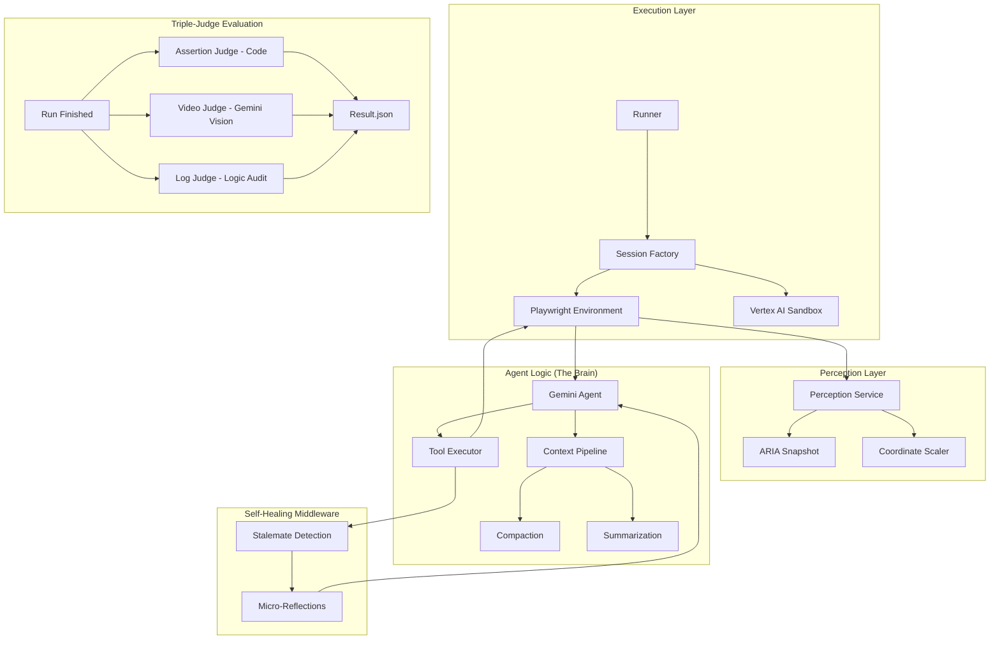

# How It Works

This document explains the internal design of the evaluation pipeline.

## System Architecture

The following diagram illustrates the decoupled lifecycle and the interaction between core components:

### The Context Pipeline (History Optimization)
...
As the agent navigates the task, the conversational history (containing screenshots, DOM snapshots, and model actions) grows rapidly. The framework uses a sophisticated **Context Pipeline** to manage this token load based on configured presets (`EFFICIENT`, `AGGRESSIVE`, `BALANCED`).

The pipeline uses three distinct strategies to reduce context while preserving API validity and execution momentum:

1.  **Compaction (Lossless-ish Loop Folding):**
    *   **What it does:** Detects repetitive navigational actions (e.g., a sequence of 5 `scroll` or `wait_5_seconds` calls).
    *   **How it works:** It mathematically condenses these into a single text summary injected into the model's history (e.g., `[Summarized: Agent executed 'scroll_at' 5 times to stabilize UI/Navigation.]`).
    *   **Why it matters:** It removes redundant API bloat without losing the semantic knowledge that the agent *did* scroll down the page.

2.  **Summarization (Lossy Semantic Compression):**
    *   **What it does:** Uses a secondary LLM call to summarize the "middle" of the history.
    *   **How it works:** Purely triggered by token weight (e.g., if history exceeds 120,000 tokens). It preserves the exact "Head" (Turn 0 Goal) and "Tail" (last 10 turns of momentum), but replaces the middle steps with a high-level narrative summary.

3.  **Smart Trimming (Safety Fallback):**
    *   **What it does:** The ultimate fail-safe if the history simply exceeds the `max_history_turns` limit (e.g., 150 turns).
    *   **How it works:** It uses an atomic slicing algorithm to chop the oldest intermediate turns out of the history buffer entirely.
    *   **Why it's "Smart":** It guarantees that a `function_call` is never split from its `function_response` (which would crash the Gemini API validator). It always ensures the resulting array starts and ends with the correct `user`/`model` role alternating sequence.

> **Note:** The `AGGRESSIVE` preset maximizes token savings by scrubbing all intermediate screenshots (saving only the Goal and the absolute latest image) and downscaling the active image quality to 75%.

## The Core Loop

The pipeline runs a high-performance **Observe -> Think -> Batch Act** loop:

1.  **Runner (`runner.py`)**: Sets up the browser (Playwright) and loads the task.
2.  **Observe**: The agent captures a screenshot and an ARIA snapshot of the current page.
3.  **Think (`computer_use_eval.core.gemini_agent.GeminiAgent`)**: The observation and task goal are sent to Gemini. The model can return a **batch of actions** in a single turn.
4.  **Smart Batching (`computer_use_eval.tool_executor.ToolExecutor`)**:
    *   **History Linearization**: Gemini 3.0 API backends enforce strict sequential execution for the `computer_use` tool. To maintain performance, the executor batches parallel actions (e.g., typing in 3 fields) but automatically rewrites the agent's history into a linear sequence of Model->User turns to satisfy API constraints safely.
    *   **Terminal Slicing**: Batches are automatically truncated if a "terminal" action occurs (e.g., navigation or Enter key) to ensure the agent doesn't act on stale information.
    *   **Fast Path Bundling**: Consecutive text-entry actions are collapsed into a single high-speed JS execution, bypassing the slow individual "typing" simulation.
    *   **Perception Guards**: The executor monitors the UI between batched steps using **Mutation-Gated Aria Hashing** (leveraging native Playwright accessibility trees). If the URL changes or the DOM undergoes a massive shift, the batch is cancelled and the agent must re-observe.
5.  **Evaluate**: Once the task is done (or fails), we check if it succeeded.

## Evaluation

We don't trust the agent's word. We verify success using three independent methods:

### 1. Code Assertions (The Hard Truth)
We run JavaScript or check URL patterns to verify the state.
*   *Example:* Does the URL contain `order-confirmed`?
*   *Verdict:* Pass/Fail (1.0 or 0.0).

### 2. Visual Verification (The Eyes)
We send the screen recording to Gemini (e.g. gemini-3.0-pro-preview) to watch what happened.
*   *Example:* "Did the user actually see the confirmation modal?"
*   *Verdict:* Score (0.0 - 1.0).

### 3. Log Analysis (The Why)
We analyze the agent's internal logs to spot reasoning errors or safety issues.
*   *Example:* "Did the agent try to click a button that wasn't there?"
*   *Verdict:* Qualitative feedback.

## Key Components

*   **`GeminiAgent`**: The brain. Manages the context window, model interaction, and batch processing logic. Located in `computer_use_eval.core.gemini_agent`.
*   **`PlaywrightEnv`**: The hands. Wraps Playwright to make browser automation simple. Located in `computer_use_eval.browser.playwright_env`.
*   **`PerceptionService` & `CoordinateScaler`**: Advanced hitbox normalization and visual state processing. Located in `computer_use_eval.browser.perception` and `computer_use_eval.utils` respectively.
*   **`ToolExecutor`**: The coordinator. Implements Smart Batching logic and serves as the unified entry point for both browser actions and custom Python tools. Located in `computer_use_eval.tool_executor`.
*   **`Reflective Supervision Middleware`**: A reliability layer in the `ToolExecutor` that automatically detects stalemates and injects semantic recovery context. See [Reflective Supervision Architecture](./REFLECTIVE_SUPERVISION.md).
*   **`Settings`**: Global configuration loaded from `pyproject.toml`, `.env`, and benchmark YAMLs.
