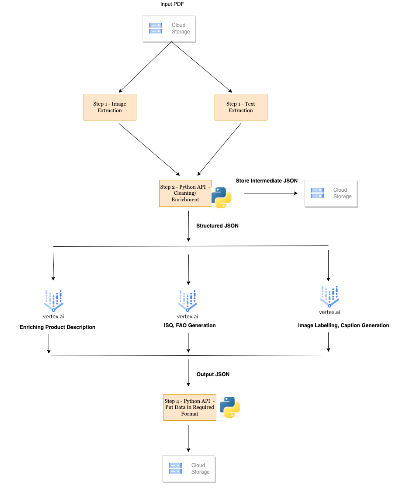
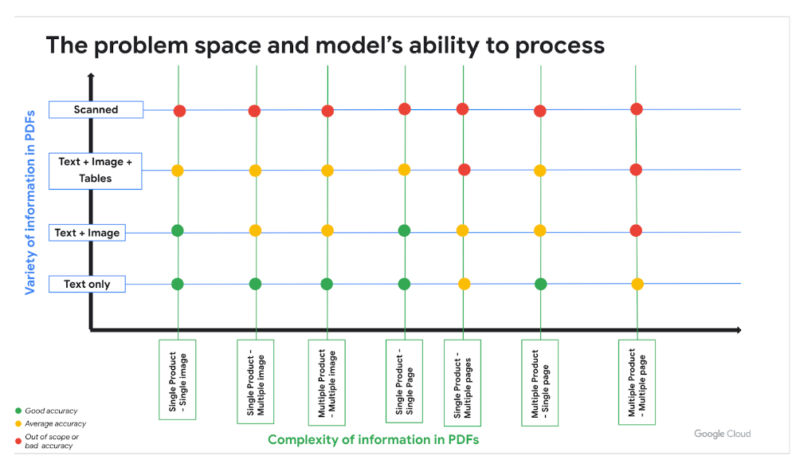

# Product Catalog Extraction Tool

A GenAI driven tool utilizing Google Vertex AI to extract text and images from product catalogs.

## Objectives

* Extract product information (text, images) from product catalogs in PDF format.
* Enrich extracted data with AI-generated captions and metadata.
* Provide structured output for downstream processing.

## Solution Architecture



1. **Image/Text Extraction:**
   - Employs PyMuPDF to extract raw images and text from PDF files, including citations.

2. **Text/Image Cleaning & Enrichment:**
   - Sanitizes extracted text and images.
   - Leverages a GEN AI (like Imagen) for caption generation ("specific captions").
   - Stores enriched data in an intermediate bucket for traceability.

3. **Dynamic Prompt Generation & LLM Interaction:**
   - Generates prompts for tasks: Product ISQ, FAQ generation, Image Labeling, Image Captions.
   - Submits prompts to a Large Language Model (LLM).
   - Implements auto-reflection for refining output if needed.
   - Aggregates results into a final JSON.

4. **Storage:**
   - Stores the final JSON in Google Cloud Storage (GCS) for downstream use.

## Tool Evaluation

Product Catalogs could be in various formats, below space graph shows the performance of the tool 



## Project Structure

* `src/`: Contains the core Python modules for the extraction, cleaning, and LLM interaction components.
* `tests/`: Test suites ensuring correctness and robustness (TDD principles).

## Setup

1. **Prerequisites:**
   - Python 3.11+ 
   - Google Cloud Platform account with Vertex AI configured
   - API keys for GEN AI (if applicable)

2. **Installation:**
   ```bash
   pip install -r requirements.txt
   
3. **Running Instructions:**

   Given a product catalog pdf URI this tool will extract text and image details of the product.
   

   Text Details that are extracted
      * Company Details - Details of Company which owns the Product - name , address , email , contact details.
      * Product Name - Name of the product , description.
      * FAQ - Frequently asked questions around the product
      * ISQ - Product specifications 
   

   Image Details that are extracted
      * Main Image of the product  
      * Captions for the Image 
      * Label for the Image 
      * Tags for the Image 
   

   Once these details are extracted the Result JSON file is placed in the output GCS bucket that is also passed as
   an argument. For a sample JSON look at the file output_prod_details.json in this repo.
   

   Sample Run Command
   ```bash
   python3 ./runner.py "gs://test-sl/hepasky-herbal-liver-tablets.pdf" "test-sl" "sl-test-project-353312"
   ```

   Argument 1 - GCS URI of the pdf file 
   Argument 2 - Bucket Name where the output file will be placed  
   Argument 3 - GCP Project ID 

## Release Notes
**Jan 2024**
* Tool Launch on open source google cloud repo 