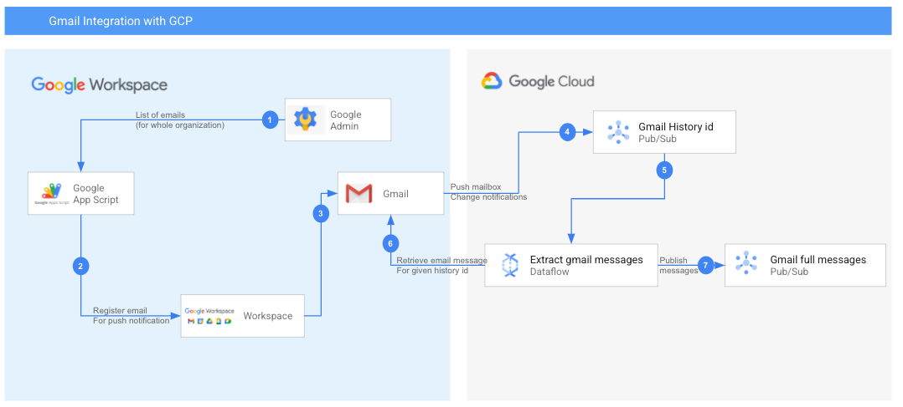

# Overview

[Gmail push notification](https://developers.google.com/gmail/api/guides/push) is a feature provided by GSuite to monitor a Gmail account for any changes to the email box and send a push notification to a pub/sub topic in the provided Google Cloud Platform project. This project is about setting up and monitoring multiple domains for Gmail push notification and using dataflow to gather content of all those notification and pushing it to another pub/sub topic so that analytics or threat detection could be performed.

# Architecture



There are 2 components involved in execution of the end to end pipeline.

1. [App Script](code.gs) which can be scheduled to read from a worksheet with all the domain names for which the Gmail push needs to be enabled.
2. [Dataflow job](src/main/java/com/google/cloud/pso/pipeline/GmailDataflow.java) which monitors the pub/sub topic for the pusbusb event from Gmail and reads all the email with that historyId and publishes all the messages to another pub/sub topic.

# Setup Instructions

## GCP project setup

1. Create a new Google Cloud Platform project or use an existing project that would receive the pub/sub push messages from GSuite.

2. [Create a Service Account](https://cloud.google.com/iam/docs/creating-managing-service-accounts) 

3. On Google Cloud Platform console go to `API & Services - > Credentials`. Here you should see the service account that you created. Select your service account and `Add Key`. Select `JSON` for your private key download and it will download the JSON private key file to your local computer. This is needed for setting up both the dataflow job and app-script job. 

4. Follow the [private key](https://cloud.google.com/iam/docs/creating-managing-service-account-keys) creation and management documentation for best practices.

5. On the service account page click `Domain Wide Delegation` button and select `Enable G Suite Domain-wide Delegation` radio button to enable domain wide delegation for the service account. This will create OAuth2 client id for the service account that will be given Domain-wide delegation privilege.

6. Go back to Credentials screen and you should see the newly created Oauth2 Client id. Save `Client ID` value for setting up Domain-wide delegation in a later section.

7. From the main menu select `IAM & admin - > IAM`. On the service account you just created use the `Edit Member` pencil icon to add the following roles.

    1. Service Account Token Creator

    2. Pub/Sub Editor

8. Create a pub/sub topic to receive the Gmail push notification. Create another topic to push the email threads that are read by the dataflow job. Save the fully qualified topic names as well as the topic names (for dataflow)

    1. gmail-push: topic where G Suite will push.

    2. gmail-messages: topic where dataflow will publish the email messages.


## Google Admin setup

1. Login to your Google Admin console to grant domain wide delegation privilege to the service account you just created.

2. On the menu select `Security` to go to the security menu. 

3. Select `API controls` from security menu to go to API controls menu. You should see `Domain wide delegation` tab at the bottom. Click the `Manage Domain wide delegation` to go to the domain wide delegation page.

4. Click `Add new` and paste the `Client ID` that you saved for the service account that you created earlier.

5. For the scopes use the following scope:

    1. https://www.googleapis.com/auth/gmail.readonly

## Dataflow script setup

1. Git clone this repo to your local computer.

2. Copy the service account private key file which you download earlier to `src/main/java/com/google/pso/pipelines` folder.

3. Open the GmailApiDriver.java and change the `SERVICE_ACCOUNT_JSON_FILE_PATH` to point to the service account private key JSON file.

4. Use the following command to compile and run the dataflow job either locally (for testing) or on Google Cloud Platform for real-time monitoring.

```sh


# Compile and upload the template to GCS for dataflow
RUNNER=DataflowRunner 
PROJECT_ID=[YOUR_PROJECT_ID]
BUCKET_NAME=[YOUR_GCP_BUCKET_NAME]
TOPIC_NAME="YOUR_TOPIC_NAME_NOT_FULLY_QUALIFIED"
PIPELINE_FOLDER=gs://${BUCKET_NAME}/dataflow/pipelines/gmail-dataflow
USE_SUBSCRIPTION=false 
OUTPUT_TOPIC="YOUR_OUTPUT_TOPIC_NAME_NOT_FULLY_QUALIFIED"

mvn compile exec:java \
-Dexec.mainClass=com.google.cloud.pso.pipeline.GmailDataflow \
-Dexec.cleanupDaemonThreads=false \
-Dexec.args=" \
--project=${PROJECT_ID} \
--tempLocation=${PIPELINE_FOLDER}/temp \
--stagingLocation=${PIPELINE_FOLDER}/staging \
--templateLocation=${PIPELINE_FOLDER}/template \
--runner=${RUNNER} \
--inputTopic=projects/$PROJECT_ID/topics/$TOPIC_NAME \
--outputTopic=projects/$PROJECT_ID/topics/$OUTPUT_TOPIC \
--output=gs://$BUCKET_NAME/samples/output \
--windowSize=2 \
--truncateSize=4096 \
--defaultWorkerLogLevel=DEBUG"

// Run locally
RUNNER=DirectRunner
mvn clean compile exec:java -Dexec.mainClass=com.google.cloud.pso.pipeline.GmailDataflow \
-Dexec.cleanupDaemonThreads=false \
-Dexec.args=" \
--project=${PROJECT_ID} \
--runner=${RUNNER} \
--inputTopic=projects/$PROJECT_ID/topics/$TOPIC_NAME \
--outputTopic=projects/$PROJECT_ID/topics/$OUTPUT_TOPIC \
--output=gs://$BUCKET_NAME/samples/output \
--windowSize=2 \
--truncateSize=4096" 


# Once the template location is populated with the jar files then they can be launched
# using the gcloud dataflow command as below

export GOOGLE_APPLICATION_CREDENTIALS=[YOUR_SERVICE_ACCOUNT_PRIVATE_KEY_FILE_LOCATION]
gcloud auth activate-service-account --key-file=[YOUR_SERVICE_ACCOUNT_PRIVATE_KEY_FILE_LOCATION]


JOB_NAME=gmail-push-$USER-`date +"%Y%m%d-%H%M%S%z"`
gcloud dataflow jobs run ${JOB_NAME} \
--region=us-central1 \
--service-account-email="test-anand-1@anand-1-291314.iam.gserviceaccount.com" \
--gcs-location=${PIPELINE_FOLDER}/template \
--worker-zone=us-east1-d \
--parameters \
"inputTopic=projects/${PROJECT_ID}/topics/${TOPIC_NAME},\
"

```

### Parameters used for processing pipeline

|Parameter Name | Description |
|---------------|-------------|
|project | Project id where dataflow will run.|
|tempLocation | Temporary GCS location for Dataflow compile.|
|stagingLocation | Staging location for dataflow output staging.|
|templateLocation | Use this option if you want to create a template and not run it.|
|runner | DataflowRunner for running dataflow, DirectRunner: for running local (developer mode). |
|inputTopic | Input pub/sub topic name.|
|outputTopic | Output pub/sub topic name.|
|output | Output bucket for Dataflow output.|
|windowSize | Window size for streaming pipeline (in minutes).|
|truncateSize | Truncate message size (in bytes).|
|defaultWorkerLogLevel | Optional parameter. DEBUG: if debug level logs are needed (for troubleshooting) |

## App script setup

1. Go to [your scripts project page](https://script.google.com/home).
2. Create a new project and copy-paste the [App Script](code.gs) content to that page.
3. Create a Google sheet where you would provide the domain names to monitor.

   1. Create 2 tabs with names (domains, users).

   2. In the domains tab, create the first column with name (Domain) and from A2 you could add all the domain names that you would want to monitor.

   3. On the user tab on row 1 you could create these columns where the output of the app script will be stored after each run. The outputs are overwritten every time the script runs.

      1. User Name

      2. Email

      3. Date updated

      4. User registration response

      5. Registration expiration date time (EST)

4. Copy the sheet id from the URL bar of the google sheet you just created.

   Example:

   For a sheet: `h_ttps://docs.google.com/spreadsheets/d/1SBB_xf7KudS4l5vkoSH-udFlbOmt--4W/edit#gid=0`

   Sheet id: `1SBB_xf7KudS4l5vkoSH-udFlbOmt--4W`

5. In the App script update the `SHEET_ID` variable with the sheet id of your sheet.

6. You need to set up a GCP project where the pub/sub is hosted. You also need a service account with Domain wide delegation privilege so that the service account can impersonate each email account and pull their email for analytics. Follow the setup instruction for those provided earlier.

7. On the App script project, use the menu `Resource -> Cloud Platform project` and update the project number from your GCP project where the pub/sub topic is hosted.

8. From the Google Cloud Platform project copy the "Private Key", "Client Email" of the service account which you have setup earlier and update the `PRIVATE_KEY` and `CLIENT_EMAIL` in the app script.

9. Copy the fully qualified topic name from the pub/sub topic where the Gmail push notification is received and update the `TOPIC_NAME` variable in the app script project.

Example of a fully qualified topic name: `projects/YOUR_PROJECT_ID/topics/TOPIC_NAME`

10. From the app services project use the menu `Resources -> Advanced Google Services` and enable `Admin SDK`.

11. Add the Oauth2 library. From the app services project use the menu `Resources -> Libraries` and on the `Add a library` search box past the following id to add the Oauth2 library.

`1B7FSrk5Zi6L1rSxxTDgDEUsPzlukDsi4KGuTMorsTQHhGBzBkMun4iDF`

12. If you want to schedule this script to run on a scheduled time use the [documentation](https://developers.google.com/apps-script/guides/triggers/installable#time-driven_triggers) provided by the link.

