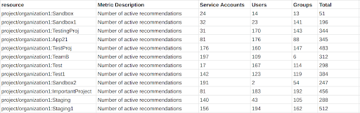
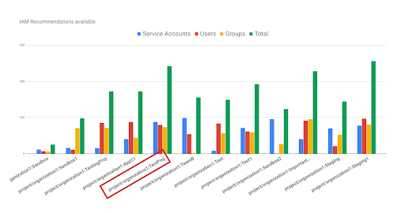
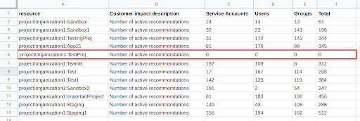

# Applying IAM Recommendations at Scale

## TL;DR

This article will use GCP’s
[IAM Recommender](https://cloud.google.com/iam/docs/recommender-overview) to
explore how to address a common pain-point we see in identity access-- enforcing
least-privilege at scale. You will learn how to:
1. Identify a GCP project that has a lot of IAM Recommendations
2. Bulk-apply all (or some) of the recommendations on that project
3. Revert that bulk-application (if necessary)

## Introduction

Imagine this scenario- your company has been using Google Cloud Platform for a
little while now and things are going pretty well: no outages, no security
breaches, and no unexpected costs. You’ve just begun to feel comfortable when an
email comes in from a developer. She has noticed that the project she is a part
of has a service account with an
[Owner](https://cloud.google.com/iam/docs/understanding-roles#primitive_role_definitions)
role. She tells you that she knows this service account was created solely to
access the Cloud Storage API and she is uncomfortable with the elevated
[permissions](https://cloud.google.com/iam/docs/permissions-reference) it has
beyond that job. You reply back that you are on it and begin looking around.

As you look at the project the developer was referencing you see the offending
Service Account, but also recognize the name of a senior manager who has the
Owner role as well. The manager is a fine person, but probably should not have
the sort of universal access to the project that the Owner role allows. Next,
you click into a different project that has “sandbox” in the title and find
every principal has the Editor role. It is just a sandbox but the blatant
disregard for the
[principle of least privilege](https://cloud.google.com/blog/products/application-development/least-privilege-for-cloud-functions-using-cloud-iam)
is alarming. Another hour of looking and you see that time and time again
permissions were given to people, groups, and service accounts that just did not
need them. The worst part is you don’t even know how big the problem is. There
are hundreds of projects at your company and thousands of GCP principals. You
can’t check them all because you don’t have time and you don’t know what
permissions each principal needs to do their job.

If any part of this scenario sounds familiar, you are not alone. There is good
news though! Google has built the
[IAM Recommender](https://cloud.google.com/iam/docs/recommender-overview) to
help with just this sort of situation. The IAM Recommender uses
[Machine Learning](https://cloud.google.com/blog/products/identity-security/exploring-the-machine-learning-models-behind-cloud-iam-recommender)
to inspect the permission usage of every principal across your entire GCP
environment for the last 90 days. Based on that scan it either deems a principal
as having a role that is a good fit, or it recommends a new role that would be a
better fit. For example, if the senior manager from the example above only uses
GCP to look at BigQuery reports, then the IAM Recommender will notice that
pattern and recommend changing the manager’s role from Owner to something more
appropriate, like
[BigQuery Data Viewer](https://cloud.google.com/iam/docs/understanding-roles#bigquery-roles).
An important feature of the IAM Recommender is that it will never recommend
adding permissions to a principal, only remove them. In other words, taking an
IAM Recommendation will never grant a principal more access to your GCP
environment.

Now that you know what the IAM Recommender is and what it can do, the next
problem is knowing how to get started using the feature. We’ve
[written an article](https://cloud.google.com/blog/products/identity-security/achieve-least-privilege-with-less-effort-using-iam-recommender)
before outlining some concrete ways to get started, and if that is enough for
your company then great! However, in this article we are going to walk through a
particular process that allows you to bulk-apply IAM Recommendations for an
entire project using a set of commands in Cloud Shell.

Here is that process in four steps (pre-step not included):

1.  View the total number of service accounts, users, and groups that have IAM
    Recommendations broken out by project.
2.  Identify a project with some IAM recommendations that you feel comfortable
    testing out the IAM Recommender on. We used a sandbox project for this step,
    but you can do whatever seems best for you.
3.  Bulk-apply recommendations on that project.We’ll also show you how to revert
    this bulk-application as well.
4.  Identify the next project that has recommendations and apply those too.

## Pre-step

Before step 1, there is a bit of work that needs to be done to make sure you and
your GCP environment are ready:

-   Check and make sure that you have the
    [Recommender API](https://cloud.google.com/recommender/docs/reference/rest)
    enabled.
-   [Create a Service Account](https://cloud.google.com/iam/docs/creating-managing-service-accounts)
    and give it the
    [IAM Recommender Viewer](https://cloud.google.com/iam/docs/understanding-roles#recommender-roles),
    [IAM Role Viewer](https://cloud.google.com/iam/docs/understanding-roles#roles-roles),
    and
    [Cloud Asset Viewer role](https://cloud.google.com/iam/docs/understanding-roles#cloud-asset-roles).
    You will need to be able to reference this Service Account and its
    associated key later while running this script.

## STEP-1: viewing total number of IAM Recommendations

1.  Run the below command in your [Cloud Shell](https://cloud.google.com/shell)
    to save all the required code in a folder named `iam_recommender_at_scale`.
    This command will also create a python virtual environment within the folder
    to execute the code.

    ```
    curl https://raw.githubusercontent.com/GoogleCloudPlatform/professional-services/master/tools/iam-recommender-at-scale/install.sh | bash -
    ```

2.  Enter the below command to go to the source directory and activate the
    python environment.

    ```
    cd iam-recommender-at-scale
    . env/bin/activate
    ```

3.  Next, run the below code to retrieve all IAM Recommendations in your
    organization and break it out by project. Make sure to enter in your
    Organization ID, called out here as,`<YOUR-ORGANIZATION-ID>`. You’ll also
    need to include a path to the service account key you created earlier,
    called out below as, `<SERVICE-ACCOUNT-FILE-PATH>`.

    ```
    python get_projects_security_status.py \
    --organization=<organizations/YOUR-ORGANIZATION-ID> \
    --service_account_file_path=<SERVICE-ACCOUNT-FILE-PATH> \
    --to_csv=<PATH-TO-CSV-FILE (optional)>
    ```

4.  For this demo we exported the results from step 1.2 into a CSV and uploaded
    that CSV into a Google Sheet.

    

    *Table 1: The resource column lists the name of every project that has
    active IAM recommendations in it within your organization. In subsequent
    columns, we break out the total number of recommendations by service
    account, users, and groups.*

## Step 2: picking a project to apply IAM recommendations on

1.  Analyze the output of the work you’ve done so far. We used the Google Sheet
    from 1.3 to create a column chart, but you can easily use the data format
    and visualization tool of your choice.

    

    *Figure 1: When we visualize table 1 using a column chart, it become clear
    that there are a couple outliers in terms of the total number of
    recommendations. The red square around “project/organization1:TestProj” is
    there because we will focus on that project for the duration of this blog.*

2.  Choose a project you want to bulk apply all the recommendations on. We had
    two qualifying criteria that we felt were met by “project/organization1:
    TestProj”:

    -   Does the project have a relatively high number of recommendations?
        “TestProj” has the second highest total number of recommendations, so it
        qualified.
    -   Is the project a safe environment to give the IAM Recommender a test
        drive on? Since, “TestProj” is a sandbox, we felt it was safe.

3.  (optional) If you don’t have a sandbox project, or the criteria we mentioned
    in step B don’t feel right, here are some other ideas for criteria:

    -   Choose a project you are very familiar with. Something you would notice
        any unwanted changes on.
    -   Ask a colleague who is security conscious if they might be willing to
        have their project lead the way toward least-privilege.
    -   Choose a legacy project that has very predictable patterns of use. While
        the IAM Recommender uses machine learning to make accurate
        recommendations for even the most dynamic of projects, this could
        represent a more manageable risk

## Step 3: Applying IAM Recommendations for a project

1.  Surface each principal with a recommendation in “TestProj” by running the
    below command in Cloud Shell. This won’t apply the recommendations, just
    view them.

    ```
    python get_recommendations.py \
    --project_id=<YOUR-PROJECT-ID> \
    --service_account_file_path=<SERVICE-ACCOUNT-FILE-PATH> \
    --to_json=<PATH-TO-JSON>
    ```

2.  The resulting JSON will be used as the template for making the actual change
    to our IAM access policy. Below is a generic example of what the JSON would
    look like. Each recommendation in the JSON will contain:

    -   “id” : an ID that uniquely identifies the recommendation
    -   “etag”: an etag that identifies the modification time of the
        recommendation.
    -   “principal”: the principal is the identity the recommendation is about.
        There can be more than one recommendation per principal because a
        principal can have more than one role.
    -   “roles_recommended_to_be_removed”: the role that will be removed by the
        IAM Recommender.
    -   “roles_recommended_to_be_replaced_with”: the role(s) that will replace
        the existing role. Depending on the recommendation, the IAM Recommender
        will recommend replacing the existing role with one role, many roles, or
        no roles (i.e. remove that role altogether). It all depends on what fits
        the principle of least privilege the closest.

    ```
    {
        "recommendations": [
            {
                "id": "unique-id-1",
                "etag": "etag-1",
                "principal": "serviceAccount:abc@cloudservices.gserviceaccount.com",
                "role_recommended_to_be_removed": "roles/editor",
                "roles_recommended_to_be_replaced_with": [
                    "roles/storage.objectAdmin"
                ]
            },
            {
                "id":"unique-id-2",
                "etag": "etag-2",
                "principal": "user:abc@xyz.com",
                "role_recommended_to_be_removed": "roles/owner",
                "roles_recommended_to_be_replaced_with": [
                    "roles/orgpolicy.policyViewer",
                    "roles/composer.environmentAndStorageObjectAdmin"
                ]
            },
            {
                "id": "unique-id-3",
                "etag": "etag-3",
                "principal": "group:def@xyz.com",
                "role_recommended_to_be_removed": "roles/storage.admin",
                "roles_recommended_to_be_replaced_with": []
            }
    }
    ```

3.  (optional) For the sake of this demonstration we aren’t going to alter the
    JSON at all because we are going to apply all the recommendations as is.
    However, if you wanted to customize this JSON and get rid of certain
    recommendations this would be the time. Simply delete a recommendation in
    the editor of your choice, save the file, and upload it into the Cloud Shell
    file manager. You could even write a script that goes through the JSON and
    removes certain types of recommendations (maybe you don’t want to take
    recommendations associated with a certain principal or role).

4.  Apply all the changes described in the JSON created in step 3.2 by executing
    the command below. Step 3.6 will describe how you can revert these changes
    later if you want to.

    ```
    python apply_recommendations.py \
    --project_id=<YOUR-PROJECT-ID (required)> \
    --service_account_file_path=<SERVICE-ACCOUNT-FILE-PATH> \
    --recommendation_to_be_applied=<PATH-TO-RECOMMENDATIONS-INPUT (required)> \
    --to_json=<OUTPUT-FILE-TO-STORE-SUCCESSFULLY-APPLIED-RECOMMENDATION (required)>
    ```

5.  Just like that, your project is far closer to the principle of
    least-privilege than it was at the beginning of this process! When we run
    step 1.2 again we see that all recommendations for “TestProj” went from 483
    to 0.

    


    *Table 2: after bulk-applying all the recommendations on “TestProj”, we see
    that recommendations are down to 0.*

## Step 4: Reverting the change (optional)

If you find that you need to revert the IAM policy change you made during step
3, here is a simple way to do it.

1.  Refer back to the JSON you created in 3-D. and run this code if
    you want to revert all the changes you made.

    ```
    python revert_recommendations.py \
    --project_id=<YOUR-PROJECT-ID (required)> \
    --service_account_file_path=<SERVICE-ACCOUNT-FILE-PATH> \
    --recommendation_to_be_reverted=<PATH-TO-SUCCESSFULLY-APPLIED-RECOMMENDATIONS (required)>
    ```

## Step 5: Take more recommendations

At this point, there are a couple options about what do do next:

1.  You can wait and monitor the changes you’ve made. While waiting, you could
    [read about](https://cloud.google.com/blog/products/identity-security/achieve-least-privilege-with-less-effort-using-iam-recommender)
    companies like Uber and Veolia who have used the IAM Recommender to remove
    millions of permissions with no adverse effects. We are hopeful that your
    company will have a similar experience to these companies who successfully
    use the IAM Recommender.
2.  You could also start taking more recommendations! Run this script again or
    go to the IAM page in the GCP console and look for individual
    recommendations by looking for the
    [IAM Recommendation icon](https://cloud.google.com/iam/docs/recommender-managing#review-apply-console)
    and applying the recommendations from there. Another option is go to the
    [Recommendations Hub](https://cloud.google.com/recommender/docs/recommendation-hub/getting-started)
    and look at all your GCP Recommendations, not just the IAM related ones.

## Bonus step: setting up an Infrastructure-as-Code pipeline

If your company uses an infrastructure-as-code solution for managing IAM, then
you may want to set up a pipeline that allows you to use the IAM Recommender
with something like Terraform. If this is interesting, check out this tutorial
written on how to set that up.

## Conclusion

There are many ways to use the IAM Recommender to ensure least-privilege. Our
hope is that this blog has helped you identify and mitigate projects that could
represent a security risk to your company. Please don’t hesitate to reach out
with questions.

Good luck and thanks for reading!
