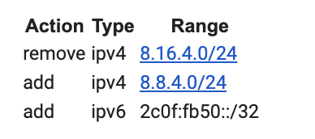
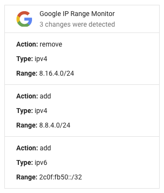

# Google IP Range Monitor

Google maintains a global infrastructure, which grows dynamically to accommodate
increasing demand. Google services use a large range of IP addresses, which
often change.

As a result, there are some instances where G Suite customers will want to
monitor and know when changes are made to the list of IP addresses.

_Google IP Range Monitor_ provides a method that G Suite Administrators, Network
Admins, or Google Partners can follow in order to set up an automated Apps
Script project that will notify them via email when changes are made to Google’s
IP ranges.

This is an updated version of
[Google Netblock Monitor](https://github.com/GoogleCloudPlatform/professional-services/tree/master/tools/netblock-monitor).

## Requested Scopes

In order for the script to work, it must be initialized and granted necessary
permissions in order to take actions on behalf of the signed-in user. The
following scopes are required for the IP Range Monitor to function:

-   Gmail (https://mail.google.com)
-   Apps Script (https://www.googleapis.com/auth/script.external_request)
-   Apps Script (https://www.googleapis.com/auth/script.scriptapp)

## Configuration and Usage

The script is generally expected to be initalized once via manual execution,
followed by triggered execution on a daily basis. Additionally, a few helper
functions are provided to help with ongoing visibility of the tool's execution.

### Configuration

There are 5 variables in the code itself that may require modification before
execution:

-   DISTRIBUTION: enable or disable the available channels for updates, which
    are via email or Google Chat (wehbook).
-   DISTRIBUTION_LIST: an array of strings that includes the email addresses
    that will receive notifications. Mandatory to update.
-   DAILY_TRIGGER_HOUR: the hour of the day that the trigger will run, defaulted
    to 8am. Optional to update.
-   DAILY_TRIGGER_TZ: the time zone that the trigger will run in, defaulted to
    America/New_York. Optional to update.
-   CHAT_WEBHOOK_URL: the URL of the webhook established in a Google Chat room.

### Usage

-   Create a new Google Apps Script project. Name it "Google IP Range Monitor".
-   Copy and paste the code from this repository into the Code.gs script.
-   You must modify the DISTRIBUTION and DISTRIBUTION_LIST/CHAT_WEBHOOK_URL
    variables accordingly. Modifying DAILY_TRIGGER_HOUR and DAILY_TRIGGER_TZ is
    optional.
-   Run the initializeMonitor function. Authorize the required scopes.
-   Validate via Logs that initial values are populated.

## End Results

## Helpful links

-   [Google Netblock Monitor](https://www.cloudconnect.goog/docs/DOC-33011)
-   [Google's IP Ranges](http://www.gstatic.com/ipranges/goog.json)
-   [IP address ranges for outbound SMTP](https://support.google.com/a/answer/60764)
-   [Overview of Google Apps Script](https://developers.google.com/apps-script/overview)
