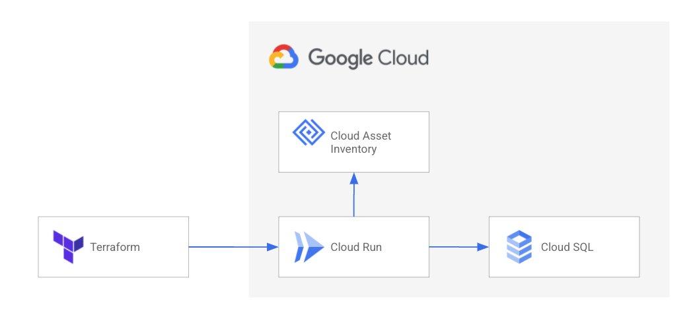

# IPAM Autopilot

IPAM Autopilot is a simple Docker Container and Terraform provider that allows you to manage automatically manage IP ranges for GCP VPCs.

It connects to Cloud Asset Inventory to also retrieve already existing subnets and ranges, in order to allow for a mixed usage.

IPAM Autopilot consists of two parts, a [backend service](./container) that provides a Rest API and a [terraform provider](./provider).

## Deploying IPAM Autopilot Backend
The [infrastructure](./infrastructure) folder contains a sample Terraform setup with which the IPAM Autopilot backend can be deployed to CloudRun. It provisions a CloudSQL instance as well. The container is also build as part of this setup.

The following GCP services are used as part of the deployment, and might cause cost:
  * [Cloud Run](https://cloud.google.com/run)
  * [CloudSQL](https://cloud.google.com/sql)
  * [Secret Manager](https://cloud.google.com/secret-manager)

## Building and providing the Terraform Provider
You can build the Terrafrom provider by calling `make release` from the provider folder.