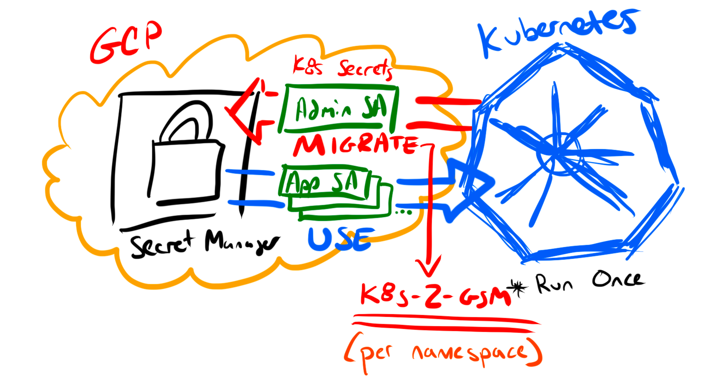
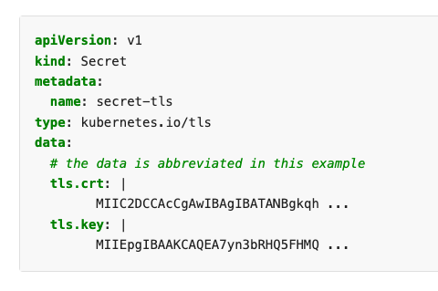

`k8s-2-gsm` is a containerized script that leverages the Google and Kubernetes API client to migrate Kubernetes secrets to Google Secret Manager.

## Overview

`k8s-2-gsm` runs once per namespace (the traditional security boundary per Kubernetes secret / tenant). `Admin SA` is a GCP service account with permissions to create/manage secrets in a GCP project.



1. Creates, or deletes, secrets in Google Secret Manager based on all non-`service-account-token` secrets in a namespace. `k8s-2-gsm` exits/fails if any secret it's trying to migrate exists in GSM.
1. Generates a JSON report of GSM object identification (NO SECRET OBJECT PAYLOAD / DATA). To be used in future automation / migration activities.
1. Generates ready-to-apply `SecretProviderClass` yaml for each Kubernetes secret (printed to stdout). Allowing the CSI driver to consume multiple GSM secrets in a single CSI object.
1. Generates a markdown doc with instructions how to migrate each secret (printed to stdout).

> `k8s-2-gsm` was designed to assist cluster operators with moving secrets to Google Secret Manager and providing the application owners with instructions to migrate.

## Out of scope

1. It does not delete secrets from Kubernetes, the `--delete` flag only deletes Google Secret Manager secrets.
1. The `App SA` isn't created or used by `k8s-2-gsm`, the creation left to cluster operators.
1. It does not update any existing deployments to use the CSI driver (only instructions).

After the script is ran, the next steps would be to migrate applications to the CSI secrets driver and delete the Kubernetes secrets.

## Known limitations / Security considerations

- Google Secret Manager is a key/value store, meaning only one secret per object.
  - Example: If you had 1 Kubernetes secret with 2 objects (tls.crt / tls.key), you now need 2 Google Secret Manager secrets (and 2 references / mounts in yaml).

    

  - However, the CSI Secret Driver supports mounting multiple secrets store objects as a single volume via SecretProviderClass.
- The values/file [payload size must be no larger than 64 KiB](https://cloud.google.com/secret-manager/quotas#content_limits)
  - Kubernetes secret [size limit is 1MiB](https://kubernetes.io/docs/concepts/configuration/secret/#restriction-data-size)

`k8s-2-gsm` avoids using secret data payloads if possible. There is only one variable, `secretContent`, that captures secret object data and is used for `createGoogleSecret()` (ran as many times as you have secrets objects). The rest of the code is managing non-sensitive data for reporting.

If you want to skip the following build steps, jump to a full [end to end demo](demo/README.md) (in /demo).

## Prerequisites

- A Kubernetes cluster
- Google Project with billing enabled & owner access
  - with Secret Manager (`gcloud services enable secretmanager.googleapis.com`)

## Quick start (using go) outside of GKE

The application attempts to act as a script and is a single file (main.go). Run it outside of a cluster.

### 1) Set variables from `.env`

```shell
# make modifications to .env and export
source .env
```

### 2) Setup CLI authentication

```shell
# refresh GCP credentials This is the account / ADC used for managing secrets
gcloud auth application-default login --no-launch-browser --quiet

# get a valid kubeconfig or set KUBECONFIG="${HOME}/.kube/config"
gcloud container clusters get-credentials ${GKE_NAME}
```

### 3) Run the script

```shell
# clone the repo
git clone git@github.com:GoogleCloudPlatform/professional-services.git && \
cd ./professional-services/tools/k8s-2-gsm

# copy k8s secrets to project gsm
go run . --project=${PROJECT_ID} --namespace=${NAMESPACE}

# go run . --help
# go run . --project=${PROJECT_ID} --namespace=${NAMESPACE} --prefix="cluster1" --delete --debug
```

## Building the `k8s-2-gsm` container

The utility can be build using [ko build](https://github.com/ko-build/ko) (a binary that can build multi-arch golang containers with no container runtime)

```
# install ko & authenticate to a OCI repo

# export the repo path to push
export KO_DOCKER_REPO="us-central1-docker.pkg.dev/mylab/public/secret-migration"

# create the image (auto push (build) to GCR if authenticated)
ko build --platform=linux/amd64,linux/arm64 --bare --tags "1.0.0-alpha" .
```

Alternately, there's a [Dockerfile example](Dockerfile) too that may be used.

```
# authenticate to a OCI repo

docker build -t REPO/K8S2GSM:TAG .

# push to a public repo
```
## Quick start (using Workload Identity) inside GKE

If running in a GKE cluster, Workload Identity provides credentials to write Google secrets. Ensure the following is met:

- GCP
  - [Workload Identity enabled](https://cloud.google.com/kubernetes-engine/docs/how-to/workload-identity#enable)
  - A GCP service account to create secrets `gcloud iam service-accounts create ${SA_NAME} --project=${PROJECT_ID}`
    - (does not need to match anything in k8s or GCP)
  - IAM to create secrets as SA (`gcloud projects add-iam-policy-binding ${PROJECT_ID} --member "serviceAccount:${SA_NAME}@${PROJECT_ID}.iam.gserviceaccount.com" --role "roles/secretmanager.admin"`)
  - IAM to use Workload Identity as SA in specific K8S_NAMESPACE (`gcloud iam service-accounts add-iam-policy-binding ${SA_NAME}@${PROJECT_ID}.iam.gserviceaccount.com  --role roles/iam.workloadIdentityUser --member "serviceAccount:${PROJECT_ID}.svc.id.goog[${K8S_NAMESPACE}/${K8S_SERVICEACCOUNT}]"`)
- K8S
  - A Kubernetes service account to read secret data (`kubectl -n ${K8S_NAMESPACE} create serviceaccount ${K8S_SERVICEACCOUNT}`)
    - Annotate the K8s service account with GCP annotation (`kubectl annotate serviceaccount ${K8S_SERVICEACCOUNT} --namespace ${K8S_NAMESPACE} iam.gke.io/gcp-service-account=${SA_NAME}@${PROJECT_ID}.iam.gserviceaccount.com`)

### Create Kubernetes secret reader RBAC

The following allows us to grant the `${K8S_SERVICEACCOUNT}` the ability to view secrets via Workload Identity:

```shell
# create cluster role allowing to read secrets
kubectl create clusterrole secret-reader --verb=get,list,watch --resource=secrets

# bind the cluster role to our Workload Identity service account
kubectl -n ${K8S_NAMESPACE} create rolebinding read-secrets-${K8S_NAMESPACE} --clusterrole=secret-reader --serviceaccount=${K8S_NAMESPACE}:${K8S_SERVICEACCOUNT}
```

### Run the Kubernetes job

```shell
cat <<EOF | kubectl apply -f -
apiVersion: batch/v1
kind: Job
metadata:
  name: migrate-secrets
spec:
  backoffLimit: 0  # run once
  template:
    spec:
      containers:
      - image: REPO/K8S2GSM:TAG  # <------ replace me
        name: migrate-secrets
        args:
        - --project=${GCP_PROJECT}
        - --namespace=${K8S_NAMESPACE}
      restartPolicy: Never
      serviceAccountName: ${K8S_SERVICEACCOUNT}
EOF
```

Debug using the logs

```shell
# careful if you have lots of jobs
kubectl -n ${K8S_NAMESPACE} logs job/migrate-secrets

# consider appending the output to a file (ex: `> /tmp/log`)
```

### Job clean up

The following cleans up Kubernetes complete job list

```shell
./hack/clean-up.sh
```

### Troubleshooting

> failed to define/gather list secret names: secrets is forbidden: User "system:serviceaccount:default:secret-grabber" cannot list resource "secrets" in API group "" in the namespace "default"

First, check that the service account is the correct one. Then ensure there is some form of RBAC binding allowing GET/WATCH/LIST on the objects. See [Checking API Access](https://kubernetes.io/docs/reference/access-authn-authz/authorization/#checking-api-access):

```shell
# grep for secrets: `| grep secrets` and look for [get watch list]
kubectl auth can-i --list --namespace ${NAMESPACE} --as system:serviceaccount:${NAMESPACE}:${K8S_SERVICEACCOUNT}
```

## TODO:
- output yaml/readme help to files vs. stdout
- account for networking failure / retries
- for the day-2-day use, maybe switch to "roles/secretmanager.secretAccessor"

## Disclaimer

This is not an official Google project.

## Thanks

Special thanks to Eric Hole ([@geojaz](https://github.com/geojaz)) for helping improve the original MVP design.
