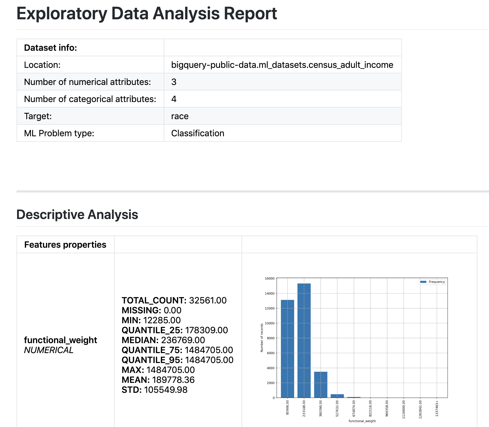

# Auto Data Exploration and Feature Recommendation Tool

Machine learning (ML) projects typically start with a comprehensive exploration of the provided datasets. 
It is critical that ML practitioners to gain a deep understanding of: 
- the properties of the data. 
- the quality of the data. 
- the potential predictive power of the data.

This process lays the groundwork for the subsequent feature selection and engineering steps, and it provides a solid 
foundation for building good ML models. Exploratory Data Analysis (EDA), feature selection, and engineering are often 
tied together and are important steps of the ML journey.

The objective of this tool is to perform comprehensive EDA, which includes
- Descriptive analysis of each attribute in a dataset for numerical, categorical
- Correlation analysis of two attributes (numerical versus numerical, numerical versus categorical, 
and categorical versus categorical) through qualitative and/or quantitative analysis.

The analysis results can be exported as a dictionary object, which can be loaded back for customized analysis.
Based on the EDA performed, feature recommendations are made, and a summary report will be generated in **markdown**, 
**html** and **pdf** (if `wkhtmltopdf` is installed) formats. A snapshot of the sample report is as follows:




Google Cloud tools used:
- [Google Cloud Platform](https://cloud.google.com/) (GCP) lets you build and 
host applications and websites, store data, and analyze data on Google's 
scalable infrastructure.
- [Google BigQuery](https://cloud.google.com/bigquery/) A fast, highly scalable, 
cost-effective, and fully managed cloud data warehouse for analytics, with even 
built-in machine learning.

## Use the tool
```shell
bash run.sh \
    --key_file [KEY_FILE] \
    --data_source [DATA_SOURCE] \
    --preprocessing_backend [BACK_END] \
    --parallel_thread [NUM_PARALLEL] \
    --job_config [JOB_CONFIG_FILE] \
    --bq_table [BQ_TABLE] \
    --generated_job_config [TO_GENERATE] \
    --target_name [TARGET_ATTRIBUTE] \
    --target_type [TARGET_TYPE] \
    --report_path [REPORT_PATH] \
    --add_config_to_report [TO_ADD_CONFIG] \
    --export_result [TO_EXPORT_RESULT] \
    --sampling_rate [SAMPLING_RATE]
```
where:

- KEY_FILE, **optional**, string: Key file of the service account used to authenticate to the BigQuery API. If this is
not specified, the `GOOGLE_APPLICATION_CREDENTIALS` from the environment variable will be used.
- DATA_SOURCE, **optional**, enum: Type of data source containing the training data. **Currently only support `BIGQUERY`**.
- BACK_END, **optional**, enum: Analysis computation backend. **Currently only support `BIGQUERY`**.
- NUM_PARALLEL, **optional**, int: Number of parallel queries issued to `BACK_END`.
- JOB_CONFIG_FILE, string: Configuration file containing the description of the datasource, and configurations of analysis.
- BQ_TABLE, string: BigQuery table name to be analyzed, in the format of [project.dataset.table].
- TARGET_ATTRIBUTE, **optional**, string: Name of attribute acting as target (label) in a ML problem.
- TARGET_TYPE, **optional**, enum: Data type of the target attribute, either `Categorical` or `Numerical`.
- TO_GENERATE, **optional**, boolean: Indicates whether the job config file should be regenerated from the datasource. 
If this is true, the generated `job_config.ini` will be saved at the path specified in `JOB_CONFIG_FILE`.
- REPORT_PATH, **optional**, string: Path of the folder for storing generated report.
- TO_ADD_CONFIG, **optional**, boolean, Indicates whether the job configuration will be added to the report.
- TO_EXPORT_RESULT, **optional**, boolean, Indicates whether the analysis result will be exported, which can be further
load back for post analysis.
- SAMPLING_RATE, **optional**, float: the sampling rate used for statistical test.

One example is as follows:
```shell
bash run.sh \
    --generate_job_config True \
    --bq_table bigquery-public-data.ml_datasets.census_adult_income \
    --target_name race
```

#### Remarks
- `TARGET_ATTRIBUTE` and `TARGET_TYPE` will only take effect while generating `job_config.ini` from the datasource, i.e.,
`TO_GENERATE` is set `True`

### Load exported analysis results
To help reload exported analysis results for further custom analysis, we have provided a utility function in
[result_loader.py](ml_eda/result_loader.py) to load exported analysis results to the format of 
`{analysis_name: analysis_protobuf_object}`. It is also possible to test the function by running from 
the top level folder as:
```python
python3 -m ml_eda.result_loader --result_file <file_path>
```

## Customize job_config.ini
It is possible to customize the `job_config.ini` if you want to
- Specify which attributes to analyze
- Control what analysis to performed
- Tune parameters for certain analysis

One example of the `job_config.ini` is as follows:
```ini
[DATASOURCE]
Type=BIGQUERY
Location=bigquery-public-data.ml_datasets.census_adult_income

[SCHEMA]
# If a column is integer type but categorical in nature, it should be assigned to categorical feature.
# The ml problem type will be determined by whether `Target` is in `NumericalFeatures` or `CategoricalFeatures`.

# Put `Null` if no target is required
Target=age
NumericalFeatures=age,hours_per_week,functional_weight,education_num
CategoricalFeatures=marital_status,race,education,native_country

[ANALYSIS.RUN]
# Control what analysis to run.
# By default, descriptive, histogram, value_counts, pearson_correlation will run.
# Others will be triggered by configuration.

# Qualitative Analysis
CONTINGENCY_TABLE.Run=True
TABLE_DESCRIPTIVE.Run=False

# Quantitative Analysis
PEARSON_CORRELATION.Run=True
INFORMATION_GAIN.Run=False
CHI_SQUARE.Run=False
ANOVA.Run=False

[ANALYSIS.CONFIG]
General.CardinalityLimit=20
HISTOGRAM.Bin=15
VALUE_COUNTS.Limit=15
```

#### Remarks
- A base version of the `job_config.ini` file can be regenerated from the datasource. 
And then further customization can be performed to perform desired analysis or tune parameters
- While generating `job_config.ini` from datasource, the datatype follows the attached convention. 
But, this can be definitely customized after the basic version of the `job_config.ini` is generated by the problem.
    - Integer -> Numerical
    - Float -> Numerical
    - Timestamp -> Numerical
    - String -> Categorical
    - Boolean -> Categorical
- Moreover, without customization of `job_config.ini`, only the following analysis will be run
    - Descriptive Analysis
    - Pearson Correlation
    - Information Gain

## Supported Analysis
The supported analysis can be summarized here
- Descriptive Analysis
    - Missing values
    - Quantile statistics
    - Descriptive statistics
    - Distribution histogram
    - Cardinality
    - Unique counts
- Correlation Analysis
    - Qualitative Analysis
        - Contingency table
        - Descriptive table
    - Quantitative Analysis
        - Pearson correlation
        - Information gain
        - ANOVA
        - Chi-Square

## Current Release
Current release is: `1.1`
### Change Logs
- Ensure Python3 runtime;
- Consistent numeric notation;
- Append job configuration to the final report;
- Performance improvement through parallel query execution;
- Generate different formats of report: markdown, html, pdf;
- Export analysis result as dictionary;
- Sample dataset for statistical test;

## Contributors
- [Shixin Luo](https://github.com/luotigerlsx)
- [Dan Anghel](https://github.com/dan-anghel)
- [Barbara Fusinska](https://github.com/BasiaFusinska)
