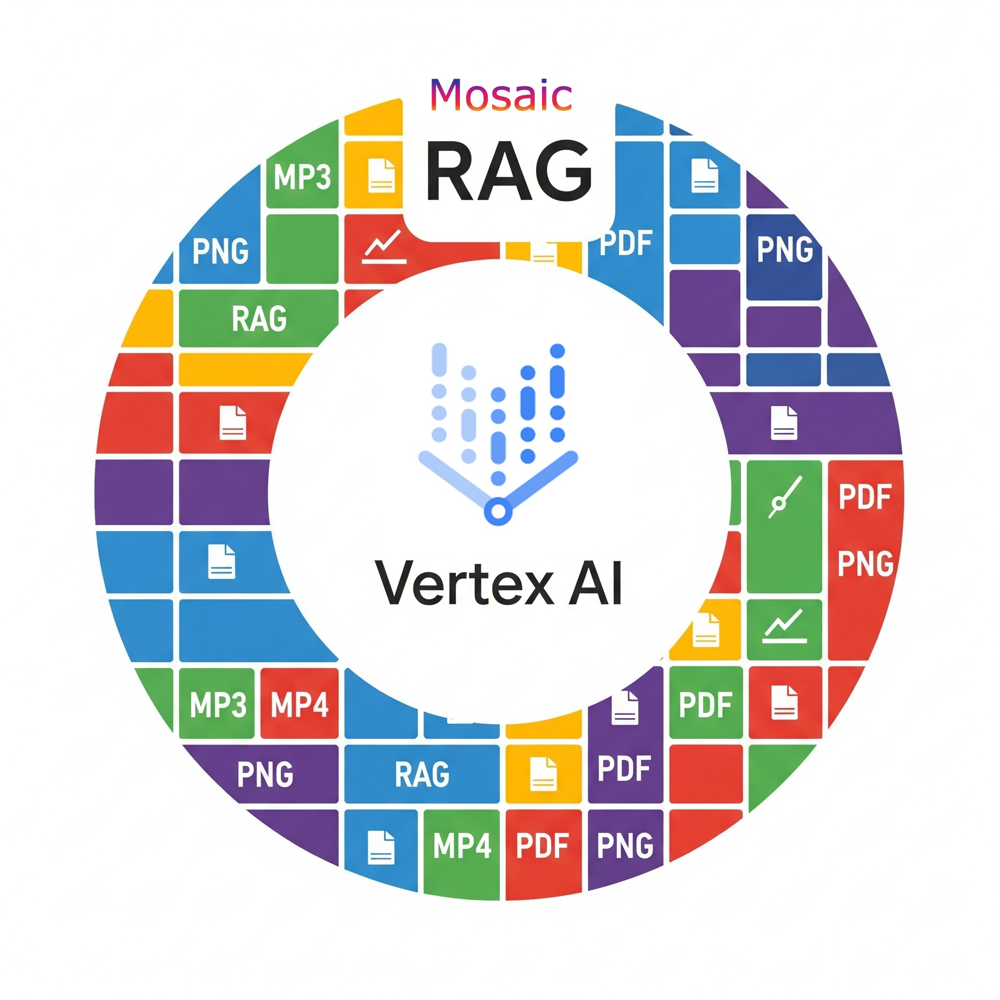
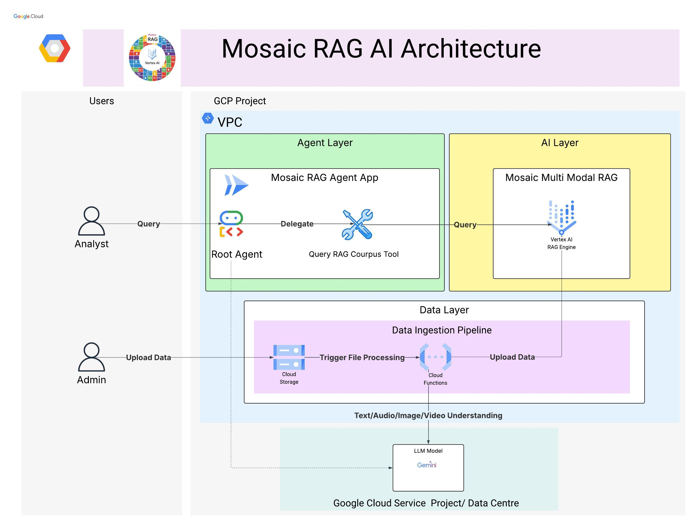

<div align="center">
  
</div>

<h1 align="center">
  Mosaic RAG AI 🧩
</h1>

<p align="center">
  
  
  
  
  
  
</p>

<p align="center">
  Welcome to Mosaic RAG AI, a state-of-the-art system architecture designed to transform your organization's data archive into a dynamic, interactive knowledge base. This system moves beyond simple keyword search, allowing users to have natural language conversations with their data, regardless of the format: video, audio, images, PDFs, and text.
</p>

## 🗂️ Supported Formats

The pipeline is designed to handle a mosaic of file types. When you upload files to the trigger bucket, the Cloud Function automatically processes them based on their extension:

*   **Documents**:
    *   `pdf`: Extracts text and any embedded images. The text is ingested directly, and the images are described by Gemini, with the descriptions also added to the corpus.
*   **Images**:
    *   `png`, `jpg`, `jpeg`, `webp`: Gemini generates a detailed description of the image, which is then ingested.
*   **Audio**:
    *   `mp3`, `m4a`, `aac`, `flac`, `wav`, `opus`, `mpga`, `mp4`, `pcm`, `webm`: Gemini transcribes or describes the audio content, and the resulting text is ingested.
*   **Video**:
    *   `mov`, `qt`, `flv`, `mpeg`, `mpg`, `wmv`, `3gp`: Gemini analyzes the video content and generates a description, which is then ingested.
---

## 🏛️ Architecture Overview

Imagine asking your data a question and getting a direct, contextualized answer, rather than just a list of files. That's the power this architecture unlocks, merging the capabilities of Large Language Models (LLMs), Retrieval-Augmented Generation (RAG), and an intelligent agent architecture on the robust Google Cloud infrastructure.

<div align="center">
  <!-- Placeholder for an architecture diagram image -->
  
</div>

### 🗺️ Workflow at a Glance
This system operates on two primary, interconnected flows that turn raw data into actionable intelligence.

**Data Ingestion Flow:** An Admin uploads files in various formats (.mp4, .mp3, .jpeg, .pdf, .txt) to Google Cloud Storage. This action automatically triggers a process that uses the Gemini model to "understand" the content. The extracted insights are then loaded into a specialized Vertex AI Multimodal RAG engine.

**Data Query Flow:** An Analyst asks a question in plain language through an agent app. The agent interprets the query, uses a tool to search for the most relevant information from the RAG engine, and then generates a coherent, contextual answer for the analyst.

The system is securely housed within a Google Cloud Project's VPC (Virtual Private Cloud), logically divided into an Agent Layer, an AI Layer, and a Data Layer.

#### 👤 Users: The Human Roles
**Admin:** The data gatekeeper. This person is responsible for uploading all raw data assets, from PDF reports to video recordings, into the system.

**Analyst:** The knowledge seeker. This user interacts with the system by asking questions to gain insights, conduct research, and find specific answers buried within the vast sea of data.

#### 📥 The Data Ingestion Pipeline: The Data's Journey
This is the heart of the system's data understanding. It transforms static files into a living, searchable knowledge base.

*   **Data Upload:** The journey begins when the Admin uploads files to Google Cloud Storage, a secure and scalable object store.
*   **Processing Trigger:** The file upload instantly triggers a Google Cloud Function.
*   **Multimodal Understanding:** This function leverages the power of the Gemini LLM Model to perform a deep understanding of the content:
    *   **Video/Image:** Recognizes objects, scenes, and extracts text.
    *   **Audio:** Transcribes spoken words into text.
    *   **PDF/Text:** Extracts and structures textual content.
*   **Populating the AI's Memory:** The extracted and structured information is loaded into the Mosaic Multi Modal RAG Engine, built on the Vertex AI RAG Engine. This creates rich vector embeddings (numerical representations) of the data, capturing semantic meaning rather than just keywords.

#### 🤖 The AI & Agent Layer: The Analyst's Experience
This is where the magic happens. The system bridges the gap between human intent and complex data retrieval.

*   **The Question:** The Analyst starts the conversation by asking a question through the Mosaic RAG Agent App (e.g., "What was said about Q4 revenue targets in the last all-hands meeting?").
*   **Intelligent Root Agent:** The query is received by a Root Agent. This agent acts as an intelligent dispatcher.
*   **Delegation to Tools:** The Root Agent delegates the task to the Query RAG Corpus Tool, a specialized tool designed to interface with the AI knowledge base.
*   **Retrieval & Generation (RAG):** The tool queries the Mosaic Multi Modal RAG Engine:
    *   **Retrieval:** The engine searches its vector index to find the most relevant, contextual snippets of information from all the uploaded documents, videos, and images.
    *   **Generation:** These retrieved snippets are handed to the LLM (Gemini), which then generates a concise, natural language answer. It doesn't just link to a file; it synthesizes the information to directly answer the Analyst's question.

## ✨ Key Features

*   ✅ **Multimodal Ingestion:** Natively accepts and understands video, audio, image, PDF, and text data.
*   ✅ **Natural Language Query:** Users can ask questions conversationally.
*   ✅ **Contextual Answers:** Provides direct answers synthesized from relevant data instead of just document lists.
*   ✅ **Agent-Based Architecture:** Uses intelligent agents to interpret user intent and delegate tasks efficiently.
*   ✅ **Scalable & Secure:** Built on Google Cloud's secure and scalable infrastructure.
*   ✅ **Automated Processing:** Data ingestion and processing are fully automated and event-driven.

## 🛠️ Tech Stack

*   **Cloud Platform:** Google Cloud Platform (GCP)
*   **Storage:** Google Cloud Storage
*   **Serverless Compute:** Google Cloud Functions
*   **AI/ML:** Google Vertex AI (RAG Engine)
*   **LLM Model:** Google Gemini
*   **Architectural Pattern:** Retrieval-Augmented Generation (RAG), Agentic Architecture

## 💡 Why It's Awesome

The Mosaic RAG AI architecture represents a paradigm shift from data search to data conversation. It democratizes access to information, breaking down the silos created by different file formats. By turning a diverse media archive into a single, queryable source of knowledge, it allows organizations to:

*   **Accelerate Research:** Find answers in minutes, not hours of manual searching.
*   **Uncover Hidden Insights:** Discover connections between different data types that were previously impossible to find.
*   **Enhance Productivity:** Empower non-technical employees to get answers from complex data without needing specialized skills.

This is the future of business intelligence, where every piece of data—whether seen, heard, or read—becomes an accessible and actionable part of an organization's collective knowledge.

## 🚀 Getting Started: A Two-Step Workflow

To get your own Mosaic RAG system running, you will first deploy the data pipeline and then deploy the agent that connects to it.

### Prerequisites

*   Google Cloud SDK installed and authenticated (`gcloud auth application-default login`).
*   Terraform installed.
*   Python 3.10+ and Pip installed.
*   Your target GCP Project is configured: `gcloud config set project YOUR_PROJECT_ID`.

---

### Step 1: Deploy the Data Ingestion Pipeline

This step provisions the GCS bucket, the processing Cloud Function, and the Vertex AI RAG Corpus.

1.  **Navigate to the pipeline directory:**
    ```bash
    cd data-ingestion-pipeline
    ```

2.  **Follow the detailed instructions** in the **Data Ingestion Pipeline README**.

    **TL;DR:**
    *   Create and configure your `infra_deployment/terraform.tfvars` file with your project details.
    *   Run `./deploy-infra.sh` to provision the resources.
    *   Upload your source documents, images, and media files to the newly created GCS bucket (the one ending in `-trigger`). The pipeline will automatically process them.

---

### Step 2: Deploy the Mosaic RAG Agent

This step deploys the conversational agent that will answer questions based on the data you just ingested.

1.  **Navigate to the agent directory:**
    ```bash
    # From the project root
    cd agent
    ```

2.  **Follow the detailed instructions** in the **Mosaic RAG Agent README**.

    **TL;DR:**
    *   Create and configure your `.env` file with your project details and the `CORPUS_PATH` from the previous step's Terraform output.
    *   To run locally for testing, execute `adk web`.
    *   To deploy as a scalable service on Google Cloud, run `./deploy-agent.sh YOUR_GCP_PROJECT_ID`.

Once deployed, you will have a service URL for your agent, which you can query with your questions!

## 📂 Project Structure

```
.
├── agent/                  # Contains the Mosaic RAG Agent (FastAPI, ADK)
│   ├── agent.py
│   ├── Dockerfile
│   ├── deploy-agent.sh
│   └── README.md
├── data-ingestion-pipeline/  # Contains the automated data ingestion pipeline (Terraform, Cloud Function)
│   ├── infra_deployment/
│   ├── deploy-infra.sh
│   └── README.md
├── mosaic-rag-logo.jpg       # Project logo
└── README.md                 # You are here!
```

## 🧹 Cleanup

To avoid ongoing charges, you can destroy the cloud resources created by this project.

1.  Navigate to the `data-ingestion-pipeline` directory.
2.  Run the destruction script:
    ```bash
    ./destruct-infra.sh
    ```
    This will execute `terraform destroy` and remove all resources managed by Terraform. You will need to manually delete the deployed Cloud Run agent service if you deployed it.

## 🤝 Contributing

Contributions are welcome! Please feel free to fork the repository, make changes, and open a pull request.

## 📄 License

This project is distributed under the MIT License.
