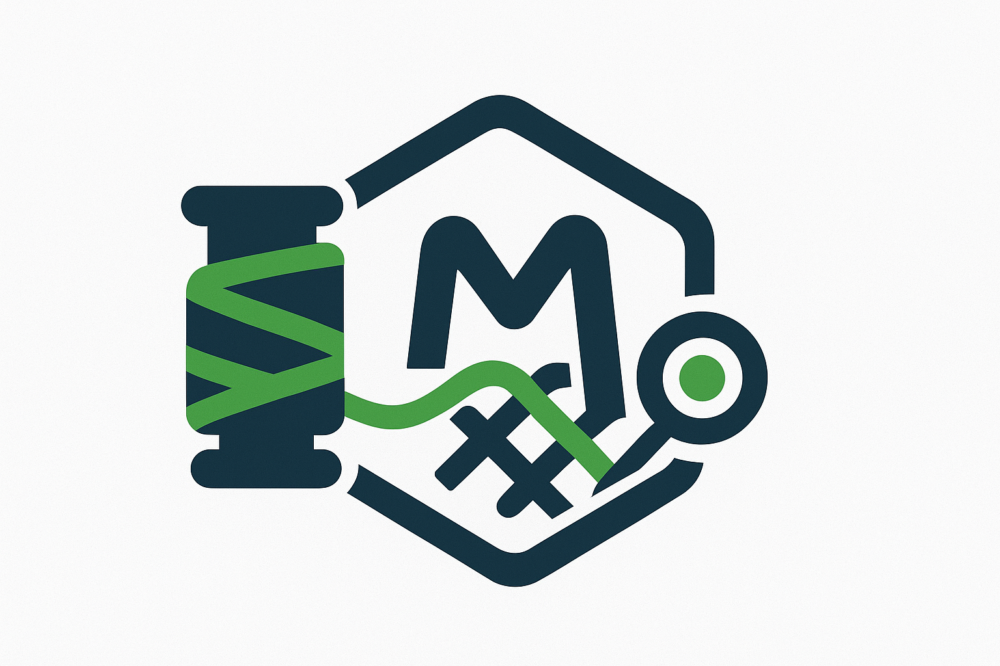
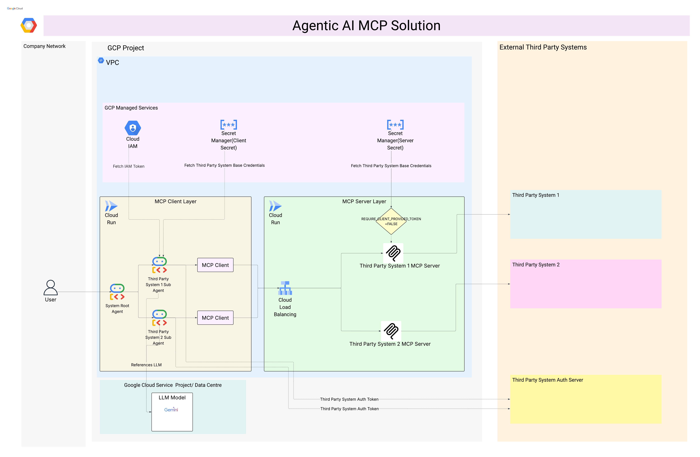

<div align="center">
  
</div>

<h1 align="center">
  OAS MCP Tools Weaver 🕸️
</h1>

<p align="center">
  
  
  
  
</p>

<p align="center">
  Welcome to <strong>OAS MCP Tools Weaver</strong>, a powerful Spring Boot application that serves as a dynamic tool provider for AI models. It parses an OpenAPI 3.0 specification at startup and exposes each API operation as a "tool" that can be invoked by a Large Language Model (LLM). This bridges the gap between your existing RESTful APIs and modern LLMs, enabling them to interact with your services through the standardized <a href="https://github.com/GoogleCloudPlatform/genai-toolbox/blob/main/mcp/spec/McpSpec.proto">Model-Context-Protocol (MCP)</a>.
</p>

---

## 🏛️ Architecture & Workflow
LLMs can be augmented with "tools" that allow them to interact with external systems. The Model-Context-Protocol (MCP) provides a standard for defining these tools. The **OAS MCP Tools Weaver** is a Spring Boot server that dynamically exposes your OpenAPI-defined APIs as MCP-compliant tools for LLMs.
This server dynamically exposes your OpenAPI-defined APIs as tools for LLMs.

The workflow is simple:

1.  **Configuration**: You place your OpenAPI 3.0 specification file (`spec.json` or `spec.yaml`) inside the application's resources and configure a `ToolCallbackProvider` bean for it.
2.  **Startup**: On startup, the Spring Boot application parses the OpenAPI specification, extracting API endpoints, parameters, and request/response schemas.
3.  **Tool Exposure**: The server dynamically creates and exposes an MCP-compliant "tool" for each API operation. It intelligently handles complex schemas (e.g., `oneOf`, `allOf`) to make them understandable to LLMs.
4.  **Interaction**: An LLM can now discover and invoke these tools. The server translates the LLM's tool call into a live HTTP request to your backend API, including authentication, and returns the result.

<div align="center">
  
</div>

## ✨ Key Features

*   ✅ **Dynamic Tool Serving**: No need to manually generate static tool files. Tools are created at runtime directly from your OAS.
*   ✅ **OpenAPI 3.0 Support**: Works with the industry-standard API specification format.
*   ✅ **Intelligent Schema Handling**: Simplifies complex JSON schemas (`oneOf`, `allOf`) from the OAS, making them easier for LLMs to consume.
*   ✅ **Enterprise Ready**: Built with Java and Spring Boot, a robust and widely-adopted stack for enterprise-grade applications.
*   ✅ **MCP Compliant**: Adheres to the Model-Context-Protocol for standardized tool interaction with LLMs.

## 🚀 Getting Started

Follow these steps to install and run the tool.

### Prerequisites

*   Java 17 or higher
*   Apache Maven
*   An OpenAPI 3.0 specification file for your API.

### Installation

1.  **Clone the repository:**
    ```bash
    git clone https://github.com/your-repo/oas-mcp-tools-weaver.git
    cd oas-mcp-tools-weaver/mcpserver
    ```

2.  **Place your OpenAPI Specification:**
    Copy your OpenAPI specification file (e.g., `my-api.yaml`) into the `src/main/resources/openapi/` directory.

3.  **Configure the Tool Provider:**
    You must create a `ToolCallbackProvider` bean for your OpenAPI specification. Open the relevant Spring configuration file and add a bean definition similar to the following:

    ```bash
    @Bean
    ToolCallbackProvider myApiTools(OASSchemaHandler schemaProcessor, RestTemplate restTemplate) {
        return new DynamicOpenApiToolCallbackProvider("/openapi/my-api.yaml", schemaProcessor, restTemplate, apiUrlEnv);
    }
    ```

### Usage

The server is run as a standard Spring Boot application using Maven.

1.  **Set Environment Variables:**
    Before running, ensure you have set the required environment variables.
    ```bash
    export API_ENV_URL="https://your.api.backend.com"
    ```

2.  **Run the Application:**
    Navigate to the `mcpserver` directory and execute the following Maven command:
    ```bash
    mvn spring-boot:run
    ```

    The server will start (by default on port `8081`) and will be ready to serve tools to your LLM.