# Quota Monitoring and Alerting 
> An easy-to-deploy Data Studio Dashboard with alerting capabilities, showing usage and quota limits in an organization or folder.

Google Cloud enforces [quotas](https://cloud.google.com/docs/quota) on resource usage for project owners, setting a limit on how much of a particular Google Cloud resource your project can use. Each quota limit represents a specific countable resource, such as the number of API requests made per day to the number of load balancers used concurrently by your application.
Quotas are enforced for a variety of reasons:
- To protect the community of Google Cloud users by preventing unforeseen spikes in usage.
- To help you manage resources. For example, you can set your own limits on service usage while developing and testing your applications.

We are introducing a new custom quota monitoring and alerting solution for Google Cloud customers.
## 1. Summary
Quota Monitoring Solution is a stand-alone application of an easy-to-deploy Data Studio dashboard with alerting capabilities showing all usage and quota limits in an organization or folder.
### 1.1 Four Initial Features


*The data refresh rate depends on the configured frequency to run the application.
## 2. Architecture
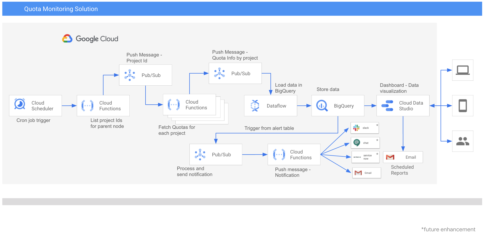

The architecture is built using Google Cloud managed services - Cloud Functions, Pub/Sub, Dataflow and BigQuery. 
- The solution is architected to scale using Pub/Sub.
- Cloud Scheduler is used to trigger Cloud Functions. This is also an user interface to configure frequency, parent nodes, alert threshold and email Ids. Parent node could be an orgnization Id, folder id, list of organization Ids or list of folder Ids.
- Cloud Functions are used to scan quotas across projects for the configured parent node.
- DataFlow is used to load data in BigQuery.
- BigQuery is used to store data. 
- Alert threshold will be applicable across all metrics. 
- Alerts can be received by email and other channels.
- Easy to get started and deploy with Data Studio Dashboard. In addition to Data Studion, other visualization tools can be configured. 
- The Data Studio report can be scheduled to be emailed to appropriate team for weekly/daily reporting.
## 3. Deployment Guide
### Content
- [3.1 Prerequisites](https://github.com/anuradha-bajpai-google/professional-services/new/main/tools/quota-monitoring-alerting#31-prerequisites)
- [3.2 Initial Setup](https://github.com/anuradha-bajpai-google/professional-services/new/main/tools/quota-monitoring-alerting#32-initial-setup)
- [3.3 Create Service Account](https://github.com/anuradha-bajpai-google/professional-services/new/main/tools/quota-monitoring-alerting#33-create-service-account)
- [3.4 Grant Roles to Service Account](https://github.com/anuradha-bajpai-google/professional-services/new/main/tools/quota-monitoring-alerting#34-grant-roles-to-service-account)
  - [3.4.1 Grant Roles in the Host Project](https://github.com/anuradha-bajpai-google/professional-services/new/main/tools/quota-monitoring-alerting#341-grant-roles-in-the-host-project)
  - [3.4.2 Grant Roles in the Target Folder](https://github.com/anuradha-bajpai-google/professional-services/new/main/tools/quota-monitoring-alerting#342-grant-roles-in-the-target-folder)
  - [3.4.3 Grant Roles in the Target Organization](https://github.com/anuradha-bajpai-google/professional-services/new/main/tools/quota-monitoring-alerting#343-grant-roles-in-the-target-organization)
- [3.6 Download Service Account Key File](https://github.com/anuradha-bajpai-google/professional-services/new/main/tools/quota-monitoring-alerting#35-download-service-account-key-file)
- [3.5 Download Terraform File](https://github.com/anuradha-bajpai-google/professional-services/new/main/tools/quota-monitoring-alerting#36-download-terraform-file)
- [3.7 Configure Terraform](https://github.com/anuradha-bajpai-google/professional-services/new/main/tools/quota-monitoring-alerting#37-configure-terraform)
- [3.8 Run Terraform](https://github.com/anuradha-bajpai-google/professional-services/new/main/tools/quota-monitoring-alerting#38-run-terraform)
- [3.9 Testing](https://github.com/anuradha-bajpai-google/professional-services/new/main/tools/quota-monitoring-alerting#39-testing)
- [3.10 Data Studio Dashboard setup](https://github.com/anuradha-bajpai-google/professional-services/new/main/tools/quota-monitoring-alerting#310-data-studio-dashboard-setup)
- [3.11 Scheduled Reporting](https://github.com/anuradha-bajpai-google/professional-services/new/main/tools/quota-monitoring-alerting#311-scheduled-reporting)
### 3.1 Prerequisites
1. Host Project - A project where the BigQuery instance, Cloud Function and Cloud Scheduler will be deployed. For example Project A. 
2. Target Node - The Organization or folder or project which will be scanned for Quota Metrics. For example Org A and Folder A.
3. Project Owner role on host Project A. IAM Admin role in target Org A and target Folder A.
4. Google Cloud SDK is installed. Detailed instructions to install the SDK [here](https://cloud.google.com/sdk/docs/install#mac). See the Getting Started page for an introduction to using gcloud and terraform. 
5. Terraform version >= 0.14.6 installed. Instructions to install terraform here
    - Verify terraform version after installing 

```
terraform -version
```
The output should look like:
```
Terraform v0.14.6
+ provider registry.terraform.io/hashicorp/google v3.57.0
```
*Note - Minimum required version v0.14.6. Lower terraform versions may not work.*
### 3.2 Initial Setup
1. In local workstation create a new directory to run terraform and store credential file
```
mkdir <directory name like quota-monitoring-dashboard>
cd <directory name>
```
2. Set default project in config to host project A
```
gcloud config set project <HOST_PROJECT_ID>
```
The output should look like:
```
Updated property [core/project].
```
3. Ensure that the latest version of all installed components is installed on the local workstation.
```
gcloud components update
```
4. Cloud Scheduler depends on the App Engine application. Create an app engine application in the host project. Replace the region. List of regions where App-Engine is available can be found [here](https://cloud.google.com/about/locations#region).
```
gcloud app create --region=<region>
```
Note: Cloud Scheduler (below) needs to be in the same region as App Engine. Use the same region in terraform as mentioned here. Also, selected region should have a VPC subnet available in the region for the DataFlow deployment.
The output should look like:
```
You are creating an app for project [quota-monitoring-project-3].
WARNING: Creating an App Engine application for a project is irreversible and the region
cannot be changed. More information about regions is at
<https://cloud.google.com/appengine/docs/locations>.

Creating App Engine application in project [quota-monitoring-project-1] and region [us-east1]....done.                                                                                                                               
Success! The app is now created. Please use `gcloud app deploy` to deploy your first app.

```
### 3.3 Create Service Account
1. In local workstation, setup environment variables. Replace the name of the Service Account in the commands below
```
DEFAULT_PROJECT_ID=$(gcloud config get-value core/project 2> /dev/null)
export SERVICE_ACCOUNT_ID="sa-"$DEFAULT_PROJECT_ID 
export DISPLAY_NAME="sa-"$DEFAULT_PROJECT_ID 
```
2. Verify host project Id.
```
echo $DEFAULT_PROJECT_ID
```
3. Create Service Account
```
gcloud iam service-accounts create $SERVICE_ACCOUNT_ID --description="Service Account to scan quota usage" --display-name=$DISPLAY_NAME
```
The output should look like:
```
Created service account [sa-quota-monitoring-project-1].
```
### 3.4 Grant Roles to Service Account
#### 3.4.1 Grant Roles in the Host Project
1. Following roles should be added to the Service Account in the host project i.e. Project A:
- BigQuery
  - BigQuery Data Editor
  - BigQuery Job User
- Cloud Functions
  - Cloud Functions Admin
- Cloud Scheduler
  - Cloud Scheduler Admin
- Dataflow
  - Dataflow Admin
  - Dataflow Worker
  - Compute Storage Admin
- Pub/Sub 
  - Pub/Sub Admin
- Run Terraform
  - Service Account User
  - Enable APIs
  - Service Usage Admin 
- Storage Bucket
  - Storage Admin
- Scan Quotas
  - Cloud Asset Viewer
  - Compute Network Viewer
  - Compute Viewer

2. Run following commands to assign the roles:
```
gcloud projects add-iam-policy-binding $DEFAULT_PROJECT_ID --member="serviceAccount:$SERVICE_ACCOUNT_ID@$DEFAULT_PROJECT_ID.iam.gserviceaccount.com" --role="roles/bigquery.dataEditor" --condition=None

gcloud projects add-iam-policy-binding $DEFAULT_PROJECT_ID --member="serviceAccount:$SERVICE_ACCOUNT_ID@$DEFAULT_PROJECT_ID.iam.gserviceaccount.com" --role="roles/bigquery.jobUser" --condition=None

gcloud projects add-iam-policy-binding $DEFAULT_PROJECT_ID --member="serviceAccount:$SERVICE_ACCOUNT_ID@$DEFAULT_PROJECT_ID.iam.gserviceaccount.com" --role="roles/cloudfunctions.admin" --condition=None

gcloud projects add-iam-policy-binding $DEFAULT_PROJECT_ID --member="serviceAccount:$SERVICE_ACCOUNT_ID@$DEFAULT_PROJECT_ID.iam.gserviceaccount.com" --role="roles/cloudscheduler.admin" --condition=None

gcloud projects add-iam-policy-binding $DEFAULT_PROJECT_ID --member="serviceAccount:$SERVICE_ACCOUNT_ID@$DEFAULT_PROJECT_ID.iam.gserviceaccount.com" --role="roles/dataflow.admin" --condition=None

gcloud projects add-iam-policy-binding $DEFAULT_PROJECT_ID --member="serviceAccount:$SERVICE_ACCOUNT_ID@$DEFAULT_PROJECT_ID.iam.gserviceaccount.com" --role="roles/dataflow.worker" --condition=None

gcloud projects add-iam-policy-binding $DEFAULT_PROJECT_ID --member="serviceAccount:$SERVICE_ACCOUNT_ID@$DEFAULT_PROJECT_ID.iam.gserviceaccount.com" --role="roles/compute.storageAdmin" --condition=None

gcloud projects add-iam-policy-binding $DEFAULT_PROJECT_ID --member="serviceAccount:$SERVICE_ACCOUNT_ID@$DEFAULT_PROJECT_ID.iam.gserviceaccount.com" --role="roles/pubsub.admin" --condition=None

gcloud projects add-iam-policy-binding $DEFAULT_PROJECT_ID --member="serviceAccount:$SERVICE_ACCOUNT_ID@$DEFAULT_PROJECT_ID.iam.gserviceaccount.com" --role="roles/iam.serviceAccountUser" --condition=None

gcloud projects add-iam-policy-binding $DEFAULT_PROJECT_ID --member="serviceAccount:$SERVICE_ACCOUNT_ID@$DEFAULT_PROJECT_ID.iam.gserviceaccount.com" --role="roles/storage.admin" --condition=None

gcloud projects add-iam-policy-binding $DEFAULT_PROJECT_ID --member="serviceAccount:$SERVICE_ACCOUNT_ID@$DEFAULT_PROJECT_ID.iam.gserviceaccount.com" --role="roles/serviceusage.serviceUsageAdmin" --condition=None

gcloud projects add-iam-policy-binding $DEFAULT_PROJECT_ID --member="serviceAccount:$SERVICE_ACCOUNT_ID@$DEFAULT_PROJECT_ID.iam.gserviceaccount.com" --role="roles/cloudasset.viewer" --condition=None

gcloud projects add-iam-policy-binding $DEFAULT_PROJECT_ID --member="serviceAccount:$SERVICE_ACCOUNT_ID@$DEFAULT_PROJECT_ID.iam.gserviceaccount.com" --role="roles/compute.networkViewer" --condition=None

gcloud projects add-iam-policy-binding $DEFAULT_PROJECT_ID --member="serviceAccount:$SERVICE_ACCOUNT_ID@$DEFAULT_PROJECT_ID.iam.gserviceaccount.com" --role="roles/compute.viewer" --condition=None
```
The output should look like:
```
Updated IAM policy for project [quota-monitoring-project-1].
bindings:
- members:
  - serviceAccount:sa-quota-monitoring-project-1@quota-monitoring-project-1.iam.gserviceaccount.com
  role: roles/bigquery.dataEditor
- members:
  - serviceAccount:sa-quota-monitoring-project-1@quota-monitoring-project-1.iam.gserviceaccount.com
  role: roles/bigquery.jobUser
- members:
  - serviceAccount:sa-quota-monitoring-project-1@quota-monitoring-project-1.iam.gserviceaccount.com
  role: roles/cloudasset.viewer
- members:
  - serviceAccount:sa-quota-monitoring-project-1@quota-monitoring-project-1.iam.gserviceaccount.com
  role: roles/cloudfunctions.admin
- members:
  - serviceAccount:sa-quota-monitoring-project-1@quota-monitoring-project-1.iam.gserviceaccount.com
  role: roles/cloudscheduler.admin
- members:
  - serviceAccount:sa-quota-monitoring-project-1@quota-monitoring-project-1.iam.gserviceaccount.com
  role: roles/compute.networkViewer
- members:
  - serviceAccount:sa-quota-monitoring-project-1@quota-monitoring-project-1.iam.gserviceaccount.com
  role: roles/compute.storageAdmin
- members:
  - serviceAccount:sa-quota-monitoring-project-1@quota-monitoring-project-1.iam.gserviceaccount.com
  role: roles/compute.viewer
- members:
  - serviceAccount:sa-quota-monitoring-project-1@quota-monitoring-project-1.iam.gserviceaccount.com
  role: roles/dataflow.admin
- members:
  - serviceAccount:sa-quota-monitoring-project-1@quota-monitoring-project-1.iam.gserviceaccount.com
  role: roles/dataflow.worker
- members:
  - serviceAccount:sa-quota-monitoring-project-1@quota-monitoring-project-1.iam.gserviceaccount.com
  role: roles/iam.serviceAccountUser
- members:
  - user:anuradhabajpai@google.com
  role: roles/owner
- members:
  - serviceAccount:sa-quota-monitoring-project-1@quota-monitoring-project-1.iam.gserviceaccount.com
  role: roles/pubsub.admin
- members:
  - serviceAccount:sa-quota-monitoring-project-1@quota-monitoring-project-1.iam.gserviceaccount.com
  role: roles/serviceusage.serviceUsageAdmin
- members:
  - serviceAccount:sa-quota-monitoring-project-1@quota-monitoring-project-1.iam.gserviceaccount.com
  role: roles/storage.admin
etag: BwW7VRmcQVU=
version: 1
```
#### 3.4.2 Grant Roles in the Target Folder
1. SKIP THIS STEP IF THE FOLDER IS NOT THE TARGET TO SCAN QUOTA. 

If you want to scan projects in the folder,  add following roles to the Service account created in the previous step at the target folder A:
- Cloud Asset Viewer
- Compute Network Viewer
- Compute Viewer
- Folder Viewer

2. Set target folder id
```
export TARGET_FOLDER_ID=<target folder id like 38659473572>
```
3. Run following command
```
gcloud alpha resource-manager folders add-iam-policy-binding  $TARGET_FOLDER_ID --member="serviceAccount:$SERVICE_ACCOUNT_ID@$DEFAULT_PROJECT_ID.iam.gserviceaccount.com" --role="roles/cloudasset.viewer"

gcloud alpha resource-manager folders add-iam-policy-binding  $TARGET_FOLDER_ID --member="serviceAccount:$SERVICE_ACCOUNT_ID@$DEFAULT_PROJECT_ID.iam.gserviceaccount.com" --role="roles/compute.networkViewer"

gcloud alpha resource-manager folders add-iam-policy-binding  $TARGET_FOLDER_ID --member="serviceAccount:$SERVICE_ACCOUNT_ID@$DEFAULT_PROJECT_ID.iam.gserviceaccount.com" --role="roles/compute.viewer"

gcloud alpha resource-manager folders add-iam-policy-binding  $TARGET_FOLDER_ID --member="serviceAccount:$SERVICE_ACCOUNT_ID@$DEFAULT_PROJECT_ID.iam.gserviceaccount.com" --role="roles/resourcemanager.folderViewer"
```

Note: If this fails, run the commands again

The output should look like:
```
Updated IAM policy for folder [38659473572].
bindings:
- members:
  - serviceAccount:sa-quota-monitoring-project-1@quota-monitoring-project-1.iam.gserviceaccount.com
  role: roles/cloudasset.viewer
- members:
  - serviceAccount:sa-quota-monitoring-project-1@quota-monitoring-project-1.iam.gserviceaccount.com
  role: roles/compute.networkViewer
- members:
  - serviceAccount:sa-quota-monitoring-project-1@quota-monitoring-project-1.iam.gserviceaccount.com
  role: roles/compute.viewer
- members:
  - user:anuradhabajpai@google.com
  role: roles/resourcemanager.folderAdmin
- members:
  - user:anuradhabajpai@google.com
  role: roles/resourcemanager.folderEditor
etag: BwW7WC-HaKQ=
version: 1

```
#### 3.4.3 Grant Roles in the Target Organization
1. SKIP THIS STEP IF THE ORGANIZATION IS NOT THE TARGET. 

If you want to scan projects in the org, add following roles to the Service account created in the previous step at the Org A:
- Cloud Asset Viewer
- Compute Network Viewer
- Compute Viewer
- Org Viewer
- Folder Viewer

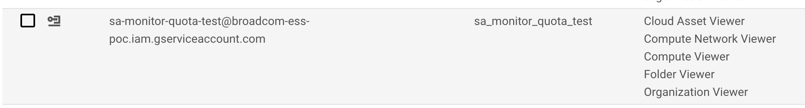

2. Set target organization id
```
export TARGET_ORG_ID=<target org id ex. 38659473572>
```
3. Run following commands
```
gcloud organizations add-iam-policy-binding  $TARGET_ORG_ID --member="serviceAccount:$SERVICE_ACCOUNT_ID@$DEFAULT_PROJECT_ID.iam.gserviceaccount.com" --role="roles/cloudasset.viewer" --condition=None

gcloud organizations add-iam-policy-binding  $TARGET_ORG_ID --member="serviceAccount:$SERVICE_ACCOUNT_ID@$DEFAULT_PROJECT_ID.iam.gserviceaccount.com"  --role="roles/compute.networkViewer" --condition=None

gcloud organizations add-iam-policy-binding  $TARGET_ORG_ID --member="serviceAccount:$SERVICE_ACCOUNT_ID@$DEFAULT_PROJECT_ID.iam.gserviceaccount.com"  --role="roles/compute.viewer" --condition=None

gcloud organizations add-iam-policy-binding  $TARGET_ORG_ID --member="serviceAccount:$SERVICE_ACCOUNT_ID@$DEFAULT_PROJECT_ID.iam.gserviceaccount.com"  --role="roles/resourcemanager.folderViewer" --condition=None

gcloud organizations add-iam-policy-binding  $TARGET_ORG_ID --member="serviceAccount:$SERVICE_ACCOUNT_ID@$DEFAULT_PROJECT_ID.iam.gserviceaccount.com"  --role="roles/resourcemanager.organizationViewer" --condition=None
```
### 3.5 Download Service Account Key File
1. Create Service Account key from host project A. The service account key file will be downloaded to your machine as CREDENTIALS_FILE.json. After you download the key file, you cannot download it again.
```
gcloud iam service-accounts keys create CREDENTIALS_FILE.json \
    --iam-account=$SERVICE_ACCOUNT_ID@$DEFAULT_PROJECT_ID.iam.gserviceaccount.com
```
2. Verify that you have these 2 files in your local directory:
   - CREDENTIALS_FILE.json
   - main.tf
### 3.7 Configure Terraform
1. Open terraform file in your favourite editor and change values for the variable 
2. DO NOT CHANGE values for variable source_code_bucket_name, source_code_zip and source_code_notification_zip. These are links to the Cloud Function source code.
3. For region, use the same region as used for app engine in earlier steps.
4. For Email notification, Create a Send Grid API Key [here](https://sendgrid.com/docs/ui/account-and-settings/api-keys/) and add in the terraform. Note: SendGrid may take a few days to create a key. This depends on the domain.Proceed with the rest of the configuration, add key once available and rerun terraform. 
```
vi main.tf
```
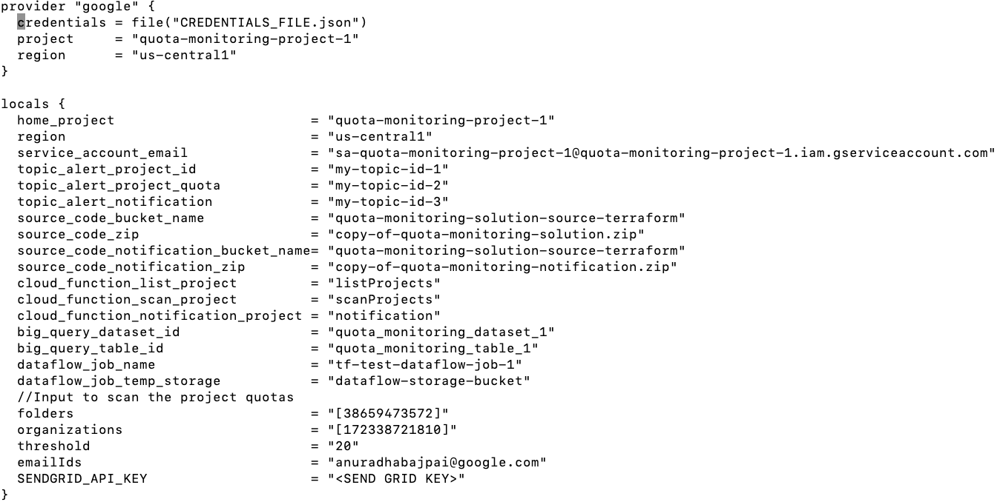

### 3.8 Run Terraform
1. Run terraform commands
   - terraform init
   - terraform plan
   - terraform apply 
     - On Prompt Enter a value: yes

2. This will:
   - Enable required APIs
   - Create all resources and connect them. 
*Note: In case terraform fails, run terraform plan and terraform apply again*
### 3.9 Testing
1. Click ‘Run Now’ on Cloud Job scheduler. 

*Note: The status of the ‘Run Now’ button changes to ‘Running’ for a fraction of seconds. *
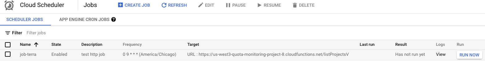

2. To verify that the program ran successfully, check the BigQuery Table. The time to load data in BigQuery might take a few minutes. The execution time depends on the number of projects to scan. A sample BigQuery table will look like this:
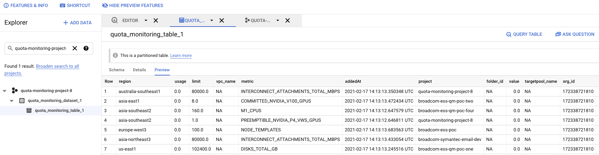

### 3.10 Data Studio Dashboard setup
1. Go to the [Data studio dashboard template](https://datastudio.google.com/reporting/61f8c09f-c593-4950-afa9-c290180482c9) . If this link is not accessible, reach out to pso-quota-framework@google.com to share the dashboard template with your email id. A data studio dashboard will look like this:
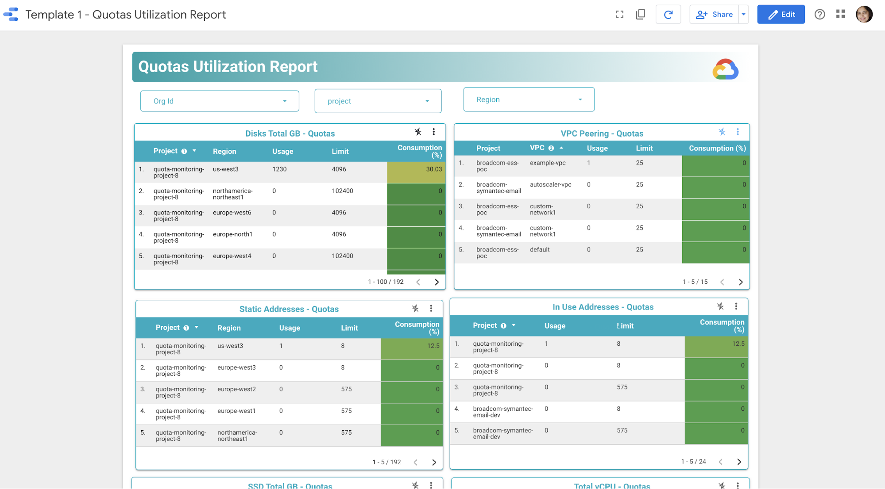
2. Make a copy of the template from the copy icon at the top bar (top - right corner)

3. Click on ‘Copy Report’ button
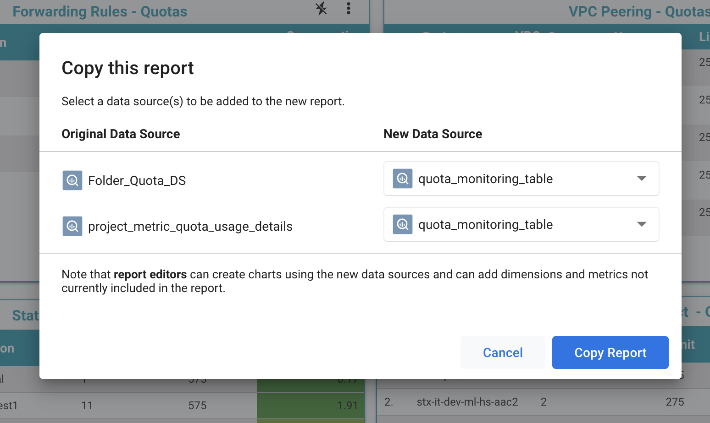
4. This will create a copy of the report and open in Edit mode. If not click on ‘Edit’ button on top right corner in copied template:
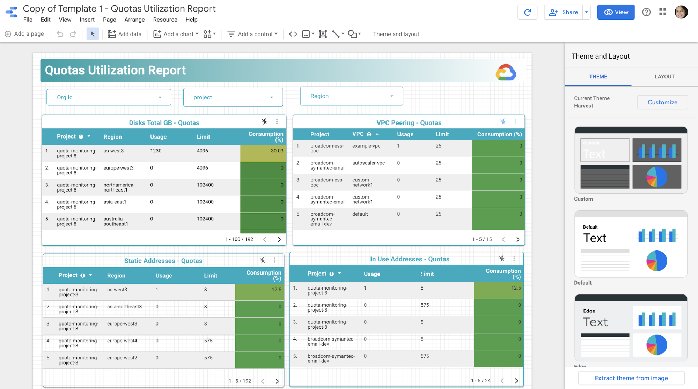
5. Select any one table like below ‘Disks Total GB - Quotas’ is selected. On the right panel in ‘Data’ tab, click on icon ‘edit data source’
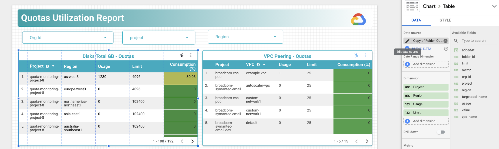
It will open the data source details
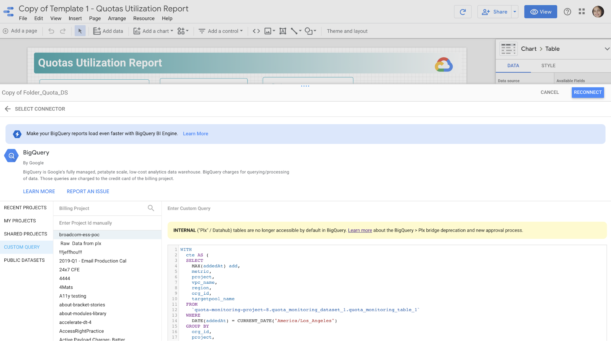
6. In the query, replace BigQuery project, dataset id and table name
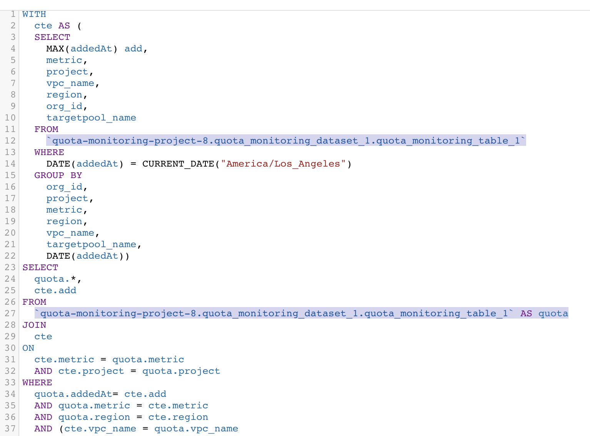
7. Verify the query by running in BigQuery Editor to make sure that query returns right results and there are no syntax errors:
Note: Replace BigQuery project id, dataset id and table name:

```
WITH
  cte AS (
  SELECT
    MAX(addedAt) add,
    metric,
    project,
    vpc_name,
    region,
    org_id,
    targetpool_name
  FROM
   `quota-monitoring-project-8.quota_monitoring_dataset_1.quota_monitoring_table_1`
  WHERE
    DATE(addedAt) = CURRENT_DATE("America/Los_Angeles")
  GROUP BY
    org_id,
    project,
    metric,
    region,
    vpc_name,
    targetpool_name,
    DATE(addedAt))
SELECT
  quota.*,
  cte.add
FROM
  `quota-monitoring-project-8.quota_monitoring_dataset_1.quota_monitoring_table_1` AS quota
JOIN
  cte
ON
  cte.metric = quota.metric
  AND cte.project = quota.project
WHERE
  quota.addedAt= cte.add
  AND quota.metric = cte.metric
  AND quota.region = cte.region
  AND (cte.vpc_name = quota.vpc_name
    OR cte.vpc_name IS NULL)
  AND DATE(addedAt) = CURRENT_DATE("America/Los_Angeles")
````

8. After making sure that query is returning results, replace it in the Data studio, click on the ‘Reconnect’ button in the data source pane.
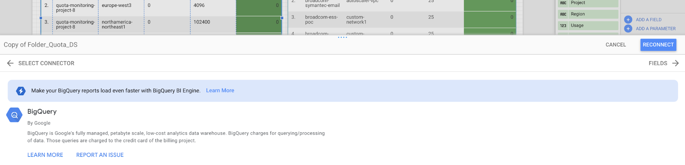
9. In the next window, click on the ‘Done’ button.

10. Click on ‘Region’ tab and repeat steps from 5 - 9 above with different query:

And query is as follows: (Replace the project id, dataset id and table name and verify query running in Bigquery editor)

```
WITH
  cte AS (
  SELECT
    MAX(addedAt) add,
    metric,
    project,
    vpc_name,
    region
  FROM
    `quota-monitoring-project-8.quota_monitoring_dataset_1.quota_monitoring_table_1`
  WHERE
    DATE(addedAt) = CURRENT_DATE("America/Los_Angeles")
  GROUP BY
    region,
    vpc_name,
    project,
    metric,
    DATE(addedAt))
SELECT
  quota.*,
  cte.add
FROM
  `quota-monitoring-project-8.quota_monitoring_dataset_1.quota_monitoring_table_1` AS quota
JOIN
  cte
ON
  cte.metric = quota.metric
  AND cte.project = quota.project
WHERE
  quota.addedAt= cte.add
  AND quota.metric = cte.metric
  AND quota.region = cte.region
  AND (cte.vpc_name = quota.vpc_name
    OR cte.vpc_name IS NULL)
  AND DATE(addedAt) = CURRENT_DATE("America/Los_Angeles")
```

11. Once the data source is configured, click on the ‘View’ button on the top right corner. 
Note: make additional changes in the layout like which metrics to be displayed on Dashboard, color shades for consumption column, number of rows for each table etc in the ‘Edit’ mode.


### 3.11 Scheduled Reporting
Quota monitoring reports can be scheduled from the Data Studio dashboard using ‘Schedule email delivery’. The screenshot of the Data studio dashboard will be delivered as a pdf report to the configured email Ids.

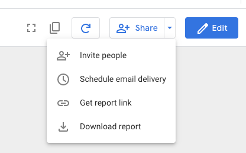

## 4. What is Next? 
1. Include quota metrics beyond compute
2. Alerting (PagerDuty, ServiceNow, Slack)
3. Graphs (Quota utilization over a period of time)
4. Search project, folder, org, region
5. Threshold configurable for each metric

## 5. Contact Us
For any comments, issues or feedback, please reach out to us at pso-quota-framework@google.com


	


