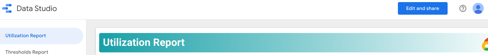

**NOTE**: This README is for python version of the solution. For Java version please refer
[here](../java/README.md).


## Introduction

Standalone tool with following capabilities
1. Export all quota related metrics to BigQuery.
2. DataStudio dashboard to
   * Visualize quota utilization data at various resource hierarchy levels.
   * Show quota threshold reports(quota's that are exceeding the configured thresholds).
3. Trigger alerts when quota's exceed set threshold(s).


## Demo Dashboard
The Demo dashboard showing the final output is available <a href="https://datastudio.google.com/u/2/reporting/50bdadac-9ea0-4dcd-bee2-f323c968186d/page/xxWVB" target="_blank">here</a>.


## Deployment Guide
### 1. Common Steps
* Create a project
* Associate billing with the project
* Provide permissions to the user/Service Account(SA) that would deploy the solution.
  > These permissions are only for deploying the solution. The deployment
    creates neccessary service accounts and permissions for the solution to
    operate.
  > An admin can create custom role(s) and assign it to the user/SA by following the example <a href="https://cloud.google.com/iam/docs/creating-custom-roles#creating_a_custom_role" target="_blank">here</a>
  * Assign the following permissions at org level to the user or service
    account(SA) that would be executing the deployment steps.
    * resourcemanager.organizations.getIamPolicy
    * resourcemanager.organizations.setIamPolicy
  * Assign the following roles at project level to the user or service account that
    would be executing the deployment steps
    * roles/appengine.appCreator
    * roles/appengine.appViewer
    * roles/bigquery.user
    * roles/cloudbuild.builds.editor
    * roles/cloudscheduler.admin
    * roles/iam.serviceAccountCreator
    * roles/iam.serviceAccountDeleter
    * roles/iam.serviceAccountUser
    * roles/logging.viewer
    * roles/monitoring.editor
    * roles/pubsub.admin
    * roles/resourcemanager.projectIamAdmin
    * roles/run.developer
    * roles/serviceusage.serviceUsageAdmin
    * roles/storage.admin


### 2. Deployment steps
#### 2.1 Configure Shell
Using Cloud Shell
* Go to https://console.cloud.google.com/
* Select the project created for deploying the solution
* Activate Cloud Shell & execute below steps

Using Local Shell
* Open terminal/shell
* Configure gcloud and select the project created for deploying the solution
  ```bash
  gcloud init
  ```


#### 2.2 Create a directory
```bash
mkdir workspace; cd workspace
```


#### 2.3 Clone code
```bash
git clone https://github.com/GoogleCloudPlatform/professional-services.git
```

```bash
cd professional-services/tools/quota-monitoring-alerting/python
```


#### 2.4 Configure credentials
* Using user credentials
  ```bash
  gcloud auth application-default login
  ```

* Using service account credentials
  * Download the service account key and keep it in a safe location.
  * Execute the below commands by pointing them to the location of the key.
    ```bash
    gcloud auth activate-service-account --key-file=[RELATIVE_PATH_TO_CREDENTIALS_FILE]
    ```
    ```bash
    export GOOGLE_APPLICATION_CREDENTIALS=[ABSOLUTE_PATH_TO_CREDENTIALS_FILE]
    ```


#### 2.5 Export ENV variables
```bash
export REGION=us-central1
```


#### 2.6 Configure Python Virtual ENV
```bash
python3 -m venv venv
```

```bash
source venv/bin/activate
```

```bash
pip install --upgrade pip
```

```bash
pip install -r requirements.txt
```


#### 2.7 AppEngine
> NOTE: CloudScheduler requires an AppEngine project.

Enable AppEngine service
```bash
gcloud services enable appengine.googleapis.com
```

Create AppEngine app
```bash
gcloud app create --region=${REGION//[0-9]/}
```


#### 2.8 Setup Common Infra
```bash
cd terraform/common; terraform init
```

Update terraform.tfvars
```
vi terraform.tfvars
```

```
name           = "quota-export"
org            = "REPLACE_WITH_ORG_ID"
project        = "REPLACE_WITH_PROJECT_ID"
project_number = "REPLACE_WITH_PROJECT_NUMBER"
region         = "us-central1"
```

```bash
terraform plan
```

```bash
terraform apply
```


#### 2.9 Setup DataStudio Dashboard

* Navigate to the URL output from the following command
  ```
  terraform output copy_dashboard_url
  ```

* After navigating to the URL, click 'Edit and Share' button
  

* Click 'ADD TO REPORT' button. Example Screenshot
  

* Update title from "Copy-QMS" to "Quota Monitoring Dashboard" and click "View"
  button
  

* Done


#### 2.9 Bootstrap Metric Descriptor
```bash
cd ../../
```

> NOTE: If the below command reports an error, wait a few seconds and try again. Cloud Monitoring throws error initially.
```bash
python3 bootstrap.py
```


#### 2.10 Setup Alerting
```bash
cd terraform/alerting; terraform init
```

Update terraform.tfvars
```
vi terraform.tfvars
```

```
project        = "REPLACE_WITH_PROJECT_ID"
email_address  = "REPLACE_WITH_EMAIL_ID"
dashboard_link = "REPLACE_WITH_DASHBOARD_LINK"
```

```bash
terraform plan
```

```bash
terraform apply
```


## Testing Guide
A testing guide with detailed instructions is available
[here](docs/testing_guide.README.md).


## Releases
Detailed release notes are available [here](docs/release_notes.README.md).


## Contact Us
For any comments, issues or feedback, please reach out to us at pso-quota-monitoring AT google.com
