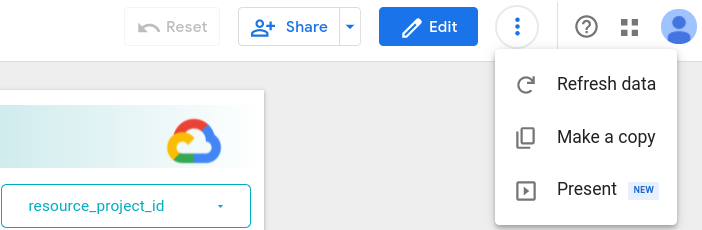
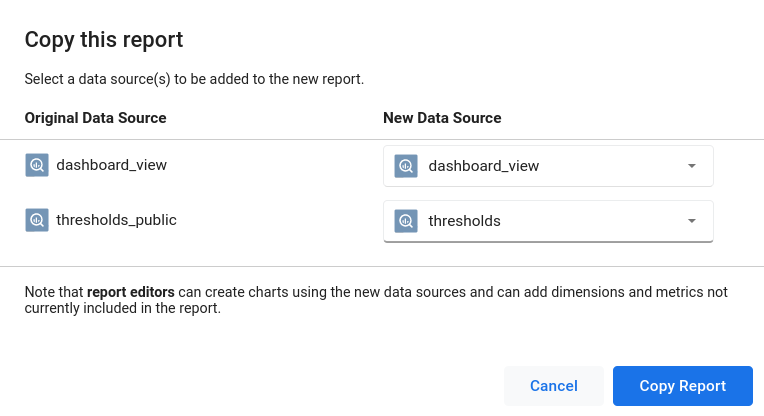
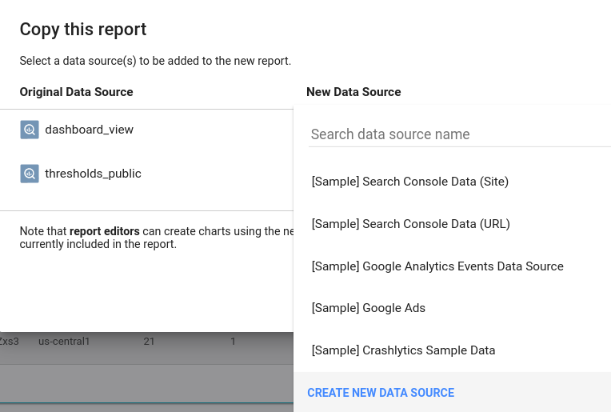
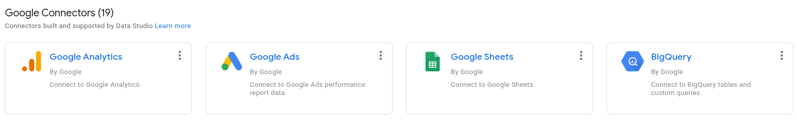
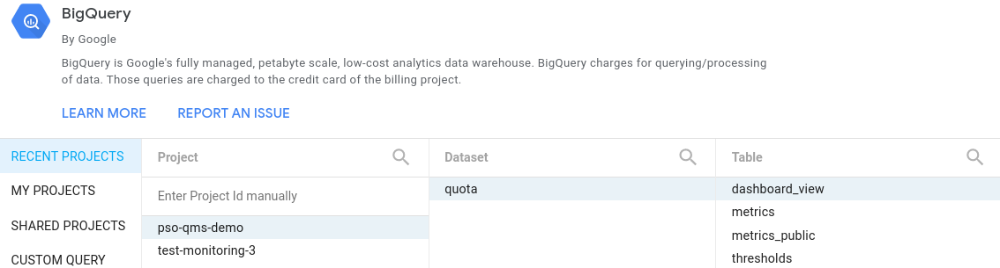
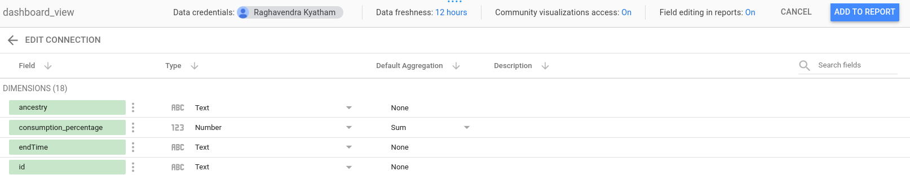

## Terraform deployment steps

Using Cloud Shell
* Go to https://console.cloud.google.com/
* Select the project created for deploying the solution
* Activate Cloud Shell & execute below steps

Using Local Shell
* Open terminal/shell
* Configure gcloud and select the project created for deploying the solution
```bash
gcloud init
```
* Execute below steps


---
### Create a directory
```bash
mkdir workspace; cd workspace
```


---
### Clone code
```bash
git clone https://github.com/GoogleCloudPlatform/professional-services.git
```

```bash
cd professional-services/tools/quota-monitoring-alerting/python
```


---
### Export ENV variables
```bash
export REGION=us-central1
```


---
### Credentials

> Irrespective of user account or service account approach, make sure the permissions mentioned in top level [README](../README.md#common-steps) are granted to the account.

* Using user credentials
```bash
gcloud auth application-default login
```

* Using service account credentials
  * Download the service account key and keep it in a safe location.
  * Execute the below commands by pointing them to the location of the key.
  * ```bash
    gcloud auth activate-service-account --key-file=[RELATIVE_PATH_TO_CREDENTIALS_FILE]
    ```
  * ```bash
    export GOOGLE_APPLICATION_CREDENTIALS=[ABSOLUTE_PATH_TO_CREDENTIALS_FILE]
    ```

---
### AppEngine
**NOTE**: CloudScheduler requires an AppEngine project.

```bash
gcloud services enable appengine.googleapis.com
```

Create AppEngine app.
```bash
gcloud app create --region=${REGION//[0-9]/} 
```

---
### Setup Common Infra

```bash
cd terraform/common; terraform init
```

Update terraform.tfvars
```
vi terraform.tfvars
```

```
name           = "quota-export"
org            = "REPLACE_WITH_ORG_ID"
project        = "REPLACE_WITH_PROJECT_ID"
project_number = "REPLACE_WITH_PROJECT_NUMBER"
region         = "us-central1"
```

```bash
terraform plan
```

```bash
terraform apply
```

---
### Setup DataStudio Dashboard

* Open the [dashboard template](https://datastudio.google.com/reporting/50bdadac-9ea0-4dcd-bee2-f323c968186d)

* Make a copy by clicking the "Make a copy" button at the top right hand side, as shown below.

  

* On the "Copy this report" screen, the goal is to do the following mappings
  * dashboard_view(original data source) to dashboard_view(new data source)
  * thresholds_public(original data source) to thresholds(new data source)

  

* For each "Original Data Source" create and link the "New Data Source" by
  clicking "CREATE NEW DATA SOURCE"

  

* From connectors screen select "Bigquery" connector

  

* Select the correct Project(the one where BQ resources got deployed), Dataset and Table on the bigquery connector screen and click "Connect" at top right corner

  

* Click "ADD TO REPORT" at the top right corner

  

* After all the data sources are mapped, click "Copy Report".


---
### Bootstrap Metric Descriptor

```bash
cd ../../
```

```bash
python3 -m venv venv
```

```bash
source venv/bin/activate
```

```bash
pip install --upgrade pip
```

```bash
pip install -r requirements.txt
```

If the below command reports an error, wait a few seconds and try again.
<br />
**NOTE**: Need to check why Cloud Monitoring throws error initially.
```bash
python3 bootstrap.py
```


---
### Setup Alerting
```bash
cd terraform/alerting; terraform init
```

Update terraform.tfvars
```
vi terraform.tfvars
```

```
project        = "REPLACE_WITH_PROJECT_ID"
email_address  = "REPLACE_WITH_EMAIL_ID"
dashboard_link = "REPLACE_WITH_DASHBOARD_LINK"
```

```bash
terraform plan
```

```bash
terraform apply
```

---
[Back to top level README](../README.md)
