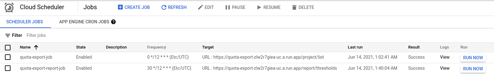
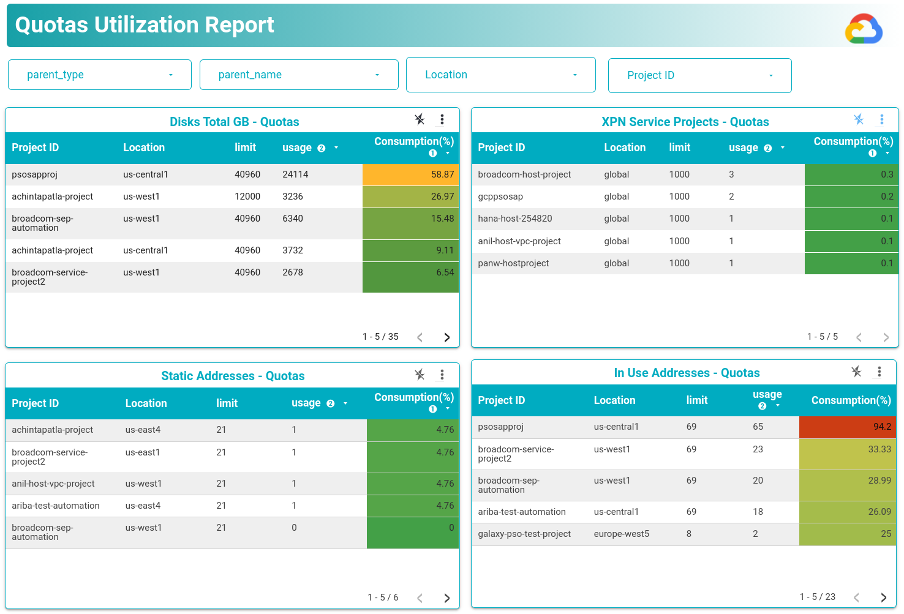
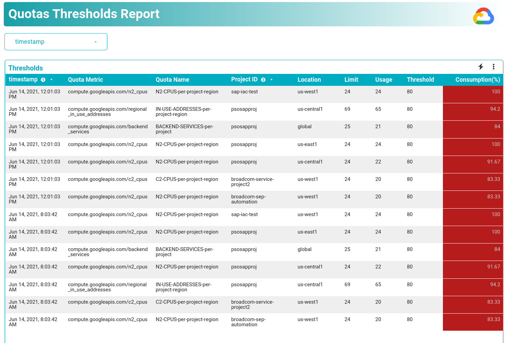
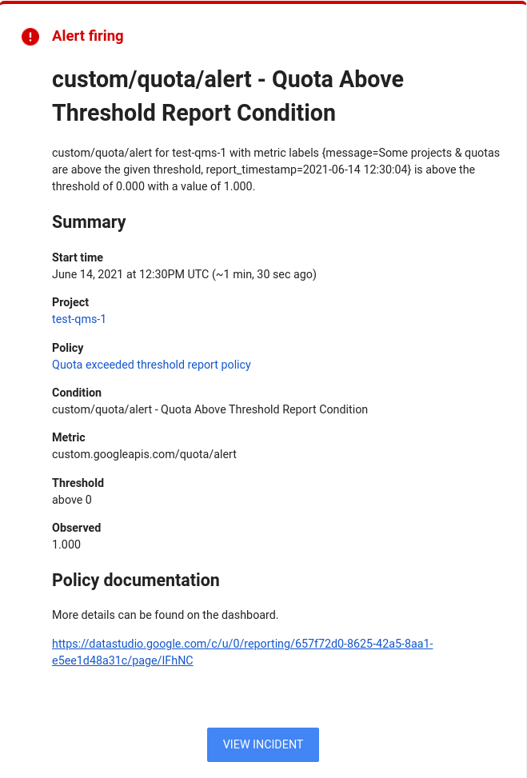

## Testing Guide
After the solution is successfully deployed, navigate to CloudScheduler console
to test the solution.

* Click 'Run Now' to execute the jobs.
* First execute 'quota-export-job' and wait for it to finish.
* After the above job finishes, execute the second job 'quota-export-report-job'.
  
* Navigate to the DataStudio dashboard.
* You should see latest utilization data on the dashboard.
  
* Thresholds report should show the latest report on the dashboard.
  
* If there are any quotas that are exceeding set threshold, you should have also recieved a
notification as well.
  

---
[Back to top level README](../README.md)
