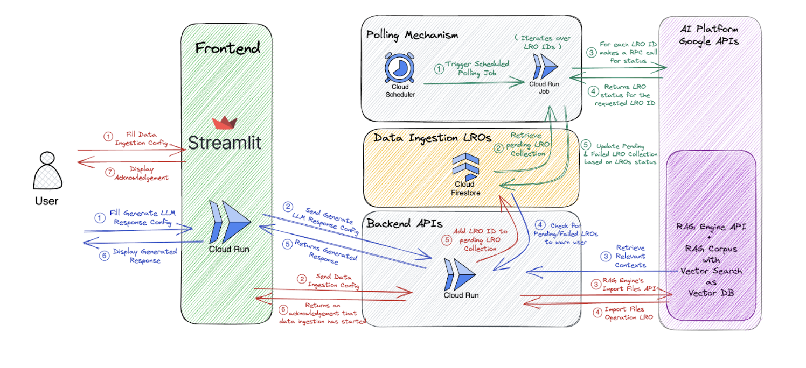

# Robust Backend for RAG with Vertex AI

This project deploys a **backend system** for Retrieval-Augmented Generation (RAG) on Google Cloud, **fully managed by Infrastructure as Code (IaC) via Terraform.** It enables querying private documents with Large Language Models (LLMs), powerfully augmented by context from Vertex AI RAG Engine and Vector Search. While a simple Streamlit UI is included, it serves primarily to **demonstrate the capabilities of the underlying backend services.**

## Table of Contents

- [Backend-Powered Functionality](#backend-powered-functionality)
- [Architecture](#architecture)
- [Prerequisites](#prerequisites)
- [Deployment: IaC for Backend & UI Setup](#deployment-iac-for-backend--ui-setup)
  - [1. Configure](#1-configure)
  - [2. Deploy with Terraform](#2-deploy-with-terraform)
- [Interacting with the System](#interacting-with-the-system)
  - [Via the Demo UI](#via-the-demo-ui)
  - [Directly with the Backend API](#directly-with-the-backend-api)
- [Key Configuration (`config.sh`)](#key-configuration-configsh)
- [Advanced Configuration](#advanced-configuration)
- [Teardown](#teardown)
- [Directory Structure](#directory-structure)

## Backend-Powered Functionality

The core of this solution is its robust backend, which provides:

* **Automated Data Ingestion & Processing**: The backend ingests documents from Google Cloud Storage (GCS), performs chunking, and can optionally utilize Document AI for advanced layout parsing.
* **Vectorization & Indexing**: It generates embeddings using Vertex AI models and manages their indexing in Vector Search through the RAG Engine.
* **Contextual RAG Responses**: The backend service enhances LLM queries with relevant document snippets retrieved by RAG Engine, delivering informed answers.
* **Scalable & Reproducible Deployment via IaC**: The entire backend infrastructure and its application components are deployed and managed using Terraform, ensuring consistency and scalability.
* **Reliable Asynchronous Operations**: Data ingestion LROs (Long-Running Operations) are managed by the backend and tracked using the Poller Job and Firestore.

## Architecture

The system is architected around a powerful backend service, with its infrastructure and deployment entirely defined using Terraform (IaC). Supporting components are also managed this way:

1.  **Backend Service (`backend/backend_service/`)**: The backend service leverages FastAPI and exposes REST APIs for all core RAG operations:
    * **Data Ingestion API**: Handles document processing, embedding, and import into the RAG Corpus.
    * **LLM Response Generation API**: Leverages RAG Engine for contextualized LLM answers.
    * Manages and tracks data ingestion LROs in Firestore.
2.  **Frontend (`frontend/`)**: A Streamlit UI acting as a client to the backend, showcasing its APIs.
3.  **Poller Job (`backend/poller_job/`)**: A supporting service, deployed via Terraform, that periodically checks and updates data ingestion LRO status in Firestore. It is triggered by a Cloud Scheduler job (configured with a cron-like schedule).
4.  **GCP Services**: Leveraged by the backend and overall infrastructure, all provisioned and configured via Terraform:
    * **Vertex AI RAG Engine & Corpus**: Orchestrates the RAG pipeline.
    * **Vertex AI Vector Search**: Provides the vector datastore.
    * **GCS, Firestore, Artifact Registry, Cloud Build, Cloud Run**: Support storage, LRO tracking, and service deployment.

### Diagram


## Prerequisites

* Google Cloud Project.
* `gcloud` CLI (authenticated, project set).
* Terraform.
* Docker (for local image modification; Cloud Build is used for deployment).
* Bash shell.
* Python 3.x.
* **Required GCP APIs**: `aiplatform.googleapis.com`, `artifactregistry.googleapis.com`, `cloudbuild.googleapis.com`, `firestore.googleapis.com`, `run.googleapis.com`, `iamcredentials.googleapis.com`, `cloudscheduler.googleapis.com`, `documentai.googleapis.com`, `storage.googleapis.com`, `iam.googleapis.com`.
    *(The `deploy.sh` script attempts to enable these.)*

## Deployment: IaC for Backend & UI Setup

The entire deployment, including the core backend services and supporting infrastructure, is fully automated using **Terraform**, orchestrated by the `deploy.sh` script.

### 1. Configure

* Open `config.sh`.
* Update variables with your GCP project details. These variables feed into the Terraform deployment.

### 2. Deploy with Terraform

* Run the deployment script from the project root:
    ```bash
    ./deploy.sh
    ```
* **Script Actions (Orchestrating Terraform)**:
    1.  Loads configuration from `config.sh`.
    2.  Attempts to enable required GCP services.
    3.  **Deploys Vector Search infrastructure using Terraform** (module: `terraform/vertex_ai_vector_search/`). *Note: This step can take 5-180 minutes.*
    4.  Creates the Vertex AI RAG Corpus (used by the backend).
    5.  Configures Docker for Artifact Registry.
    6.  **Deploys all application components (backend, poller, frontend) and their supporting GCP resources (Cloud Run, Firestore, etc.) using Terraform** (module: `terraform/application/`):
        * Builds/pushes Docker images for the **backend service** and poller job via Cloud Build (triggered by Terraform).
* Terraform workspaces (named by `DEPLOYMENT_ID`) ensure isolated and manageable deployments.
* URIs for the demo frontend and the **IaC-deployed backend service** will be output.

## Interacting with the System

You can interact with the system in two main ways, both leveraging the powerful, IaC-deployed backend:

### Via the Demo UI

Access the frontend URI (from `deploy.sh` output). This UI calls the backend for:
* **Data Ingestion**: Specifying GCS paths and configurations.
* **Generating LLM Responses**: Asking questions to get RAG-enhanced answers.

### Directly with the Backend API

This is ideal for programmatic access or integration, showcasing the backend's standalone value. Use the backend URI (which will be output by the `deploy.sh` script, e.g., `https://your-backend-service-xyz-uc.a.run.app`).

Replace `YOUR_BACKEND_SERVICE_URI` in the examples below with the actual URI of your deployed backend service.

* **Data Ingestion**:
    ```
    POST YOUR_BACKEND_SERVICE_URI/data-ingestion/rag-engine
    ```
    **Example using `curl`**:
    ```bash
    curl \
      -X POST "YOUR_BACKEND_SERVICE_URI/data-ingestion/rag-engine" \
      -H "Content-Type: application/json" \
      -H "Authorization: Bearer $(gcloud auth print-identity-token)" \
      -d @<(
      cat << EOF
    {
      "data_source_path": "gs://your-bucket/your-documents-folder/",
      "chunk_size": 1024,
      "chunk_overlap": 200,
      "layout_parser_processor": null
    }
    EOF
      )
    ```

* **LLM Response Generation**:
    ```
    POST YOUR_BACKEND_SERVICE_URI/generate-llm-response/rag-engine
    ```
    **Example using `curl`**:
    ```bash
    curl \
      -X POST "YOUR_BACKEND_SERVICE_URI/generate-llm-response/rag-engine" \
      -H "Content-Type: application/json" \
      -H "Authorization: Bearer $(gcloud auth print-identity-token)" \
      -d @<(
      cat << EOF
    {
      "prompt": "What are the main themes in my documents?",
      "model_name": "gemini-1.5-flash-001",
      "vector_distance_threshold": 0.5
    }
    EOF
      )
    ```
*(Refer to Pydantic models in `backend/backend_service/models/` for API request schemas.)*

## Key Configuration (`config.sh`)

Critical variables in `config.sh` affecting the IaC backend deployment:

* `PROJECT_ID`: Your GCP Project ID.
* `REGION`: GCP region. **Must be supported by RAG Engine for backend functionality.**
* `DEPLOYMENT_ID`: Unique deployment ID (e.g., `ragpoc`). **Format**: Letters only, < 10 characters.
* `RAG_CORPUS_DISPLAY_NAME`: Display name for the Vertex AI RAG Corpus.
* `INDEX_DIMENSIONS`: Embedding vector dimensionality (e.g., `768`). **Must match `TEXT_EMBEDDING_MODEL`.**
* `TEXT_EMBEDDING_MODEL`: Vertex AI text embedding model used by the backend.

## Advanced Configuration

* **Vector Search (Backend Foundation)**: Customize the underlying Vector Search through optional environment variables in `config.sh`. These are passed to the `terraform/vertex_ai_vector_search/` Terraform module.  You can refer to `create_vector_search_terraform_vars` function in the `deploy.sh` for the list of optional variables for this Vector Search deployment. 
* **Backend & Application Components**: The `terraform/application/` module defines the IaC for these services. Further customize directly within these Terraform files for fine-grained control over their deployment.

## Teardown

To remove all resources **deployed via Terraform**:

1.  Ensure `config.sh` reflects the `DEPLOYMENT_ID` of the instance to delete.
2.  Run the teardown script:
    ```bash
    ./destroy.sh
    ```
This script uses Terraform and API calls to delete all IaC-managed components.

**Caution**: This action is irreversible. Original GCS data remains untouched.

## Directory Structure

* `backend/`: **Contains the core backend service and supporting poller job code (deployed via IaC).**
* `frontend/`: Streamlit UI code (demonstrates backend, also IaC deployed).
* `terraform/`: **Contains all Terraform (IaC) configurations for the entire system.**
* `config.sh`: Main deployment configuration (feeds IaC).
* `deploy.sh`, `destroy.sh`: Scripts orchestrating IaC deployment and teardown.
