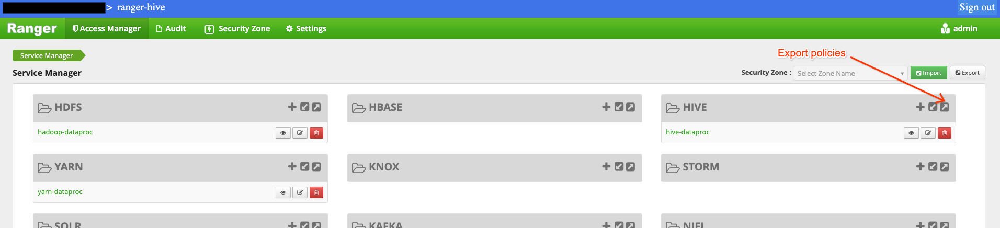
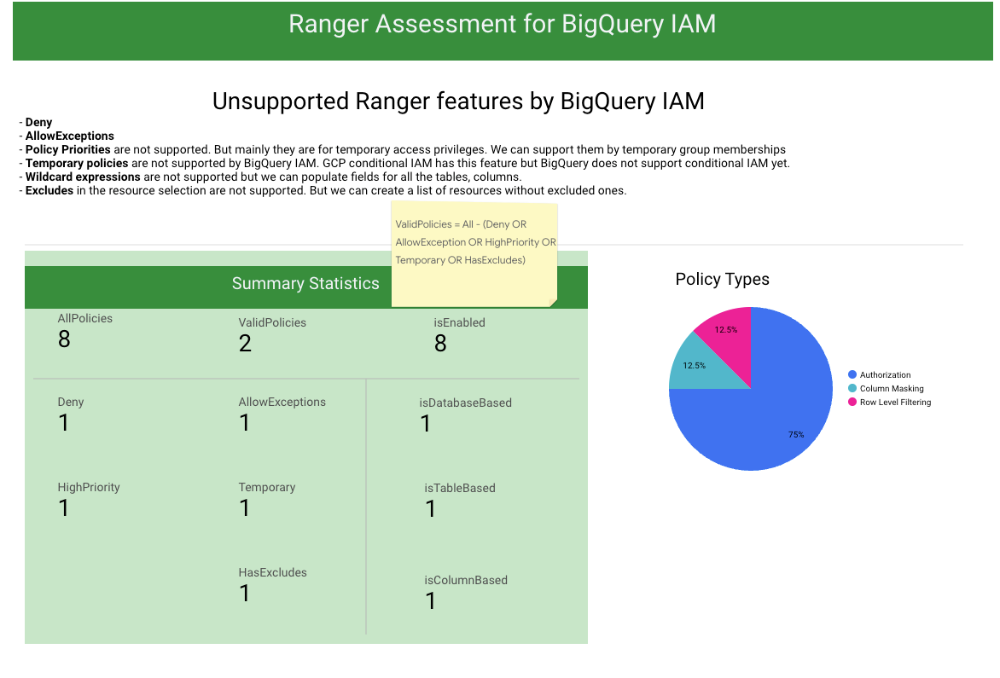

# Apache Ranger Hive to BigLake/BigQuery IAM migration assessment
With Google Cloud Dataproc, you can deploy various Hive versions and use them like on-premise.
One of the challenges in migration is authorization. It is possible to deploy Apache Ranger on Dataproc to preserve the authorization rules. Ranger-Hive plugin works as it is, and recently [Ranger-GCS plugin](https://cloud.google.com/dataproc/docs/concepts/configuring-clusters/ranger-plugin) has been introduced to replace Ranger-HDFS rules.

After an initial migration, many teams wants to adopt:
* BigQuery datawarehouse for its serverless architecture instead of maintaining Hive infrastructure
* [BigLake API](https://cloud.google.com/bigquery/docs/biglake-intro) as a single interface to data stored in GCS, AWS S3 or Azure Data Lake. BigLake provides the exact fine grained access control rules as BigQuery.

One of the challenges in this, in addition to data migration and SQL translation, is the adaptation of Apache Ranger authorization rules to BigLake/BigQuery IAM. **In this work, we provide an assessment tool for you to see what can be copied as it is and what you have to re-architecture.**

## BigLake/BigQuery IAM vs Ranger Hive Plugin
The table below compares these authorization systems.

<style>
#greenrow {
    text-align: left;
    background-color: #A8DAB5; 
    color: #5F6368
}
#redrow {
    text-align: left;
    background-color: #F6AEA9; 
    color: #5F6368
}
#yellowrow {
    text-align: left;
    background-color: #FDE293; 
    color: #5F6368
}
#rowheader {
    text-align: center;
    font-weight: bold; 
    color: #3C4043;
    background-color: #E8EAED;
}
</style>

<table>
    <thead style="text-align:center;background-color: #E8EAED; font-size: large; color: #3C4043;">
        <tr>
            <th></th>
            <th>BigLake/BigQuery IAM</th>
            <th>Ranger Hive Plugin</th>
          </tr>
    </thead>
    <tbody>
      <tr>
        <td id="rowheader">Users and Groups</td>
        <td id="greenrow">supported</td>
        <td id="greenrow">supported</td>
      </tr>
      <tr>
        <td id="rowheader">Permission Mapping</td>
        <td id="greenrow" colspan="2">
            <ul>
                <li>Select -> bigquery.tables.getData, bigquery.jobs.create</li>
                <li>Update -> bigquery.tables.updateData</li>
                <li>Create -> bigquery.tables.create </li>
                <li>Drop -> bigquery.tables.delete</li> 
                <li>Alter -> bigquery.tables.update </li> 
                <li>Index, -> index is different in BigQuery, clustering and partitioning features exist.</li> 
                <li>Lock -> there is no lock</li> 
              </ul>
        </td>        
      </tr>
      <tr>
        <td id="rowheader">Authorization Granularity</td>
        <td id="greenrow" colspan="2">Dataset, Table, Column, Row</td>
      </tr>
      <tr>
        <td id="rowheader">Data Masking on Columns</td>
        <td id="greenrow"> <a href="https://cloud.google.com/bigquery/docs/column-data-masking-intro">supported</a></td>
        <td id="greenrow">supported</td>
      </tr> 
      <tr>
        <td id="rowheader">Policy Labels</td>
        <td id="greenrow">supported</td>
        <td id="greenrow">supported</td>
      </tr> 
      <tr>
        <td id="rowheader">Tag Based Access Control</td>
        <td id="greenrow">
            <ul>
                <li><a href="https://cloud.google.com/data-catalog/docs/policy-tags">Policy Tags</a> for column based access control</li>
                <li><a href="https://cloud.google.com/resource-manager/docs/tags/tags-overview"> Resource Tags</a> at BigQuery dataset level</li>
              </ul>
        </td>
        <td id="greenrow">supported</td>
      </tr> 
      <tr>
        <td id="rowheader">Allow Exceptions</td>
        <td id="redrow">not supported</td>
        <td id="greenrow">supported</td>
      </tr> 
      <tr>
        <td id="rowheader">Deny Policies</td>
        <td id="redrow">not supported. Preview for GCS. Please check the latest information.</td>
        <td id="greenrow">supported</td>
      </tr> 
      <tr>
        <td id="rowheader">Policy Priorities (Priorities of 0 or 1)</td>
        <td id="yellowrow">Not supported since IAM is additive. <br/>
            In Ranger, policy priorities are used to allow access 
            temporarily by overriding other policies. 
            We can achieve temporary access by using group memberships
            </td>
        <td id="greenrow">supported</td>
      </tr> 
      <tr>
        <td id="rowheader">Wildcard</td>
        <td id="yellowrow">Wildcard (*) are not supported in IAM. 
            For instance, we cannot create IAM rules for finance_* <br/>
            However, we can group resources in Projects, Folders etc.
            </td>
        <td id="greenrow">supported</td>
      </tr> 
      <tr>
        <td id="rowheader">Validity Period</td>
        <td id="yellowrow">Validity period is not supported since 
            BigQuery IAM does not support conditions yet (please check the latest information).<br/>
            Nevertheless, temporary access can be given by temporary group membership, which is also
            the recommended since it does not require changes in the IAM policy and hence no need to run a 
            CI/CD pipeline.
            </td>
        <td id="greenrow">supported</td>
      </tr>     
    </tbody>
  </table>

--------------------
# How the assessment works
The assessment tool is in fact a dashboard where we: 
1. load Ranger policies to BigQuery, 
2. apply transformations via views
3. display the results in a Looker studio dashboard

## Steps for the assessment

1. Export Ranger policies for hive

2. Convert them to newline delimited json format so that BQ can parse. You may use `jq`: 
``` 
cat <RANGER EXPORT>.json | jq -c '.policies[]' > ranger_policies.jsonl
```
3. We should create or re-use a GCS bucket to upload the ranger_polices.jsonl. Then we need BigQuery tables and views for analysis. Under [terraform folder](./terraform/) you find all the necessary scripts to create all.
    ```sh
    cd terraform
    gcloud auth application-default login
    # Create and set the parameters in terraform.tfvars file
    # vi terraform.tfvars
    terraform apply
    ```
4. copy the policy export to GCS: 
    ```sh
    export PROJECT_ID=<your project id>
    gsutil cp ranger_policies.jsonl gs://$PROJECT_ID-ranger-assessment/
    ```
5. load into BQ:
    ```sh
    export REGION=<region for the dataset>
    bq load --location=$REGION  \
    --source_format=NEWLINE_DELIMITED_JSON \
    $DATASET_ID.hive_ranger_policies \
    gs://$PROJECT_ID-ranger-assessment/ranger_policies.jsonl
    ```
6. If you have used the terraform you may **skip** creating the views. Otherwise: 
Create `hive_policies_view` from the BigQuery console:
    ```sql
    create or replace durmusio_experiements.hive_policies_view as
    (
      select *, 
      array_length(validitySchedules) > 0 as temporary_policy,
      (array_length(denyPolicyItems) > 0 or isDenyAllElse) as hasDenyPolicy,
      array_length(policyItems) > 0 as hasAllowPolicy,
      array_length(allowExceptions) > 0 as hasAllowExceptions,
      (resources.udf is not null or resources.url is not null) as isNonBQResource,
      (array_length(resources.column.values) > 0 and regexp_contains(ARRAY_TO_STRING(resources.column.values, ','), r'[0-9A-Za-z_]' ) ) as isColumnBased,
      (array_length(resources.table.values) > 0 and regexp_contains(ARRAY_TO_STRING(resources.table.values, ','), r'[0-9A-Za-z_]' ) and regexp_contains(ARRAY_TO_STRING(resources.column.values, ','), r'\*' ) ) as isTableBased,
      (array_length(resources.database.values) > 0 and not regexp_contains(ARRAY_TO_STRING(resources.table.values, ','), r'[0-9A-Za-z_]' ) and not regexp_contains(ARRAY_TO_STRING(resources.column.values, ','), r'[0-9A-Za-z_]' ) ) as isDatabaseBased,
      (resources.column.isExcludes or resources.database.isExcludes or resources.table.isExcludes) as hasExcludes,
      ["Authorization", "Column Masking", "Row Level Filtering"][OFFSET(policyType)] as policyTypeName,
      
      from `[YOUR PROJECT ID].ranger_assessment.fk_hive_policies`
    )
    ```

    Then create statistics view:

    ```sql
    create or replace view ranger_assessment.hive_policy_stats (AllPolicies, ValidPolicies, Deny, AllowExceptions, Temporary, HighPriority, HasExcludes) as (

    select
    (select count(1) from `YOUR_PROJECT_ID.ranger_assessment.hive_policies_view`) as number_of_policies,
    (select count(1) from `YOUR_PROJECT_ID.ranger_assessment.hive_policies_view` where not (
    hasDenyPolicy = true or hasAllowExceptions = true or hasExcludes = true or temporary_policy = true or policyPriority = 1
    )) as number_of_valid_policies,
    (select count(1) from `YOUR_PROJECT_ID.ranger_assessment.hive_policies_view` where 
    hasDenyPolicy = true 
    ) as number_of_deny_policies,
    (select count(1) from `YOUR_PROJECT_ID.ranger_assessment.hive_policies_view` where 
    hasAllowExceptions = true 
    ) as number_of_allow_exceptions,
    (select count(1) from `YOUR_PROJECT_ID.ranger_assessment.hive_policies_view` where 
    temporary_policy = true 
    ) as number_of_temporary_policies,
    (select count(1) from `YOUR_PROJECT_ID.ranger_assessment.hive_policies_view` where 
    policyPriority > 0 
    ) as number_of_high_priority_policies,
    (select count(1) from `YOUR_PROJECT_ID.ranger_assessment.hive_policies_view` where 
    HasExcludes = true 
    ) as number_of_policies_with_excludes,
    )
    ```

7. Finally make a copy of the [data studio example](https://datastudio.google.com/reporting/fb0e0283-ef2f-488d-8b27-a2810a829fb0/page/E2C2C) and change the source to your own BigQuery dataset. If you don't have access to dashboard to copy, please request access.
    

# LICENSE
   Copyright 2023 Google LLC

   Licensed under the Apache License, Version 2.0 (the "License");
   you may not use this file except in compliance with the License.
   You may obtain a copy of the License at

       http://www.apache.org/licenses/LICENSE-2.0

   Unless required by applicable law or agreed to in writing, software
   distributed under the License is distributed on an "AS IS" BASIS,
   WITHOUT WARRANTIES OR CONDITIONS OF ANY KIND, either express or implied.
   See the License for the specific language governing permissions and
   limitations under the License.
   