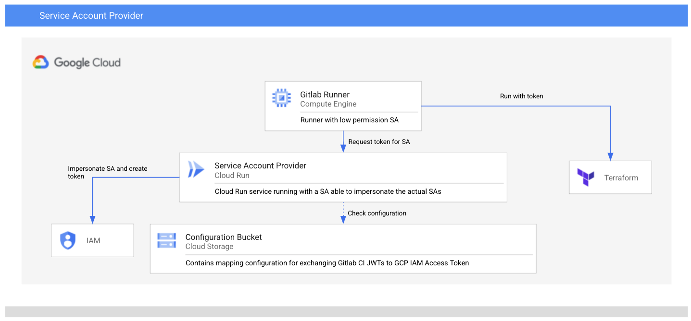

# Service Account Provider (SAPRO)

SAPRO allows to request tokens for Service Accounts from a limited permissions environment. [Gitlab CI JWT tokens](https://docs.gitlab.com/ee/ci/examples/authenticating-with-hashicorp-vault/index.html#how-it-works) contain various claims for the build and are signed with the JWKS of the Gitlab instance. It's basically a blueprint to workaround non-OIDC compliant identity providers that you want to federate. 

SAPRO limits the creation of tokens to protected branches (claim ref_protected=true)



## IPAM Autopilot Backend
The [infrastructure](./infrastructure) folder contains a sample Terraform setup with which the SAPRO backend can be deployed to CloudRun. The required APIs are created during the deployment. The container is build as part of the deployment. The `Dockerfile` containing the build instructions is at the top level, since the container needs files that are generated during the infrastructure deployment.

The following GCP services are used as part of the deployment, and might cause cost:
  * [Cloud Run](https://cloud.google.com/run)
  * [Google Cloud Storage](https://cloud.google.com/storage)

## Deploying
The infrastructure deployment takes the following variables, you can either set them via environment variables TF_VAR_<name> or in a .tfvars file.
| Variable                   	| Default Value   	| Description                                                                                                                                                	|
|----------------------------	|-----------------	|------------------------------------------------------------------------------------------------------------------------------------------------------------	|
| project                	|                 	| Project ID of the project to which the SAPRO should be deployed.                                                                                  	|
| region                     	| europe-west1    	| GCP region that should contain the resources.                                                                                                              	|
| artifact_registry_location 	| europe          	| Location for the Artifact Registry location, containing the Docker container image for SAPRO backend.                                         	|
| container_version          	| 1               	| Version of the container, since the container is build by the infrastructure automation, you can use this variable to trigger a new container image build and deployment. 	|
| refresh_interval                 	| 5                	| Interval in minutes after which the config should be reloaded from GCS
| config_storage_path     	| /sapro 	| The folder under wich the config yamls are stored in the GCS bucket                   	                                                                                      	|

In order to deploy, you will need to execute `terraform init` and `terraform apply` from the `infrastructure` folder.

## How to Use

The configuration for SAPRO is provided via a YAML file stored in GCS.

```yaml
issuers:
  - name: gitlab.com
    jwks_url: "https://gitlab.com/-/jwks"

pipelines:
  - name: "group/repo"
    branches:
      - ref: main
        service_accounts: 
          - desiredsa@project.iam.gserviceaccount.com
        allowed_scopes:
          - https://www.googleapis.com/auth/cloud-platform

```

jwks_url can either be configured with the JWKS URL of the Gitlab instance (SAPRO will then try to fetch the JWKS from Gitlab, this obviously needs a network accessibility). Otherwise you can package the jwks as a json file into the container (every path not beginning with http will be interpreted as a file path).

The pipelines configuration takes name to the group/project that should be granted access. This name attribute is evaluated against the CI_JWT in a way that the *project_path* claim begins with this name.

The location of the configuration file can configured via the Environment Variable *GCS_CONFIG_LINK* (e.g. gs://bucketname/objectname) and *CONFIG_REFRESH_INTERVAL* interval in minutes after which the configuration is refetched (disabled with 0; default value 5)

The service account running SAPRO is needed to be able to read the file from GCS (e.g. _roles/storage.objectViewer_ on the file). The service account also needs the roles _roles/iam.serviceAccountUser_ and _roles/iam.serviceAccountTokenCreator_