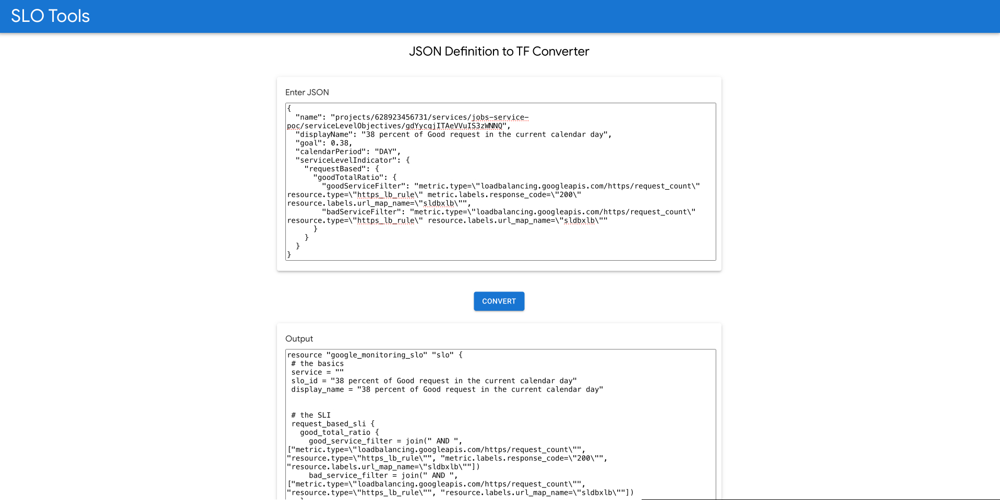

# SLO Tools - JSON Definition to TF Converter - Backend

# Description

The tool basically converts the SLO Definition in GCP to its equivalent terraform block. Following are the exhaustive list of different SLO definition covered by this tool that can be converted

1. Request based SLI
- Good Total Ratio
- Distribution cut

1. Window Based SLI
- Metrics Mean
- Metrics Sum
- Good Total Ratio Threshold

The tool has a very basic UI where user can provide the input of SLO definition and after clicking on convert button it will be converted to terraform block

The tool comprises of frontend and backend which can be developed and built based on the description given in the individual components.

