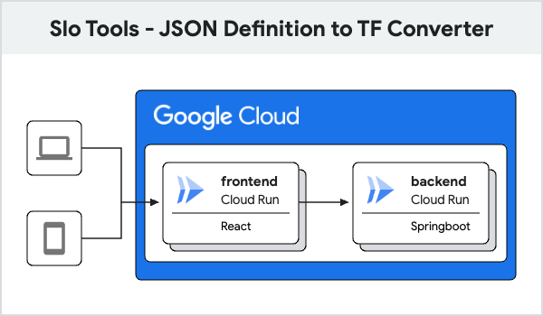

# SLO Tools - JSON Definition to TF Converter - Backend



# Description

As per the  above architecture diagram, the resource marked as backend will serve as the backend for the slo tooling project.

This backend currently converts GCP SLO definition to Terraform blocks for the same. Following are the possible SLO definitions one can encounter while creating SLOs in GCP:

1. Request based SLI
- Good Total Ratio
- Distribution cut

2. Window Based SLI
- Metrics Mean
- Metrics Sum
- Good Total Ratio Threshold


# Prerequisite

- A Google Cloud Project.
- Ensure gcloud is installed
- Ensure the one who do the work has the following project-level IAM role assigned:
    - `Editor`
    - `Project IAM Admin`
    - `Service Account Admin`
- Ensure latest Java and maven versions are installed.
    - Java can be > 22
- Ensure git is installed

# Steps to run the Service

1. Clone the repository using the following command

```
git clone <repo_url>
```


2. First of all install and build the project using the following command

```
mvn clean install
```
2. Then run the service using the following command:

```
mvn spring-boot:run -Dspring-boot.run.profiles=local -Dspring-boot.run.jvmArguments="-DPORT=8080"
```

# Testing the service

1. Open the swagger page on the internet browser by the following url

```
http://localhost:8080/swagger-ui.html
```

2. Use 'try it out' with api

```
/slo/json-converter/convert
```

with payload

```
{
    "jsonRaw": "{\"displayName\": \"45% - Windowed Distribution Cut - Calendar week\",\"goal\": 0.45,\"calendarPeriod\": \"WEEK\",\"serviceLevelIndicator\": {\"windowsBased\": {\"windowPeriod\": \"300s\",\"goodTotalRatioThreshold\": {\"performance\": {\"distributionCut\": {\"distributionFilter\": \"metric.type=\\\"serviceruntime.googleapis.com/api/request_latencies\\\" resource.type=\\\"consumed_api\\\"\",\"range\": {\"min\": -9007199254740991,\"max\": 45}}},\"threshold\": 0.45}}}}"
}
```

This is basically stringified version of

```javascript
{
  "name": "projects/628923456731/services/jobs-service-poc/serviceLevelObjectives/gdYycqjITAeVVuIS3zWNNQ",
  "displayName": "38 percent of Good request in the current calendar day",
  "goal": 0.38,
  "calendarPeriod": "DAY",
  "serviceLevelIndicator": {
    "requestBased": {
      "goodTotalRatio": {
        "goodServiceFilter": "metric.type=\"loadbalancing.googleapis.com/https/request_count\" resource.type=\"https_lb_rule\" metric.labels.response_code=\"200\" resource.labels.url_map_name=\"sldbxlb\"",
        "badServiceFilter": "metric.type=\"loadbalancing.googleapis.com/https/request_count\" resource.type=\"https_lb_rule\" resource.labels.url_map_name=\"sldbxlb\""
      }
    }
  }
}

```

3. You should get a response like this

```
{
    "tfResult": "resource \"google_monitoring_slo\" \"slo\" {\n  service = \"\"\n  display_name = \"45% - Windowed Distribution Cut - Calendar week\"\n\n  goal = 0.45\n  calendar_period= \"WEEK\"\n\n  windows_based_sli {\n    window_period = 300s\n\n    good_total_ratio_threshold {\n      threshold = 0.45\n      performance {\n        distribution_cut {\n          distribution_filter = join(\" AND \", [\"metric.type=\\\"serviceruntime.googleapis.com/api/request_latencies\\\"\", \"resource.type=\\\"consumed_api\\\"\"])\n\n          range {\n            max = 45\n            min = 0\n          }\n        }\n      }\n    }\n  }\n}",
    "error": null
}
```

4. (Optionally) you can use curl to test the service using

```
curl -X 'POST' \
'http://localhost:8080/slo/json-converter/convert' \
-H 'accept: */*' \
-H 'Content-Type: application/json' \
-d '{
"jsonRaw": "{\"displayName\": \"45% - Windowed Distribution Cut - Calendar week\",\"goal\": 0.45,\"calendarPeriod\": \"WEEK\",\"serviceLevelIndicator\": {\"windowsBased\": {\"windowPeriod\": \"300s\",\"goodTotalRatioThreshold\": {\"performance\": {\"distributionCut\": {\"distributionFilter\": \"metric.type=\\\"serviceruntime.googleapis.com/api/request_latencies\\\" resource.type=\\\"consumed_api\\\"\",\"range\": {\"min\": -9007199254740991,\"max\": 45}}},\"threshold\": 0.45}}}}"
}'
```

# Deploying the service on cloud run

1. You need to run the following command from the cli to initialize the gcloud project locally:

```
gcloud init
```

2. Create a repository(artifact) so that you can deploy the docker image on GCP:

Here's the gcloud command to create an Artifact Registry repository, along with explanations and options:

Basic Command:

```Bash
gcloud artifacts repositories create REPOSITORY_NAME \
  --repository-format=FORMAT \
  --location=LOCATION 
```

Replace:

- REPOSITORY_NAME: The name you want to give your repository (e.g., my-maven-repo).
- FORMAT: The format of the artifacts you'll store (e.g., docker, maven, npm.
- LOCATION: The region where you want to create the repository (e.g., us-central1

3. Run the following command to deploy the docker image

```
gcloud builds submit -t <country>-docker.pkg.dev/<project_id>/<repo_dir> ./
```

For example:

```
gcloud builds submit -t us-docker.pkg.dev/arjun-demo-123/slotools/backend ./
```
replace the placeholders appropriiately

4. Deploy the service from the docker image on cloud run using the following command

```
gcloud run deploy SERVICE_NAME \
  --image=<DOCKER_IMAGE_URL> \
  --platform=managed \
  --region=REGION \
  --allow-unauthenticated
```
- DOCKER_IMAGE_URL you can get from step 3


