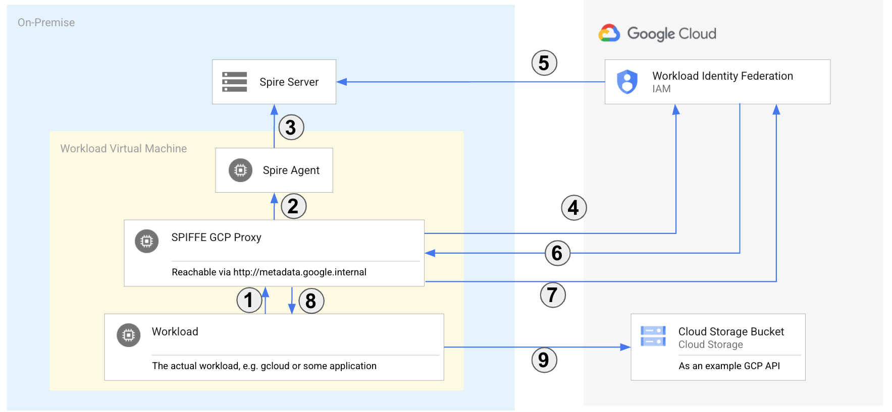

# SPIFFE GCP Proxy

This is a simple GOLANG application that provides an Auth proxy for On-Prem workloads that want to use Google Cloud Platform APIs, using SPIFFE and Workload Identity Federation.

Secure Production Identity Framework for Everyone [SPIFFE](https://spiffe.io/) is a framework defined by the Cloud Native Computing Foundation, that solves the security and identity challenges for workloads. 



The workflow this proxy implements executes the following steps:
1. The workload requests a GCP Auth token via `http://metadata.google.internal/computeMetadata/v1/instance/service-accounts/<sa>/token`.
1. The proxy requests a JSON Web Token (JWT) from the local Spire Agent.
1. The Spire Agents requests the JWT from the Spire Server.
1. The proxy takes the SPIFFE JWT and requests a new token from the Security Token Service (STS) API.
1. STS verifies that the passed SPIFFE JWT is valid, by verifiying the issuer by retrieving the `.well-known/openid-configuration` and the JWKS.
1. STS creates and passes back an access token. This token can only be used to impersonate a service account.
1. The proxy requests a service account access token using the "impersonation token".
1. The proxy responds to the workload with the GCP IAM access token for the service account.
1. The workload can use the access token to authenticate and authorize against Google Cloud APIs.

## Setup and Running
This tool requires a working SPIFFE setup with OIDC enabled (see the [SPIRE getting started](https://spiffe.io/docs/latest/try/) and setup the [OIDC discovery provider](https://github.com/spiffe/spire/tree/main/support/oidc-discovery-provider)). You also have integrated your SPIRE setup with [Workload Identity Federation](https://cloud.google.com/iam/docs/workload-identity-federation) by creating a pool and provider. 

The tool assumes that there is a GCP IAM Service Account that can be impersonated from the SPIFFE identity. This means you need to add a IAM policy binding for the SPIFFE ID:
```
gcloud iam service-accounts add-iam-policy-binding SERVICE_ACCOUNT_EMAIL \
    --role=roles/iam.workloadIdentityUser \
    --member="principal://iam.googleapis.com/projects/<project_number>/locations/global/workloadIdentityPools/<workload_pool_id>/subject/<SPIFFE_ID>"
```

The proxy would run on a VM alongside a Spire agent. At the moment it's not possible to pass the identity of an application or process to the proxy, hence the proxies SPIFFE ID needs to be configured for impersonation in GCP IAM. In order to use the proxy from GCloud SDK or Google Cloud libraries, you should map `metadata.google.internal` to `127.0.0.1` in the VMs `/etc/hosts` file.

After the proxy is setup you can just retrieve a GCP access token like you used to. This should work with proxy like gcloud, gsutil, ... or using curl with:
````
curl "http://metadata.google.internal/computeMetadata/v1/instance/service-accounts/default/token" -H "Metadata-Flavor: Google"
````

In order to run the proxy will need to checkout the sources and use `go build main.go` to build the proxy. Afterwards you can run the binary but you will need to pass the required configuration via command line. See the full table of options below.

### Proxy Configuration Parameters
| Name                     	| Default                                        	| Description                                                                    	|
|--------------------------	|------------------------------------------------	|--------------------------------------------------------------------------------	|
| bind                     	| :8080                                          	| Bind address, for a production scenario this would be :80                      	|
| spiffe_url               	| http://localhost:8081                          	| SPIFFE Server URL                                                              	|
| spiffe_agent_socket_path 	| unix:///tmp/spire-agent/public/api.sock        	| SPIFFE Agent Socket Path                                                       	|
| service_account          	|                                                	| GCP IAM Service Account to impersonate (required)                              	|
| projectId                	|                                                	| GCP Project ID of the project to use (required)                                	|
| projectNumber            	|                                                	| GCP Project Number of the project to use (required)                            	|
| providerId               	|                                                	| Provider ID of the Workload Identity provider to use (required)                	|
| poolId                   	|                                                	| Pool ID of the Workload Identity Pool to use (required)                        	|
| scope                    	| https://www.googleapis.com/auth/cloud-platform 	| Scope to request from GCP, e.g. https://www.googleapis.com/auth/cloud-platform 	|

