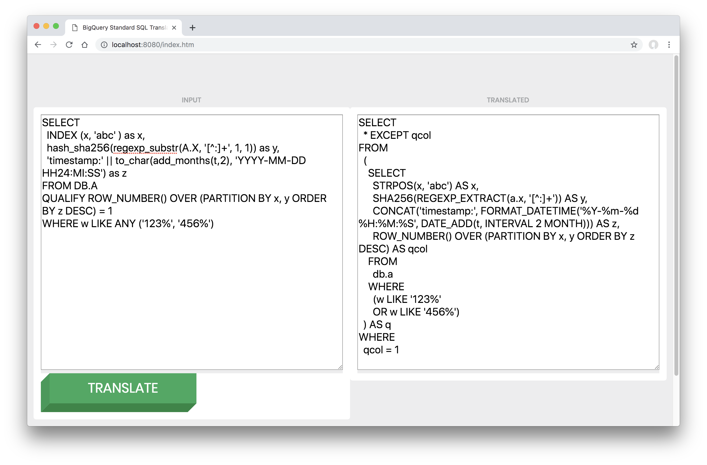

# BigQuery Standard SQL Translator

This project provides a SQL parser for BigQuery Standard SQL using the Scala Parser Combinators library. A subset of Teradata SQL dialect can be parsed and printed as BigQuery Standard SQL, enabling use of this SQL parser as a translation utility.

This project includes a command-line interface for translating an entire directory as well as a local web application for interactively translating individual single SQL statements.


## Variable Support

This parser supports Bash and Jinja variables in column names and table names. Usage of variables as SQL macros is not supported and will likely cause parsing to fail.


## Supported Teradata syntax

The following functions and syntax is translated:
- SELECT
- CREATE TABLE
- UPDATE
- MERGE
- QUALIFY
- [NOT] LIKE ANY
- [NOT] LIKE ALL
- HASH_SHA256()
- OREPLACE()
- POSITION()
- INDEX()
- REGEXP_SUBSTR()
- TO_CHAR()
- ADD_MONTHS()
- `||` (concatenate operator)
- DATE and DATETIME arithmetic

The following statements are ignored:
- STATISTICS
- LOCK TABLE
- DIAGNOSTIC
- DROP TABLE


## Usage

There are two executable classes in this project:
1. RewriteDir - rewrite all SQL files in a directory
2. SQLServlet - local webserver for SQL translation

### RewriteDir

To rewrite a directory in place, run the RewriteDir class and pass the path to a directory containing SQL statement. The parser will output a log showing any parsing failures. Statements must be contained in files with .sql extension and a single statement per file.

#### Run with SBT

```
sbt "runMain com.google.cloud.pso.sql.RewriteDir /path/to/sql"
```

#### Run from Jar
```
sbt assembly
java -jar target/scala-2.11/sql-assembly-0.1.0-SNAPSHOT.jar /path/to/sql
```

#### Checking in the files

Typically the directory being rewritten should be within a git repository. To check in the modified files after running the application:
```
git add /path/to/sql
git checkout -b translated
git commit -m "translated sql with BigQuery Standard SQL Translator"
```

#### Example Output

```
Parsing failed for sql/statement1.sql: [*] Parsing error: ) expected at 230

X LIKE ANY ('ABC_1', 'ABC_2', 'XYZ_1', 'XYZ_2'[*] 'XYZ_3')


Parsing failed for sql/statement2.sql: [*] Parsing error: ; expected at 233

A.DATE1, A.DATE2) as X,
OTRANSLATE[*](A.X, ' -./\()~!@#$%^&*-_=+\|][}{,./<>?;:','') AS Y
FROM B


Success:	1234
Failure:	123
Ignored:	345
Non-SQL:	456
Time Elapsed:	100s
```


### SQLServlet

A local web application is included that allows you to translate individual SQL statements. Execute `com.google.cloud.pso.sql.SQLServlet` to launch an embedded Jetty webserver.

#### Screenshot



#### Run with SBT
```
sbt 'runMain com.google.cloud.pso.sql.SQLServlet'
```

#### Run from Jar

```
sbt assembly
java -cp target/scala-2.11/sql-assembly-0.1.0-SNAPSHOT.jar com.google.cloud.pso.sql.SQLServlet
```


## Requirements

You'll need the [sbt](https://www.scala-sbt.org/download.html) build tool and a JDK. To install sbt, extract the archive and add the bin directory to your PATH.


## Development

Adding support for additional SQL syntax or functions typically requires adding a parser and adding a reference to it within `simpleExpr` or `precedenceOrder` in [StandardSQLParser](src/main/scala/com/google/cloud/pso/sql/StandardSQLParser.scala).

Adding support for a new statement or expression requires creation of an AST class within the [ast package](src/main/scala/com/google/cloud/pso/sql/ast), extending `Statement` or `Expression`.


### File Structure

- [ast](src/main/scala/com/google/cloud/pso/sql/ast) contains all SQL AST classes
- [RewriteDir.scala](src/main/scala/com/google/cloud/pso/sql/RewriteDir.scala) command-line application to translate all SQL files in a directory
- [package.scala](src/main/scala/com/google/cloud/pso/sql/package.scala) operators and function names
- [SQLFmt.scala](src/main/scala/com/google/cloud/pso/sql/SQLFmt.scala) pretty-printing SQL
- [SQLLexical.scala](src/main/scala/com/google/cloud/pso/sql/SQLLexical.scala) lexer providing parsing of whitespace, quotes, literals and SQL keywords
- [SQLParser.scala](src/main/scala/com/google/cloud/pso/sql/SQLParser.scala) trait extending scala.util.parsing.combinator traits
- [SQLServlet.scala](src/main/scala/com/google/cloud/pso/sql/SQLServlet.scala) exposes parser web interface on [http://localhost:8080](http://localhost:8080) with embedded Jetty webserver
- [StandardSQLParser.scala](src/main/scala/com/google/cloud/pso/sql/StandardSQLParser.scala) SQL parser definitions
-[ParseTeradataDialectSpec.scala](src/test/scala/com/google/cloud/pso/sql/ParseTeradataDialectSpec.scala) Unit tests for SQL parsing and translation
