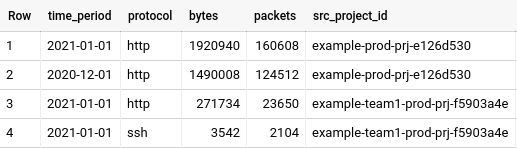

# Traffic Analysis using VPC Flow Logs

As a central network management team member in enterprise organisation, I want to be able to analyse the egress traffic from the Google Cloud projects towards on-premises networks, so that I can attribute egress traffic costs over shared Interconnect or VPN to the specific Google Cloud projects and thus to business unit or cost center. 

Here is the example report after the solution is deployed.

## Attributing Interconnect or VPN usage to specific service projects in Shared VPC

In case of the traffic flow between the Google Cloud projects and on-premises networks, egress traffic towards on-premises is billed. If there is a central IT team that manages [central landing zone and connectivity to the on-premises](https://cloud.google.com/solutions/images/vpc-bps-l7-firewall.svg), they need to pass costs to the respective business units/teams as a part of their managed cloud platform offer.

### The problem

If the traffic is captured and measured in the [Untrusted (global) VPC](https://cloud.google.com/solutions/images/vpc-bps-l7-firewall.svg) or [Outside VPC](https://cloud.google.com/solutions/images/vpc-bps-native-firewall-rules.svg), then the attribution to the service projects will be lost. It is still possible to determine which business unit or team generated the traffic by inspecting only IP ranges of the packets, but this requires keeping up-to-date mapping of business unit to IP address ranges. In case if subnets in the Shared VPC are assigned to multiple service projects (which is a [recommended approach to have larger subnets in Shared VPC](https://cloud.google.com/solutions/best-practices-vpc-design#fewer-subnets)) - it is impossible to distinguish and attribute traffic based only on the IP address.

To address this limitation the VPC Flow Logs are collected in the Shared VPC host project in each environment ([Prod VPC, Dev VPC](https://cloud.google.com/solutions/images/vpc-bps-native-firewall-rules.svg)), where the full metadata is available. This allows to capture the `project_id` for the egress traffic, which later can be attributed to the specific business unit or the team. 

To minimize amount and thus costs of the stored VPC Flow Logs - only traffic towards the IP ranges of the on-premises networks is captured in the LogSink and the rest is discarded (i.e. traffic between the projects, towards the internet or to Cloud APIs).

## Requirements

You will need [Terraform](https://www.terraform.io/downloads.html) version 0.13 to deploy this code. 

The following items should be provisioned before spinning up the project:

* An existing project where the [log sink](https://github.com/terraform-google-modules/terraform-google-log-export) will be created.
* An existing project where [BigQuery dataset](https://github.com/terraform-google-modules/terraform-google-log-export/tree/master/modules/bigquery) will be created.
* [VPC Flow Logs](https://cloud.google.com/vpc/docs/using-flow-logs) must be already [enabled](https://cloud.google.com/vpc/docs/using-flow-logs#enabling_vpc_flow_logging) in the target subnets where traffic should be monitored.

## Resources deployed by this solution

* Log sink and filter (for collecting logs only with traffic sent from the Cloud to on-premises network)
* BigQuery dataset (for storing traffic logs)
* BigQuery view (predefined query to generate the summary)
* BigQuery functions (aggregation and labelling of the addresses/ports for the view)

## Usage

Once installed, you'll see a [BigQuery view](https://cloud.google.com/bigquery/docs/views-intro) with the name `on_prem_traffic_report` under the newly created dataset. This dataset will automatically get populated by Cloud Operations with the VPC Flow Logs that are enabled in the project where the log sink resides. It may take some minutes for first entries to appear in the dataset.

## Limitations

This solution does not optimize BigQuery tables used for the request. Because VPC Flow Logs generate daily partitioned tables, it is possible to optimize BigQuery execution by limiting number of tables requested (for example use `vpc_flowlogs_dataset.compute_googleapis_com_vpc_flows_202101*` to request tables only for January 2021 instead of `compute_googleapis_com_vpc_flows_*` which scans all tables).

As a limitation of VPC Flow Logs, only [TCP and UDP traffic](https://cloud.google.com/vpc/docs/flow-logs#key_properties) is captured.

## Costs

If you enable VPC Flow Logs, they will be sent by default to the `_Default` log sink. You can either disable the `_Default` log sink (not recommended) or create an exclusion rule that skips VPC Flow Logs.

Standard pricing for Logging, BigQuery, or Pub/Sub apply. VPC Flow Logs pricing is described in [Network Telemetry pricing](https://cloud.google.com/vpc/network-pricing#network-telemetry).

## Inputs

| Name | Description | Type | Default | Required |
|------|-------------|------|---------|:--------:|
| aggregation\_period | Specify for what period of time to aggregate. Valid values are `month` and `day`. | `string` | `"month"` | no |
| dataset\_name | Name that the BigQuery dataset is going to have in the logs project (referenced by logs\_project\_id) where VPC Flow Logs are going to be stored. | `string` | `"vpc_flowlogs_dataset"` | no |
| exclude\_interconnect\_ip\_ranges | IP address ranges of VPC flowlog packets that should be ignored from ingestion into the BigQuery sink. These are useful if the included interconnect IP address ranges contain sub-ranges that should be ignored. | `list(string)` | `[]` | no |
| include\_interconnect\_ip\_ranges | IP address ranges of VPC flowlog packets that should be ingested into the BigQuery sink. Only this ranges (minus any overlapping excluded ranges) will be used to calculate the total Interconnect traffic. | `list(string)` | n/a | yes |
| location | GCP location, i.e. (multi-)region, where resources will be created. The list of all available values can be found under https://cloud.google.com/storage/docs/locations#available\_locations. | `string` | `"EU"` | no |
| logs\_project\_id | Id of the project where the BigQuery dataset with the VPC Flow Logs will be stored. | `string` | n/a | yes |
| vpc\_project\_ids | Set of project ids where a sink should be created and thus, VPC Flow Logs should be ingested. This does not activate VPC Flow Logs, it only ingests already activated VPC Flow Logs. | `set(string)` | n/a | yes |

## Outputs

No output.

## Additional reading

0. [Reference architectures](https://cloud.google.com/solutions/best-practices-vpc-design#reference_architectures)
