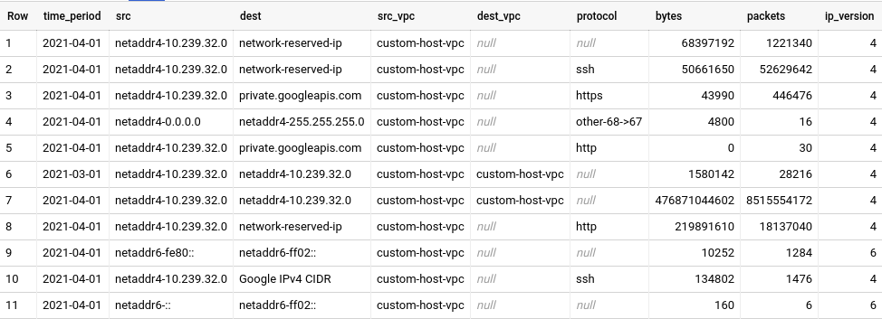

# VPC Flow Logs Top Talkers

This solutions allows to generate reports on the traffic generated by subnets or hosts inside the VPC network.

Generated reports allow finding top sources of the traffic in a specific VPC.

### The problem

For monitoring reasons it may be necessary to determine which hosts or networks in the VPC generate most of the traffic towards other internal hosts or the Internet.
This solution allows to generate a report with desired granularity, label Google API IPs, and custom IP ranges and ports.

## Deployed resources

* Logs sink and filter (for collecting only Egress traffic)
* BigQuery dataset (for storing traffic logs)
* BigQuery view (report)
* BigQuery functions (aggregation and labelling of the addresses/ports for the view)

## Requirements

The following items should be provisioned before installing these reports:

* An existing project where the [log sink](https://github.com/terraform-google-modules/terraform-google-log-export) will be created.
* An existing project where [BigQuery dataset](https://github.com/terraform-google-modules/terraform-google-log-export/tree/master/modules/bigquery) will be created.
* [VPC flow logs](https://cloud.google.com/vpc/docs/using-flow-logs) must be already enabled in the target subnets where traffic should be monitored.

## Setup

### Terraform configuration

Please rename `terraform.tfvars.example` to `terraform.tfvars` and change the values to point to the correct log sink project ID and VPC project ID.

### Google API IP address ranges

This project comes with a pre-populated list of IP addresses for Google APIs. These IPs change from time to time, so there is a script `update-ip-range-labels.sh` which takes care of updating the list in `ip-range-labels.yaml`. You need to run it manually to update the list, it is not a part of Terraform run.

### Labelling the traffic

This solution allows adding custom labels to specific IP ranges and ports. Edit the corresponding sections of the `labels.yaml` to add the mapping between the hosts or subnets and text labels.

To label the traffic on the specific port add it under the `port_labels` key.

Re-run the `update-ip-range-labels.sh` script after you changed the `labels.yaml` file to regenerate IP ranges definitions. The `labels.yaml` file will **not** be read by terraform.
Instead, the generated file `ip-range-labels.yaml` will be ingested by Terraform.

### Report settings

There are several Terraform input variables which change the report output. They do not affect the volume of the logs exported to Big Query or the tables scanned to generate the report.

- `enable_split_by_destination` - set to `false`, if you are interested only in having source IPs in the report
- `enable_split_by_protocol` - set to `false`, if you are not interested in split by the protocol
- `enable_ipv4_traffic` - if set to `false` will exclude all IPv4 traffic from the report.
    - `ipv4_ranges_to_include` `ipv4_ranges_to_exclude` - list of IPs or subnets to include or exclude. Specify single IP in `8.8.8.8/32` form.
    - `ipv4_aggregate_prefix` - if the subnet is not mentioned in the `labels.yaml`, then at which granularity level aggregate traffic together. I.e. when it is `24`, all IPs in `10.239.1.0/24` network will be labelled `netaddr4-10.239.1.0`. If you want to see per-hosts statistics, please use `32` as a value.
- `enable_ipv6_traffic` - same as above, but for `IPv6` traffic
    - `ipv6_ranges_to_include`
    - `ipv6_ranges_to_exclude`
    - `ipv6_aggregate_prefix` - if the subnet is not mentioned in the `labels.yaml` the resulting label will be `netaddr6-IPV6PREFIX`

### Time ranges

Please note that the `current_month_*` and `last_month_*` reports will process only the tables from the corresponding time ranges. If you need historical time ranges - please change the view implementation.

## Usage

Once installed with the right configuration values, you'll see several views with the names `top_talkers_report_{current|previous}_month_{daily|weekly|monthly}` under the newly created dataset. This dataset will automatically get populated by Cloud Operations with the VPC flow logs that are enabled in the project where the log sink resides. It may take some minutes for the first entries to appear in the dataset.

Example of the generated output:



## Costs

If you enable VPC flow logs, they will be sent by default to the `_Default` log sink. You can either disable the `_Default` log sink (not recommended) or create an exclusion rule that skips VPC flow logs.

## Troubleshooting

If you get an error like this:

> │ Error: googleapi: Error 400: Field name dest_vpc does not exist in STRUCT<start_time STRING, src_instance STRUCT<project_id STRING, vm_name STRING, region STRING, ...>, src_vpc STRUCT<project_id STRING, subnetwork_name STRING, vpc_name STRING>, ...> at [213:19], invalidQuery

It is probably because the VPC flow logs are not generating specific type of traffic that implicitly creates all the required columns in the BigQuery Tables. In order to fix this, please execute the following command:

```
bq ls --format json <BG_PROJECT>:<BQ_DATASET> | jq -r '.[].id' | grep compute_googleapis_com_vpc_flows_ | xargs -I{} bq update {} $(pwd)/vpc_flows_schema.json
```

This will apply the predefined schema stored in this project to all the tables inside the dataset dedicated to this utility after which `terraform apply` should succeed.
