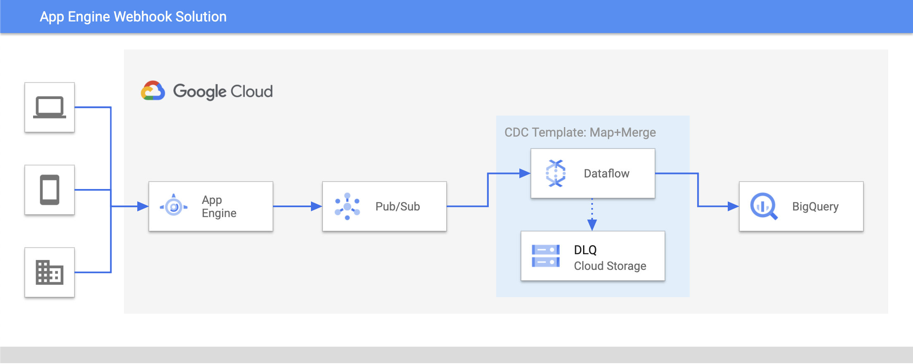

# Webhook Data Ingestion Pipeline
## Webhook App Overview
It can often be helpful to have an easy to deploy and easy to manage endpoint which load data into your Data Warehouse.  Use cases include:

- Javascript SDK data from your website for custom analytics or A/B testing
- Mobile IOS or Android SDKs to track and manage app usage
- Many SaaS offerings can supply data via webhooks to give you realtime access to important data
	- Stripe allows you to receive purchase data realtime via webhooks
	- Others include Atlassian, Segment, and many more
- Custom development is easier for your team when they only need to read data and forward it.  You can optionally use App Engine or Pub/Sub directly without breaking the pipeline.

The webhoook tool is intended to be an easy to deploy and easy to manage
application.  You can use it to receive and process any un-authenticated http(s)
data.

## How to Deploy

- Step 1) Create a GCP Project you want the application to be deployed in
- Step 2) Ensure variables are set via `make PROJECT_ID="<my-project>" PROJECT_NUMBER="<my-project-number>"`
- Step 3) Build Webhook Application via `make build PROJECT_ID="<my-project>" PROJECT_NUMBER="<my-project-number>"`
- Finally) Tear Down Webhook Application via `make destroy PROJECT_ID="<my-project>" PROJECT_NUMBER="<my-project-number>"`

That's it!  All resources will be deployed via Terraform.

## Sending Data

Once the project is deployed, an endpoint will be available at `{project-name}.uc.r.appspot.com` which can receive JSON data via POST requests. A sample payload is included in `tests/system/send_data.py` which can be invoked with the following command.

```
python3 tests/system/send_data.py -p {project_name}
```

By default 1000 events will be sent to the app engine endpoint deployed on the project you provided. Larger by tweaking additional optional parameters.

```
--pool-size, (-ps), # Number of concurrent processes used (default 100)
--request-size, (-r) # Number of events per request to batch (default 10)
--batch-size (-bs) # Number of requests per batch (default 100)
--batches (-b) # Number of batches to send. Supplying 0 sends in infinite loop. (default 1)
--batch-sleep-secs" (-s) # Seconds to sleep between batches (default 0)
```

## Architectural Diagram



## Components

The webhook ingestion pipeline consists of two key components - An App Engine based webhook endpoint and the Dataflow pipeline
dataflow pipeline.

### App Engine Endpoint

The App Engine Endpoint is a lightweight webhook server that listens for data on http and forwards it to an internal pubsub topic. The source code of this application is contained entirely within this repository and is deployed to App Engine.

### Dataflow pipeline

The dataflow template deployed by this terraform config produces a pipeline that consumes data from the aforementioned pubsub topic and ultimately loads that data into a table in BigQuery. The template contains a number of optional parameters that allow you to transform incoming data and define the target BigQuery schema. These features [are documented in depth here.](https://github.com/GoogleCloudPlatform/DataflowTemplates/tree/master/v2/pubsub-cdc-to-bigquery)